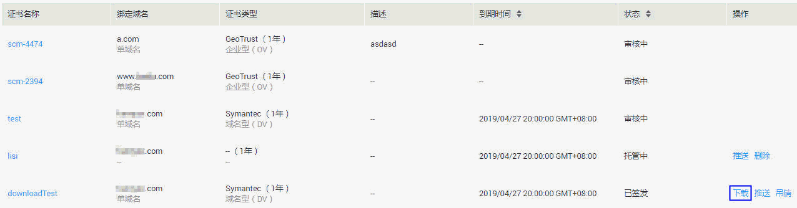

# 下载证书

## 操作场景

该任务指导用户在SSL证书管理平台下载证书，只有购买的证书且证书状态为“已签发“或“已过期“时，才可以下载。

## 前提条件

-   已获取管理控制台的登录帐号与密码。
-   “证书状态“为“已签发“或“已过期“。

## 操作步骤

1.  登录管理控制台。
2.  单击页面上方的“服务列表“，选择“安全  \>  SSL证书管理“，进入SSL证书管理界面。
3.  在需要下载的证书所在行的“操作“列，单击“下载“，如[图1](#fig121926536132)所示。

    **图 1**  下载证书  
    

4.  在“下载“页面，单击“下载证书“，浏览器自动执行下载任务。
5.  按照界面指导步骤，完成证书安装。
    -   在Tomcat上安装SSL证书的详细指导操作请参见[如何在Tomcat上安装SSL证书？](https://support.huaweicloud.com/scm_faq/scm_01_0022.html)
    -   在Nginx上安装SSL证书的详细指导操作请参见[如何在Nginx上安装SSL证书？](https://support.huaweicloud.com/scm_faq/scm_01_0023.html)
    -   在Apache上安装SSL证书的详细指导操作请参见[如何在Apache上安装SSL证书？](https://support.huaweicloud.com/scm_faq/scm_01_0024.html)
    -   在IIS上安装SSL证书的详细指导操作请参见[如何在IIS上安装SSL证书？](https://support.huaweicloud.com/scm_faq/scm_01_0025.html)

