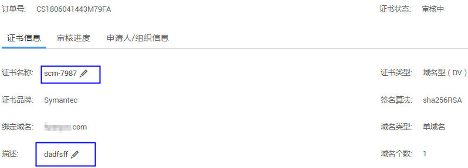
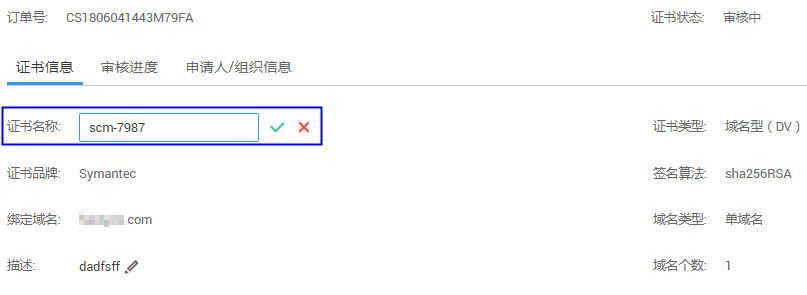
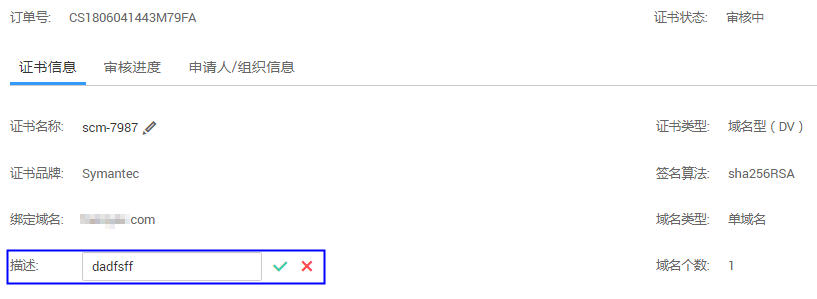

# 修改证书名称和描述

## 操作场景

该任务指导用户修改证书名称和描述信息，包括购买和上传的证书。

证书描述信息主要用于用户对证书进行自定义备注。

## 前提条件

-   已获取管理控制台的登录帐号与密码。
-   已购买证书或者已上传原有证书。

## 操作步骤

1.  登录管理控制台。
2.  单击页面上方的“服务列表“，选择“安全  \>  SSL证书管理“，进入SSL证书管理界面。

1.  单击需要修改的证书名称，进入证书修改和描述页面。
2.  单击“证书名称“栏后的展开编辑框，如[图1](#fig52235577104025)所示。

    **图 1**  修改证书名称  
    

3.  在编辑框中重新输入证书的名称，单击保存修改的证书名称，页面右上角弹出“修改成功“，则说明修改证书名称成功，如[图2](#fig33807647105012)所示。

    > **说明：**   
    >证书名称不能重复。  

    **图 2**  保存修改的证书名称  
    

4.  单击“描述“栏后的展开编辑框，在编辑框中输入描述信息后，单击保存修改的描述信息，页面右上角弹出“修改成功“，则说明修改证书描述信息成功，如[图3](#fig55643331173110)所示。

    **图 3**  修改证书描述  
    

