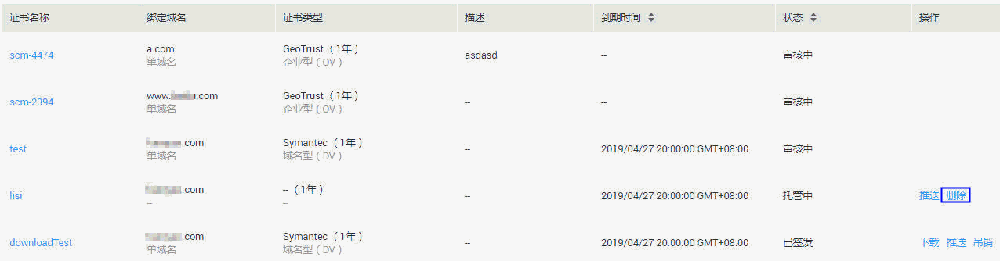

# 删除证书

## 操作场景

该任务指导用户删除不需要的证书。

证书删除后将无法恢复，请谨慎操作。

## 前提条件

-   已获取管理控制台的登录帐号与密码。
-   证书状态为“已到期“。
-   上传的证书状态为“托管中“。

> **说明：**   
>当免费测试证书的状态为“待补全信息“或“审核失败“时，用户可以根据需要删除该证书。  

## 操作步骤

1.  登录管理控制台。
2.  单击页面上方的“服务列表“，选择“安全  \>  SSL证书管理“，进入SSL证书管理界面。

1.  在需要删除的证书所在行的“操作“列，单击“删除“，如[图1](#fig378795517413)所示。

    **图 1**  删除证书  
    

2.  在弹出的对话框中，单击“确定“，页面右上角弹出“删除证书成功“，完成证书删除。

