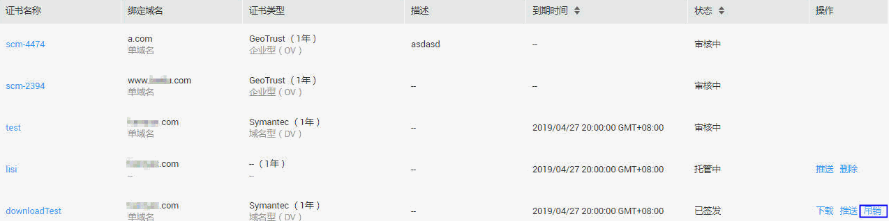
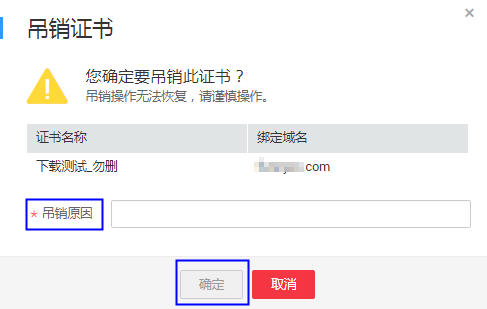

# 吊销证书

## 操作场景

该任务指导用户吊销不需要的证书或者丢失私钥的证书。

吊销证书后，将清除该证书所有的记录，包括CA机构的记录，且无法恢复，请谨慎操作。

## 前提条件

-   已获取管理控制台的登录帐号与密码。
-   证书的状态为“已签发“。

## 操作步骤

1.  登录管理控制台。
2.  选择“安全  \>  SSL证书管理“，进入SSL证书列表界面。
3.  在需要吊销的证书所在行的“操作“列中，单击“吊销“，如[图1](#fig27878013420)所示。

    **图 1**  吊销证书  
    

4.  在弹出的对话框中，输入吊销的原因，单击“确定“，在页面的右上角弹出“吊销证书成功“，表示吊销证书申请已成功提交审核，等待审核通过后即吊销成功，如[图2](#fig751892851013)所示。

    **图 2** “吊销证书“对话框  
    

