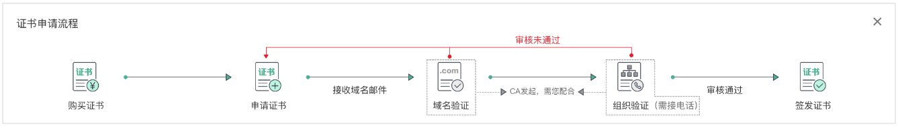

# SSL证书申购流程

华为云SSL证书提供多个品牌和类型的证书，详情请参见[各证书之间的区别](https://support.huaweicloud.com/productdesc-ccm/ccm_01_0219.html)。本文档介绍如何购买和选择华为云SSL证书。

在购买、申请证书前，请您了解证书申请的流程，以便更快地获取SSL证书。相关流程如[图1](#zh-cn_topic_0000001215698655_zh-cn_topic_0000001124216585_fig19468201294017)所示，具体说明如[表1](#zh-cn_topic_0000001215698655_zh-cn_topic_0000001124216585_table961119194017)所示。

**图 1**  SSL证书申请流程  

**表 1**  证书申请流程说明

<table><thead align="left"><tr id="zh-cn_topic_0000001215698655_zh-cn_topic_0000001124216585_row96151954017"><th class="cellrowborder" valign="top" width="13.251325132513253%" id="mcps1.2.4.1.1">
步骤

</th>
<th class="cellrowborder" valign="top" width="21.3021302130213%" id="mcps1.2.4.1.2">
申请操作

</th>
<th class="cellrowborder" valign="top" width="65.44654465446544%" id="mcps1.2.4.1.3">
说明

</th>
</tr>
</thead>
<tbody><tr id="zh-cn_topic_0000001215698655_zh-cn_topic_0000001124216585_row13714194406"><td class="cellrowborder" valign="top" width="13.251325132513253%" headers="mcps1.2.4.1.1 ">
1

</td>
<td class="cellrowborder" valign="top" width="21.3021302130213%" headers="mcps1.2.4.1.2 ">
<a href="步骤一-购买SSL证书.md#ZH-CN_TOPIC_0000001216304853">购买SSL证书</a>

</td>
<td class="cellrowborder" valign="top" width="65.44654465446544%" headers="mcps1.2.4.1.3 ">
在SSL证书管理平台，根据您的域名类型选购对应的证书。

</td>
</tr>
<tr id="zh-cn_topic_0000001215698655_zh-cn_topic_0000001124216585_row67121964017"><td class="cellrowborder" valign="top" width="13.251325132513253%" headers="mcps1.2.4.1.1 ">
2

</td>
<td class="cellrowborder" valign="top" width="21.3021302130213%" headers="mcps1.2.4.1.2 ">
<a href="步骤二-申请SSL证书.md#ZH-CN_TOPIC_0000001216146273">申请SSL证书</a>

</td>
<td class="cellrowborder" valign="top" width="65.44654465446544%" headers="mcps1.2.4.1.3 ">
成功购买证书后，您需要为证书绑定域名、填写证书申请人的详细信息并提交审核。

</td>
</tr>
<tr id="zh-cn_topic_0000001215698655_zh-cn_topic_0000001124216585_row197419114014"><td class="cellrowborder" valign="top" width="13.251325132513253%" headers="mcps1.2.4.1.1 ">
3

</td>
<td class="cellrowborder" valign="top" width="21.3021302130213%" headers="mcps1.2.4.1.2 ">
<a href="步骤三-域名验证.md#ZH-CN_TOPIC_0000001215904789">域名验证</a>

</td>
<td class="cellrowborder" valign="top" width="65.44654465446544%" headers="mcps1.2.4.1.3 ">
按照CA中心的规范，证书提交申请后您需要配合完成域名授权验证来证明您对所申请绑定域名的所有权。

SCM提供有以下几种验证方式：

<ul id="zh-cn_topic_0000001215698655_ul26157268529"><li>自动DNS验证：符合<a href="方式一-自动DNS验证.md#zh-cn_topic_0000001170697332_zh-cn_topic_0000001215201973_section1271838161315">条件</a>的证书可选。</li><li>手动DNS验证：所有类型证书均可选。</li><li>文件验证：仅OV、EV型证书可选。</li><li>邮箱验证：仅OV、EV型证书可选。</li></ul>
</td>
</tr>
<tr id="zh-cn_topic_0000001215698655_zh-cn_topic_0000001124216585_row27141944015"><td class="cellrowborder" valign="top" width="13.251325132513253%" headers="mcps1.2.4.1.1 ">
4

</td>
<td class="cellrowborder" valign="top" width="21.3021302130213%" headers="mcps1.2.4.1.2 ">
<a href="步骤四-（OV-EV）组织验证.md#ZH-CN_TOPIC_0000001170266468">（可选）组织验证</a>

</td>
<td class="cellrowborder" valign="top" width="65.44654465446544%" headers="mcps1.2.4.1.3 ">
仅当申请OV、OV Pro、EV和EV Pro类型证书时，需要该操作。

域名验证完成后，CA机构需要确认企业/组织是否发起了此次的证书订单申请。

</td>
</tr>
<tr id="zh-cn_topic_0000001215698655_zh-cn_topic_0000001124216585_row3751912408"><td class="cellrowborder" valign="top" width="13.251325132513253%" headers="mcps1.2.4.1.1 ">
5

</td>
<td class="cellrowborder" valign="top" width="21.3021302130213%" headers="mcps1.2.4.1.2 ">
<a href="步骤五-签发SSL证书.md#ZH-CN_TOPIC_0000001222574123">签发证书</a>

</td>
<td class="cellrowborder" valign="top" width="65.44654465446544%" headers="mcps1.2.4.1.3 ">
组织验证完成后，CA机构还需要一段时间进行处理，请您耐心等待。具体申请时间请参见<a href="https://support.huaweicloud.com/ccm_faq/ccm_01_0060.html" target="_blank" rel="noopener noreferrer">各证书的申请时长</a>。

CA机构审核通过后，将签发证书。证书签发后便立即生效，即可推送证书到华为云其他云产品或下载证书并部署到服务器上进行使用。

</td>
</tr>
</tbody>
</table>

