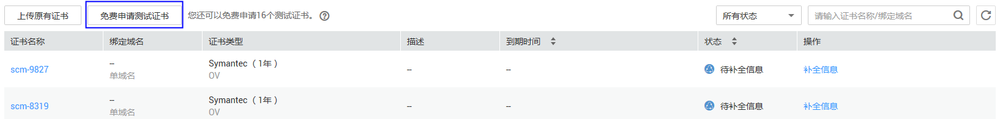
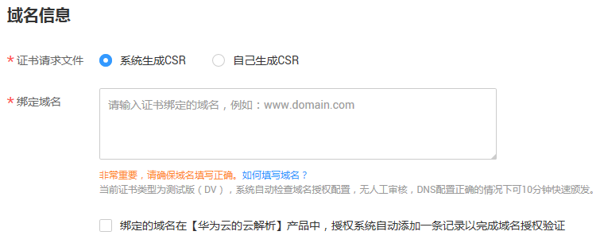
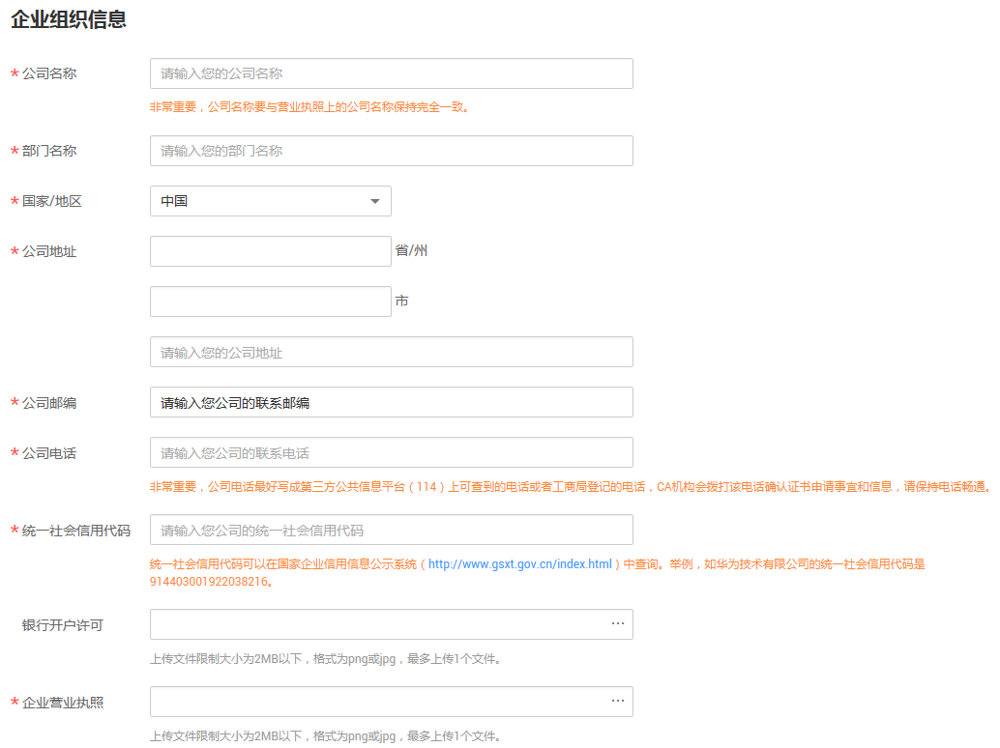
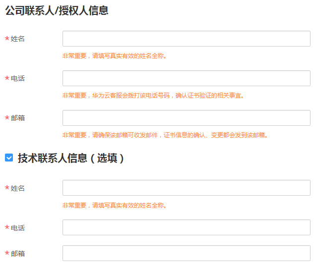

# 一键免费申请测试证书

## 操作场景

该任务指导用户如何一键免费申请测试证书。

## 前提条件

已获取管理控制台的登录帐号与密码。

## 操作步骤

1.  登录管理控制台。
2.  单击页面上方的“服务列表“，选择“安全  \>  SSL证书管理“，进入SSL证书管理界面。
3.  在证书列表左上角，单击“免费申请测试证书“，如[图1](#fig2346145623211)所示，进入“域名信息“界面。

    **图 1**  免费申请测试证书  
    

    > **说明：**   
    >-   一个账号最多可以免费申请20个测试证书。  
    >-   测试证书的签发由系统自动完成，申请者按要求完成配置后即可获得证书，因此无法加速。同时，测试证书建议只用于测试，华为云不提供测试证书安装部署的咨询服务。  

4.  在“补全信息“界面，补全证书信息。
    1.  补全域名信息，“证书请求文件“可以选择“系统生成CSR“或者“自己生成CSR“，在“绑定域名“配置框中，输入证书绑定的域名，如[图2](#zh-cn_topic_0110866215_fig212112271419)所示。

        > **说明：**   
        >CSR即证书签名申请，获取SSL证书，需要先生成CSR文件并提交给证书颁发机构（CA）。CSR包含了公钥和标识名称（Distinguished Name），通常从Web服务器生成CSR，同时创建加解密的公钥私钥对。  

        **图 2**  填写测试证书的域名信息  
        

        > **注意：**   
        >-   建议您使用系统提供的“系统生成CSR“功能，避免出现内容不正确而导致的审核失败。  
        >-   “自己生成CSR“即手动生成的CSR文件，手动生成CSR文件的同时会生成私钥文件，请务必妥善保管和备份您的私钥。  
        >-   证书服务系统对CSR文件的密钥长度有严格要求，密钥长度必须是2,048位，密钥类型必须为RSA。  
        >-   选中“绑定的域名在【华为云的云解析】产品中，授权系统自动添加一条记录以完成域名授权验证”，如果绑定的域名在华为云的云解析产品中，在成功绑定域名后，系统将自动完成该域名的授权验证。  

    2.  （仅企业、组织单位需要补充此信息）补全企业组织信息，如[图3](#zh-cn_topic_0110866215_fig1517919331585)所示，参数说明如[表1](#zh-cn_topic_0110866215_table1283352018128)所示。

        **图 3**  企业组织信息  
        

        **表 1**  参数说明

        
        <table><thead align="left"><tr id="zh-cn_topic_0110866215_row6834172011120"><th class="cellrowborder" valign="top" width="30%" id="mcps1.2.3.1.1">
参数名称

        </th>
        <th class="cellrowborder" valign="top" width="70%" id="mcps1.2.3.1.2">
参数说明

        </th>
        </tr>
        </thead>
        <tbody><tr id="zh-cn_topic_0110866215_row14834162071216"><td class="cellrowborder" valign="top" width="30%" headers="mcps1.2.3.1.1 ">
公司名称

        </td>
        <td class="cellrowborder" valign="top" width="70%" headers="mcps1.2.3.1.2 ">
营业执照注册公司的全称。

        </td>
        </tr>
        <tr id="zh-cn_topic_0110866215_row20359195410554"><td class="cellrowborder" valign="top" width="30%" headers="mcps1.2.3.1.1 ">
部门名称

        </td>
        <td class="cellrowborder" valign="top" width="70%" headers="mcps1.2.3.1.2 ">
用户所在的部门名称。

        </td>
        </tr>
        <tr id="zh-cn_topic_0110866215_row1082712855611"><td class="cellrowborder" valign="top" width="30%" headers="mcps1.2.3.1.1 ">
国家/地区

        </td>
        <td class="cellrowborder" valign="top" width="70%" headers="mcps1.2.3.1.2 ">
公司所在的国家或地区。

        </td>
        </tr>
        <tr id="zh-cn_topic_0110866215_row883482020125"><td class="cellrowborder" valign="top" width="30%" headers="mcps1.2.3.1.1 ">
公司地址

        </td>
        <td class="cellrowborder" valign="top" width="70%" headers="mcps1.2.3.1.2 ">
营业执照注册的地址。

        </td>
        </tr>
        <tr id="zh-cn_topic_0110866215_row1098854545515"><td class="cellrowborder" valign="top" width="30%" headers="mcps1.2.3.1.1 ">
公司邮编

        </td>
        <td class="cellrowborder" valign="top" width="70%" headers="mcps1.2.3.1.2 ">
公司所在区域的邮编。

        </td>
        </tr>
        <tr id="zh-cn_topic_0110866215_row4834172031220"><td class="cellrowborder" valign="top" width="30%" headers="mcps1.2.3.1.1 ">
公司电话

        </td>
        <td class="cellrowborder" valign="top" width="70%" headers="mcps1.2.3.1.2 ">
可正常使用的公司联系电话。

        </td>
        </tr>
        <tr id="zh-cn_topic_0110866215_row16834102071211"><td class="cellrowborder" valign="top" width="30%" headers="mcps1.2.3.1.1 ">
统一社会信用代码

        </td>
        <td class="cellrowborder" valign="top" width="70%" headers="mcps1.2.3.1.2 ">
统一社会信用代码可以在国家企业信用信息公示系统（<a href="http://www.gsxt.gov.cn/index.html">http</a><a href="http://www.gsxt.gov.cn/index.html">://</a><a href="http://www.gsxt.gov.cn/index.html">www.gsxt.gov.cn/index.html</a>）中查询。举例，如华为技术有限公司的统一社会信用代码是914403001922038216。

        </td>
        </tr>
        <tr id="zh-cn_topic_0110866215_row1834420121214"><td class="cellrowborder" valign="top" width="30%" headers="mcps1.2.3.1.1 ">
银行开户许可

        </td>
        <td class="cellrowborder" valign="top" width="70%" headers="mcps1.2.3.1.2 ">
（可选）单击“上传文件”，上传银行开户许可证电子件。

        </td>
        </tr>
        <tr id="zh-cn_topic_0110866215_row13437156131417"><td class="cellrowborder" valign="top" width="30%" headers="mcps1.2.3.1.1 ">
企业营业执照

        </td>
        <td class="cellrowborder" valign="top" width="70%" headers="mcps1.2.3.1.2 ">
单击“上传文件”，上传企业营业执照电子件。

        </td>
        </tr>
        </tbody>
        </table>

    3.  补全联系方式，如[图4](#zh-cn_topic_0110866215_fig974115386374)所示。

        **图 4**  联系方式  
        

        **表 2**  参数说明

        
        <table><thead align="left"><tr id="zh-cn_topic_0110866215_row6981152116396"><th class="cellrowborder" valign="top" width="24%" id="mcps1.2.4.1.1">
参数名称

        </th>
        <th class="cellrowborder" valign="top" width="43%" id="mcps1.2.4.1.2">
参数说明

        </th>
        <th class="cellrowborder" valign="top" width="33%" id="mcps1.2.4.1.3">
取值样例

        </th>
        </tr>
        </thead>
        <tbody><tr id="zh-cn_topic_0110866215_row498122120394"><td class="cellrowborder" valign="top" width="24%" headers="mcps1.2.4.1.1 ">
姓名

        </td>
        <td class="cellrowborder" valign="top" width="43%" headers="mcps1.2.4.1.2 ">
请输入您的姓名。

        </td>
        <td class="cellrowborder" valign="top" width="33%" headers="mcps1.2.4.1.3 ">
张三

        </td>
        </tr>
        <tr id="zh-cn_topic_0110866215_row398115215398"><td class="cellrowborder" valign="top" width="24%" headers="mcps1.2.4.1.1 ">
电话

        </td>
        <td class="cellrowborder" valign="top" width="43%" headers="mcps1.2.4.1.2 "><ol id="zh-cn_topic_0110866215_ol588015194310"><li>输入可以正常联系您的11位电话号码。</li><li>单击“免费获取短信验证码”，在配置框中正确输入您收到的验证码。</li></ol>
        </td>
        <td class="cellrowborder" valign="top" width="33%" headers="mcps1.2.4.1.3 ">
12345678912

        </td>
        </tr>
        <tr id="zh-cn_topic_0110866215_row298162112394"><td class="cellrowborder" valign="top" width="24%" headers="mcps1.2.4.1.1 ">
邮箱

        </td>
        <td class="cellrowborder" valign="top" width="43%" headers="mcps1.2.4.1.2 ">
请输入可以正常收到邮件的邮箱地址。

        
 注意： 

该邮箱会收到华为云发送的通知邮件（证书签发通知），CA中心发来的认证邮件将发送到域名管理员的邮箱，请您提交审核后务必第一时间登录域名管理员的邮箱进行查收和认证。

        

        </td>
        <td class="cellrowborder" valign="top" width="33%" headers="mcps1.2.4.1.3 ">
zs@example.com

        </td>
        </tr>
        </tbody>
        </table>

        > **说明：**   
        >用户需要填写公司联系人或授权人信息，可以选择填写技术联系人信息。勾选“技术联系人信息（选填）“后，可以填写技术联系人信息。  

5.  确认填写的信息无误后，阅读《SSL证书管理（SCM）免责声明》和《隐私政策声明》，并勾选“我已阅读、理解并同意......“。
6.  单击“确定“。

    证书补全信息完成，页面返回到证书列表，状态更新为“审核中“。

    > **说明：**   
    >根据用户填写的信息，SCM自动生成证书请求文件（Certificate Signing Request，CSR）。  

