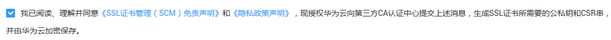

# 一键免费申请测试证书

## 操作场景

该任务指导用户如何一键免费申请测试证书。

## 前提条件

已获取管理控制台的登录账号与密码。

## 操作步骤

1.  登录管理控制台。
2.  单击页面上方的“服务列表“，选择“安全  \>  SSL证书管理“，进入SSL证书管理界面。
3.  在证书列表左上角，单击“免费申请测试证书“，如[图1](#fig2346145623211)所示。

    **图 1**  免费申请测试证书  
    

    > **说明：**   
    >-   一个账号最多可以免费申请20个测试证书。  
    >-   测试证书的签发由系统自动完成，申请者按要求完成配置后即可获得证书，因此无法加速。同时，测试证书建议只用于测试，华为云不提供测试证书安装部署的咨询服务。  

4.  在“补全信息“界面，补全证书信息。
    1.  补全域名信息，“证书请求文件“可以选择“系统生成CSR“或者“自己生成CSR“，在“绑定域名“配置框中，输入证书绑定的域名，如[图2](#zh-cn_topic_0110866215_fig212112271419)所示。

        > **说明：**   
        >CSR即证书签名申请，获取SSL证书，需要先生成CSR文件并提交给证书颁发机构（CA）。CSR包含了公钥和标识名称（Distinguished Name），通常从Web服务器生成CSR，同时创建加解密的公钥私钥对。  

        **图 2**  填写测试证书的域名信息  
        

        > **注意：**   
        >-   建议选择“系统生成CSR“，避免出现内容不正确而导致的审核失败。  
        >-   “自己生成CSR“即手动生成的CSR文件，手动生成CSR文件的同时会生成私钥文件，请务必妥善保管和备份您的私钥。  
        >-   证书服务系统对CSR文件的密钥长度有严格要求，密钥长度必须是2,048位，密钥类型必须为RSA。  
        >-   选中“绑定的域名在【华为云的云解析】产品中，授权系统自动添加一条记录以完成域名授权验证“，如果绑定的域名在华为云的云解析产品中，在成功绑定域名后，系统将自动完成该域名的授权验证。  

    2.  补全联系方式，如[图3](#zh-cn_topic_0110866215_fig974115386374)所示。

        **图 3**  联系方式  
        

        请确保您在填写的姓名、电话、邮箱地址真实有效。

        > **说明：**   
        >-   此处填写的公司联系人/授权人的邮箱会收到华为云发送的通知邮件（证书签发通知），CA中心发来的认证邮件将发送到域名管理员的邮箱，请您提交审核后务必第一时间登录域名管理员的邮箱进行查收和认证。  
        >-   系统会在证书到期前两个月、一个月、一周和到期时，向此处填写的公司联系人/授权人的邮箱和电话分别发送邮件和短信提醒。  
        >-   用户需要填写公司联系人或授权人信息，可以选择填写技术联系人信息。勾选“技术联系人信息（选填）“后，可以填写技术联系人信息。  

5.  确认填写的信息无误后，阅读《SSL证书管理（SCM）免责声明》和《隐私政策声明》，并勾选声明内容前面的框，如[图4](#fig85701212917)所示。

    **图 4**  勾选同意免责声明  
    

6.  单击“确定“。

    证书补全信息完成，页面返回到证书列表，状态更新为“审核中“。

    系统将把您的申请提交到CA认证机构，请您保持电话畅通，并及时查阅邮箱中来自CA认证机构的电子邮件。

    > **说明：**   
    >-   单击“保存“，系统将自动保存填写的信息。  
    >-   根据用户填写的信息，SCM自动生成证书请求文件（Certificate Signing Request，CSR）。  

