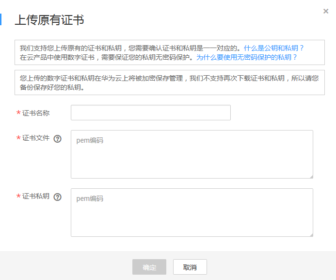

# 上传已有证书

您可以将您所拥有的证书上传到云证书管理平台，以便在云证书管理平台中对您的证书进行统一管理。

该任务指导您如何在本地将外部SSL证书上传到云证书管理平台。

## 前提条件

已获取PEM格式的SSL证书且证书私钥无密码保护，更多详细介绍请参见[为什么要使用无密码保护的私钥？](https://support.huaweicloud.com/ccm_faq/ccm_01_0274.html)。

## 约束条件

-   目前SSL证书管理平台只支持上传PEM格式的证书。其他格式的证书需要转化成PEM格式后才能上传，具体操作请参见[如何将证书格式转换为PEM格式？](https://support.huaweicloud.com/ccm_faq/ccm_01_0128.html)。
-   上传的证书，SSL证书管理控制台会在证书到期前30天提醒您证书即将到期，同时还支持配置消息提醒，设置后SSL证书管理系统会在证书到期前两个月、一个月、一周和到期时，发送邮件和短信提醒用户，具体配置操作请参见[如何配置SSL证书到期提醒？](https://support.huaweicloud.com/ccm_faq/ccm_01_0204.html)。

## 操作步骤

1.  登录[管理控制台](https://console.huaweicloud.com/)。
2.  单击页面左上方的，选择“安全与合规  \>  云证书管理“，进入云证书管理界面。
3.  在左侧导航树中选择“证书管理  \>  SSL证书“，进入“SSL证书管理“界面。
4.  在证书列表左上角，单击“上传原有证书“，进入“上传原有证书“界面。
5.  在“上传原有证书“对话框中，输入证书信息，如[图1](#zh-cn_topic_0000001124401715_zh-cn_topic_0110866194_fig17246889161023)所示，各参数说明如[表1](#zh-cn_topic_0000001124401715_zh-cn_topic_0110866194_table490517514292)所示。

    **图 1**  上传原有证书  
    

    **表 1**  上传证书参数说明

    
    <table><thead align="left"><tr id="zh-cn_topic_0000001124401715_zh-cn_topic_0110866194_row12906135142916"><th class="cellrowborder" valign="top" width="18.8%" id="mcps1.2.3.1.1">
参数

    </th>
    <th class="cellrowborder" valign="top" width="81.2%" id="mcps1.2.3.1.2">
说明

    </th>
    </tr>
    </thead>
    <tbody><tr id="zh-cn_topic_0000001124401715_zh-cn_topic_0110866194_row109081515297"><td class="cellrowborder" valign="top" width="18.8%" headers="mcps1.2.3.1.1 ">
证书名称

    </td>
    <td class="cellrowborder" valign="top" width="81.2%" headers="mcps1.2.3.1.2 ">
用户自定义。

    </td>
    </tr>
    <tr id="zh-cn_topic_0000001124401715_zh-cn_topic_0110866194_row6911165182919"><td class="cellrowborder" valign="top" width="18.8%" headers="mcps1.2.3.1.1 ">
证书文件

    </td>
    <td class="cellrowborder" valign="top" width="81.2%" headers="mcps1.2.3.1.2 ">
以文本方式打开待上传证书里的PEM格式的文件（后缀名为“.pem”），将证书内容复制到此处。

    
按照“服务器证书-证书链”的顺序依次排列上传。具体方法请参见<a href="https://support.huaweicloud.com/ccm_faq/ccm_01_0187.html" target="_blank" rel="noopener noreferrer">如何上传证书文件？</a>。

    </td>
    </tr>
    <tr id="zh-cn_topic_0000001124401715_zh-cn_topic_0110866194_row1491212517291"><td class="cellrowborder" valign="top" width="18.8%" headers="mcps1.2.3.1.1 ">
证书私钥

    </td>
    <td class="cellrowborder" valign="top" width="81.2%" headers="mcps1.2.3.1.2 ">
以文本方式打开待上传证书里的KEY格式的文件（后缀名为“.key”），将私钥复制到此处。

    </td>
    </tr>
    </tbody>
    </table>

    > **说明：** 
    >-   上传的原有证书和秘钥必须是一一对应的。
    >-   保证私钥无密码保护，更多详细介绍请参见[为什么要使用无密码保护的私钥？](https://support.huaweicloud.com/ccm_faq/ccm_01_0274.html)。

6.  单击“确定“，完成上传证书。

    证书上传成功，证书列表中新增一条状态为“托管中“的证书。

    上传的证书可以部署到云产品中。

## 相关操作

上传证书可部署到华为云其他云产品中，具体操作请参见[推送证书到云产品](推送证书到云产品.md#ZH-CN_TOPIC_0114377953)。

