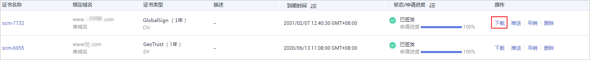
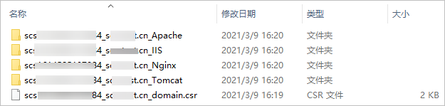

# 下载证书

该任务指导用户在SSL证书管理平台下载证书。

## 前提条件

-   已获取管理控制台的登录账号与密码。
-   “证书状态“为“已签发“或“托管中“。

## 约束条件

-   仅支持在证书有效期内，不限次数的下载证书，下载后即可在服务器（华为云的或非华为云的均可）上进行部署。
-   “证书请求文件“选择的是“系统生成CSR“，下载的文件包含了“Apache“、“IIS“、“Nginx“、“Tomcat“4个文件夹和1个“domain.csr“文件。
-   “证书请求文件“选择的是“自己生成CSR“，下载的证书仅包含一个名为“server.pem“的文件。文件中已经包含两段证书代码，分别是服务器证书和CA中间证书。私钥为用户自行保存的，华为云SSL证书管理不提供。

## 操作步骤

1.  登录[管理控制台](https://console.huaweicloud.com/)。
2.  在左侧导航树中，单击，选择“安全  \>  SSL证书管理“，进入SSL证书管理界面。
3.  在需要下载的证书所在行的“操作“列，单击“下载“，如[图1](#fig121926536132)所示。

    **图 1**  下载证书  
    

4.  请根据您需要的服务类型，在对应的“操作“列单击“下载证书“，进行证书下载操作。
5.  证书下载后，需要安装到对应的服务器上。
    -   在Tomcat上安装SSL证书的详细指导操作请参见[如何在Tomcat上安装SSL证书？](在Tomcat服务器上安装SSL证书.md)。
    -   在Nginx上安装SSL证书的详细指导操作请参见[如何在Nginx上安装SSL证书？](在Nginx服务器上安装SSL证书.md)。
    -   在Apache上安装SSL证书的详细指导操作请参见[如何在Apache上安装SSL证书？](在Apache服务器上安装SSL证书.md)。
    -   在IIS上安装SSL证书的详细指导操作请参见[如何在IIS上安装SSL证书？](在IIS服务器上安装SSL证书.md)。
    -   在Weblogic上安装SSL证书的详细指导操作请参见[在Weblogic服务器上安装SSL证书](在Weblogic服务器上安装SSL证书.md)。

## 下载的证书文件说明

下载文件说明：根据申请证书时，选择的“证书请求文件“方式的不同，下载文件也有所不同。

-   申请证书时，如果“证书请求文件“选择的是“系统生成CSR“，则下载文件说明如下：

    下载的文件包含了“Apache“、“IIS“、“Nginx“、“Tomcat“4个文件夹和1个“domain.csr“文件，如[图2](#fig4414184151010)所示，具体文件说明如[表1](#table116635101410)所示。

    **图 2**  解压SSL证书  
    

    **表 1**  下载文件说明

    
    <table><thead align="left"><tr id="row966491019412"><th class="cellrowborder" valign="top" width="36.04%" id="mcps1.2.3.1.1">
文件夹/文件名称

    </th>
    <th class="cellrowborder" valign="top" width="63.959999999999994%" id="mcps1.2.3.1.2">
文件夹内容

    </th>
    </tr>
    </thead>
    <tbody><tr id="row966411101347"><td class="cellrowborder" valign="top" width="36.04%" headers="mcps1.2.3.1.1 ">
Tomcat

    </td>
    <td class="cellrowborder" valign="top" width="63.959999999999994%" headers="mcps1.2.3.1.2 ">
keystorePass.txt：证书密码。

    
server.jks：证书文件。

    </td>
    </tr>
    <tr id="row366413101949"><td class="cellrowborder" valign="top" width="36.04%" headers="mcps1.2.3.1.1 ">
Nginx

    </td>
    <td class="cellrowborder" valign="top" width="63.959999999999994%" headers="mcps1.2.3.1.2 ">
server.crt：证书文件，包含两段证书代码，分别为服务器证书和CA中间证书。

    
server.key：证书私钥文件，包含一段证书私钥代码。

    </td>
    </tr>
    <tr id="row1065383320412"><td class="cellrowborder" valign="top" width="36.04%" headers="mcps1.2.3.1.1 ">
Apache

    </td>
    <td class="cellrowborder" valign="top" width="63.959999999999994%" headers="mcps1.2.3.1.2 ">
ca.crt：证书链文件，包含一段中级CA代码。

    
server.crt：证书文件，包含一段服务器证书代码。

    
server.key：证书私钥文件，包含一段证书私钥代码。

    </td>
    </tr>
    <tr id="row1286419431648"><td class="cellrowborder" valign="top" width="36.04%" headers="mcps1.2.3.1.1 ">
IIS

    </td>
    <td class="cellrowborder" valign="top" width="63.959999999999994%" headers="mcps1.2.3.1.2 ">
keystorePass.txt：证书密码。

    
server.pfx：证书文件。

    </td>
    </tr>
    <tr id="row35741610193613"><td class="cellrowborder" valign="top" width="36.04%" headers="mcps1.2.3.1.1 ">
domain.csr

    </td>
    <td class="cellrowborder" valign="top" width="63.959999999999994%" headers="mcps1.2.3.1.2 ">
证书请求文件。

    </td>
    </tr>
    </tbody>
    </table>

-   申请证书时，如果“证书请求文件“选择的是“自己生成CSR“，则下载文件说明如下：

    下载的证书仅包含一个名为“server.pem“的文件。文件中已经包含两段证书代码，分别是服务器证书和CA中间证书。

    私钥为用户自行保存的，华为云SSL证书管理不提供。在各个服务器上安装证书时，需要填写对应私钥的位置。

    > **说明：** 
    >“自己生成CSR“的证书不支持推送到云产品。

