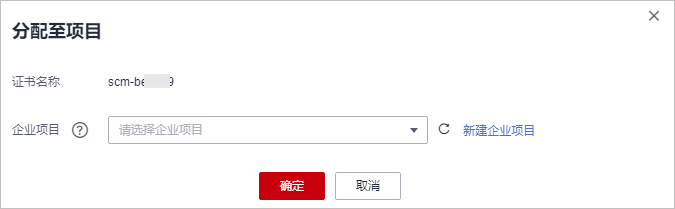

# 分配至企业项目

企业项目是一种云资源管理方式，企业项目管理服务提供统一的云资源按项目管理，以及项目内的资源管理、成员管理。更多关于企业项目的信息，请参见[《企业管理用户指南》](https://support.huaweicloud.com/usermanual-em/zh-cn_topic_0108763975.html)。

该任务指导用户如何将SSL证书分配至对应的企业项目中。

## 前提条件

-   已获取登录管理控制台的帐号与密码。
-   已创建企业项目。如需使用该功能，请[开通企业管理功能](https://support.huaweicloud.com/usermanual-em/em_am_0008.html)。

## 操作步骤

1.  登录[管理控制台](https://console.huaweicloud.com/)。
2.  单击页面左上方的，选择“安全与合规  \>  云证书管理服务“，进入云证书管理界面。
3.  在左侧导航栏选择“SSL证书管理“，进入SSL证书管理页面。
4.  在目标SSL证书所在行的“操作“列，单击“分配至项目“。
5.  在弹出的对话框中，选择迁入的企业项目。

    **图 1**  分配至项目  
    

6.  单击“确定“。

