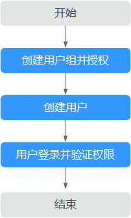

# 创建用户并授权使用SCM

如果您需要对您所拥有的SCM进行精细的权限管理，您可以使用[统一身份认证服务](https://support.huaweicloud.com/usermanual-iam/zh-cn_topic_0079496985.html)（Identity and Access Management，简称IAM），通过IAM，您可以：

-   根据企业的业务组织，在您的华为云账号中，给企业中不同职能部门的员工创建IAM用户，让员工拥有唯一安全凭证，并使用SCM资源。
-   根据企业用户的职能，设置不同的访问权限，以达到用户之间的权限隔离。
-   将SCM资源委托给更专业、高效的其他华为云账号或者云服务，这些账号或者云服务可以根据权限进行代运维。

如果华为云账号已经能满足您的要求，不需要创建独立的IAM用户，您可以跳过本章节，不影响您使用SCM服务的其它功能。

本章节为您介绍对用户授权的方法，操作流程[图1](#fig673713328586)所示。

## 前提条件

-   “SCM Viewer“属于策略，请先在IAM控制台中开通基于策略的访问控制公测，开通方法请参见：[申请基于策略的访问控制公测](https://support.huaweicloud.com/usermanual-iam/iam_01_019.html)。
-   给用户组授权之前，请您了解用户组可以添加的SCM权限，并结合实际需求进行选择，SCM支持的系统权限，请参见[SCM系统权限](https://support.huaweicloud.com/productdesc-scm/scm_01_0070.html)。若您需要对除SCM之外的其它服务授权，IAM支持服务的所有策略请参见[系统权限](https://support.huaweicloud.com/permissions/policy_list.html?product=scm)。

## 示例流程

**图 1**  给用户授权SCM权限流程  

1.  [创建用户组并授权](https://support.huaweicloud.com/usermanual-iam/zh-cn_topic_0046611269.html)

    在IAM控制台创建用户组，并授予SSL证书管理的只读权限“SCM Viewer“。

2.  [创建用户并加入用户组](https://support.huaweicloud.com/usermanual-iam/zh-cn_topic_0046611303.html)

    在IAM控制台创建用户，并将其加入[1](#li8135822590)中创建的用户组。

3.  [用户登录](https://support.huaweicloud.com/usermanual-iam/iam_01_0552.html)并验证权限

    新创建的用户登录控制台，切换至授权区域，验证权限：

    -   在“服务列表“中选择SSL证书管理，进入SCM主界面，单击右上角“购买证书“，尝试购买证书，如果无法购买证书，表示“SCM Viewer“已生效。
    -   在“服务列表“中选择除SSL证书管理外的任一服务，若提示权限不足，表示“SCM Viewer“已生效。

