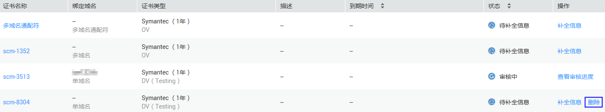

# 删除SSL证书

删除证书是指将证书资源从华为云系统中删除。证书仍然有效，浏览器信任该证书。

该任务指导用户删除不需要的证书。

## 前提条件

-   证书状态为“已到期“。
-   上传的证书状态为“托管中“。
-   购买的证书状态为“已签发“或“已吊销“。

## 约束条件

-   未签发的证书不支持删除，仅支持删除签发成功的证书。
-   证书删除后，华为云平台将不再保管您的证书，证书文件与私钥需要您自行保管，因此建议您只删除不需要的证书。
-   证书删除后，无法恢复，请谨慎操作。

## 操作步骤

1.  登录[管理控制台](https://console.huaweicloud.com/)。
2.  单击页面左上方的，选择“安全与合规  \>  云证书管理服务“，进入云证书管理界面。
3.  在左侧导航栏选择“SSL证书管理“，进入SSL证书管理页面。
4.  在需要删除的证书所在行的“操作“列，单击“删除“或单击“更多 \> 删除“，如[图1](#zh-cn_topic_0000001170537396_zh-cn_topic_0000001124316649_zh-cn_topic_0110866180_fig75253510311)所示。

    **图 1**  删除证书  
    

5.  在弹出的对话框中，单击“确定“，页面右上角弹出“删除证书成功“，完成证书删除。

