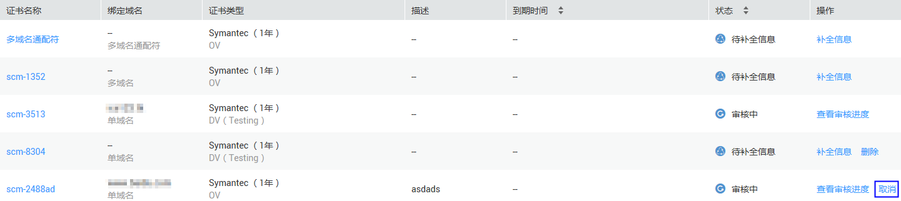

# 取消申请

## 操作场景

该任务指导用户取消申请。

当用户已提交审核，域名注册平台DNS或者用户信息正在审核中，此时用户可以申请取消证书。

取消证书后，CA将终止审核，请谨慎操作。需要注意，由于处理流程的原因，可能您选择取消时CA已经审核通过，那么您的取消申请将会失败。因此，是否取消成功以华为云SCM证书列表呈现最终状态为准。

## 前提条件

-   已获取管理控制台的登录账号与密码。
-   证书状态为“审核中“。

## 操作步骤

1.  登录管理控制台。
2.  选择“安全  \>  SSL证书管理“，进入SSL证书列表界面。
3.  在目标证书所在行的“操作“列，单击“取消“，如[图1](#fig9203145514618)所示。

    **图 1**  取消申请证书  
    

4.  在弹出的“取消证书“对话框中，单击“确定“，页面右上角弹出“取消申请流程成功“，则说明取消证书的申请流程提交成功。

    此时，证书的状态仍然为“审核中“，待服务审核取消证书申请流程通过后，取消证书成功，证书的状态切换为“待补充信息“。

