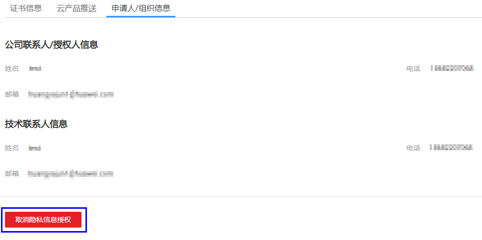

# 取消隐私信息授权

## 操作场景

该任务指导用户取消隐私信息授权。

当用户补全信息后，除了证书的状态处于“审核中”之外，其他的状态中用户可以取消隐私信息授权。

取消隐私信息授权后，华为云将不再保存并删除您的相关信息（包括联系人姓名、电话、邮箱、企业信息）。

> **注意：**   
>取消隐私信息授权后，该证书所属的所有隐私信息将无法恢复，请谨慎操作。  

## 前提条件

-   已获取管理控制台的登录账号与密码。
-   证书已补全信息。
-   证书状态不在“审核中”。

## 操作步骤

1.  登录管理控制台。
2.  单击页面上方的“服务列表“，选择“安全  \>  SSL证书管理“，进入SSL证书管理界面。

1.  单击需要取消授权信息的证书名称，进入证书详情页面。
2.  单击“申请人/组织信息“页签，进入申请人/组织信息详情页面。
3.  单击页面右下角“取消隐私信息授权“，弹出“取消隐私信息授权“对话框。

    **图 1**  取消隐私信息授权  
    

4.  在弹出的“取消隐私信息授权“对话框中，单击“确定“。

    页面右上角弹出“您已成功取消隐私信息授权“，则说明取消隐私信息授权成功。

    证书信息的申请人/组织信息详情页面将不会显示您的相关信息。

