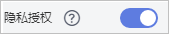

# 取消隐私信息授权

## 操作场景

该任务指导用户取消隐私信息授权。

当用户申请证书后，除了证书的状态处于审核中（即“待完成域名验证“、“待完成组织验证“、“即将签发“和“CA审核中（追加域名）“）之外，其他的状态中用户可以取消隐私信息授权。

取消隐私信息授权后，华为云将不再保存并删除您的相关信息（包括联系人姓名、电话、邮箱、企业信息）。

> **须知：**   
>取消隐私信息授权后，该证书所属的所有隐私信息将无法恢复，请谨慎操作。  

## 前提条件

-   已获取管理控制台的登录账号与密码。
-   已完成申请证书操作。
-   证书状态不在审核中（即“待完成域名验证“、“待完成组织验证“、“即将签发“和“CA审核中（追加域名）“）。

## 操作步骤

1.  登录[管理控制台](https://console.huaweicloud.com/)。
2.  在左侧导航树中，单击，选择“安全  \>  SSL证书管理“，进入SSL证书管理界面。

1.  单击需要取消授权信息的证书名称，系统从右面弹出证书详情页面。
2.  在证书详情的页面最下方，找到“隐私授权“配置项。

    **图 1**  隐私授权  
    

3.  关闭隐私授权。
4.  在弹出的“取消隐私信息授权“对话框中，单击“确定“。

    页面右上角弹出“您已成功取消隐私信息授权“，则说明取消隐私信息授权成功。

    证书详情页面的申请人/组织信息详情页面将不会显示您的相关信息。

