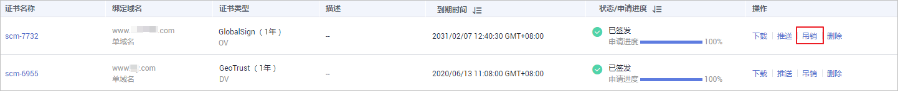
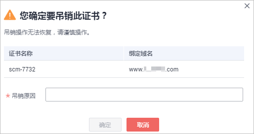

# 吊销SSL证书

该任务指导用户吊销不需要的证书或者丢失私钥的证书。证书吊销后将失去加密效果，浏览器不再信任该证书。

吊销证书后，将清除该证书所有的记录，包括CA机构的记录，且无法恢复，请谨慎操作。

## 前提条件

证书的状态为“已签发“。

## 约束条件

-   仅支持吊销已签发的证书。
-   上传的证书无法吊销。
-   吊销证书申请提交后，将无法取消，但是证书吊销不影响再次购买新证书。

## 操作步骤

1.  登录[管理控制台](https://console.huaweicloud.com/)。
2.  单击页面左上方的，选择“安全与合规  \>  云证书管理服务“，进入云证书管理界面。
3.  在左侧导航栏选择“SSL证书管理“，进入SSL证书管理页面。
4.  在需要吊销的证书所在行的“操作“列中，单击“吊销“或单击“更多 \> 吊销“，如[图1](#zh-cn_topic_0000001170218852_zh-cn_topic_0000001124316611_zh-cn_topic_0114377954_fig20898181553714)所示。

    **图 1**  吊销证书按钮  
    

5.  在弹出的对话框中，输入吊销的原因，单击“确定“。

    在页面的右上角弹出“吊销证书成功“，表示吊销证书申请已成功提交审核，等待CA机构审核通过后即吊销成功。

    > **须知：** 
    >吊销证书申请提交后，将无法取消，请谨慎操作。

    **图 2**  吊销证书提示  
    

6.  （可选）果您要吊销的是OV、EV证书，您需要完成邮件确认。

    提交证书吊销申请后，CA中心会向您的联系人邮箱（即申请该证书时提交的联系人邮箱地址）发送一封确认邮件。您需要及时登录该邮箱并确认吊销证书。

    当您完成邮件确认后，OV、EV证书将会吊销成功。

