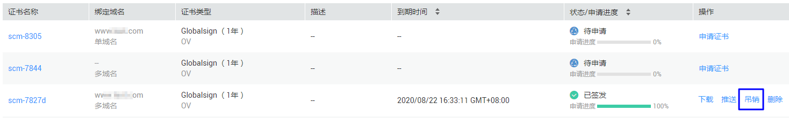
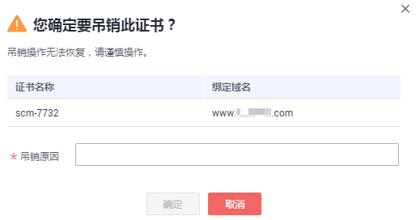

# 吊销证书

## 操作场景

该任务指导用户吊销不需要的证书或者丢失私钥的证书。证书吊销后将失去加密效果，浏览器不再信任该证书。

吊销证书后，将清除该证书所有的记录，包括CA机构的记录，且无法恢复，请谨慎操作。

> **说明：**   
>-   吊销证书申请提交后，将无法取消，请谨慎操作。  
>-   上传的证书无法吊销。  
>-   暂不支持对已经吊销的SSL证书进行退款操作。  
>-   证书签发后的30天内（GlobalSign品牌要求7天内）完成了吊销（提交了吊销申请并完成吊销审核），可申请退款。超过限定时间无法完成吊销的，不退款。  

## 前提条件

-   已获取管理控制台的登录账号与密码。
-   证书的状态为“已签发“。

## 操作步骤

1.  登录[管理控制台](https://console.huaweicloud.com/)。
2.  单击页面上方的“服务列表“，选择“安全  \>  SSL证书管理“，进入SSL证书管理界面。
3.  在需要吊销的证书所在行的“操作“列中，单击“吊销“或单击“更多 \> 吊销“，如[图1](#fig20898181553714)所示。

    **图 1**  吊销证书按钮  
    

4.  在弹出的对话框中，输入吊销的原因，单击“确定“。

    在页面的右上角弹出“吊销证书成功“，表示吊销证书申请已成功提交审核，等待CA机构审核通过后即吊销成功。

    > **须知：**   
    >吊销证书申请提交后，将无法取消，请谨慎操作。  

    **图 2**  吊销证书提示  
    

