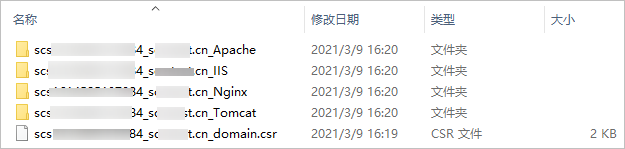

# 在IIS服务器上安装SSL证书<a name="ZH-CN_TOPIC_0171809253"></a>

## 操作场景<a name="section14208195416611"></a>

本章节介绍如何将下载的证书安装到IIS服务器上。安装好证书后，您的Web服务器将能支持SSL通信，从而保证您Web服务器的通信安全。

> **须知：**   
>-   安装前，请务必在IIS服务器上开启“443“端口，避免安装后仍然无法启用HTTPS。  
>-   如果一个域名有多个服务器，则每一个服务器上都要去部署。  

## 前提条件<a name="section171927174218"></a>

-   已获取管理控制台的登录账号与密码。
-   “证书状态“为“已签发“。
-   已下载SSL证书，具体操作请参见[下载证书](下载证书.md)。

## 操作步骤<a name="section6411655151013"></a>

在IIS服务器上安装SSL证书的流程如下所示：

[①获取文件](#section742217010229)  →  [②配置IIS](#section1673412172217)  →  [③效果验证](#section6185131765211)

## 步骤一：获取文件<a name="section742217010229"></a>

安装证书前，需要获取证书文件和密码文件，请根据申请证书时选择的“证书请求文件“生成方式来选择操作步骤：

-   如果申请证书时，“证书请求文件“选择“系统生成CSR“，具体操作请参见：[系统生成CSR](#li11421229112212)。
-   如果申请证书时，“证书请求文件“选择“自己生成CSR“，具体操作请参见：[自己生成CSR](#li84352942216)。

具体操作如下：

-   <a name="li11421229112212"></a>系统生成CSR
    1.  在本地解压已下载的证书文件。

        下载的文件包含了“Apache“、“IIS“、“Nginx“、“Tomcat“4个文件夹和1个“domain.csr“文件，如[图1](#zh-cn_topic_0171809250_zh-cn_topic_0110866190_fdd76c20249e24d95b7a52872f72f84fd)所示。

        **图 1**  本地解压SSL证书<a name="zh-cn_topic_0171809250_zh-cn_topic_0110866190_fdd76c20249e24d95b7a52872f72f84fd"></a>  
        

    2.  从“IIS“文件夹内获得SSL证书文件“server.pfx“和密码文件“keystorePass.txt。“

        > **须知：**   
        >密码文件“keystorePass.txt“中的密码为服务默认生成的初始随机密码，为了保证您的系统安全，建议您及时修改该密码。转换证书格式时可修改密码，详细操作请参见[主流数字证书都有哪些格式？](https://support.huaweicloud.com/scm_faq/scm_01_0054.html)。  


-   <a name="li84352942216"></a>自己生成CSR
    1.  解压已下载的证书压缩包，获得“server.pem“文件。

        “server.pem“文件包括两段证书代码“-----BEGIN CERTIFICATE-----“和“-----END CERTIFICATE-----“，分别为服务器证书和中级CA证书。

    2.  使用OpenSSL工具，将pem格式证书转换为PFX格式证书，得到“server.pfx“文件。
        1.  “pem“文件和生成CSR时的私钥“server.key“放在OpenSSL工具安装目录的bin目录下。
        2.  在OpenSSL工具安装目录的bin目录下，执行以下命令将pem格式证书转换为PFX格式证书，按“Enter”。

            **openssl pkcs12 -export -out server.pfx -inkey server.key -in server.pem**

            回显信息如下：

            ```
            Enter Export Password:
            ```

        3.  输入PFX证书密码，按“Enter”。

            此处输入的密码为用户自定义密码，请根据自己的需求进行设置并输入密码。

            回显信息如下：

            ```
            Verifying - Enter Export Password:
            ```

            > **说明：**   
            >请牢记此处输入的PFX证书密码。后续设置JKS密码需要与此处设置的PFX密码保持一致，否则可能会导致IIS启动失败。  
            >为提高用户密码安全性，建议按以下复杂度要求设置密码：  
            >-   密码长度为8～32个字符。  
            >-   至少需要包含大写字母、小写字母、数字、空格、特殊字符\~\`!@\#$%^&\*\(\)\_+|\{\}:"<\>?-=\\\[\];',./中的3种类型字符。  

        4.  再次输入PFX证书密码，按“Enter”。

            当系统没有回显任何错误信息，表示已在OpenSSL工具安装目录下成功生成“server.pfx“文件。

        5.  在OpenSSL工具安装目录下，新建一个“keystorePass.txt“文件，将PFX的密码保存在该文件中。


## 步骤二：配置IIS<a name="section1673412172217"></a>

1.  安装IIS，请参照IIS相关安装指导进行安装。
2.  打开IIS管理控制台，双击“服务器证书“，如[图2](#zh-cn_topic_0110866162_fdb03405d173b4801bfd78cc32b0a8db5)所示。

    **图 2**  服务器证书<a name="zh-cn_topic_0110866162_fdb03405d173b4801bfd78cc32b0a8db5"></a>  
    

3.  在弹出的窗口中，单击“导入“，如[图3](#zh-cn_topic_0110866162_f5d03b60479e049b69fcee536081c097f)所示。

    **图 3**  导入<a name="zh-cn_topic_0110866162_f5d03b60479e049b69fcee536081c097f"></a>  
    

4.  <a name="zh-cn_topic_0110866162_l339c789af23b4684bb037fe01033bc6c"></a>导入“server.pfx“证书文件，单击“确定“。

    > **说明：**   
    >“密码“配置框内需要输入“keystorePass.txt“文件内的密码。  

    **图 4**  导入pfx证书文件<a name="zh-cn_topic_0110866162_f124ab265d1a0449f898c1e9ef009adf0"></a>  
    

5.  鼠标右键单击目标站点（这里以默认站点为例），选择“编辑绑定“，如[图5](#zh-cn_topic_0110866162_fa67d82525d864c32a2e8629b1e51e9ae)所示。

    **图 5**  编辑绑定<a name="zh-cn_topic_0110866162_fa67d82525d864c32a2e8629b1e51e9ae"></a>  
    

6.  在弹出的窗口中，单击“添加“，并填写以下信息。

    **图 6**  添加网站绑定<a name="zh-cn_topic_0110866162_fa87fe74862bf4577beb6001afffd84bd"></a>  
    

    -   类型：选择“https“。
    -   端口：保持默认的“443“端口即可。
    -   SSL证书：选择[4](#zh-cn_topic_0110866162_l339c789af23b4684bb037fe01033bc6c)导入的证书。

7.  填写完成后，单击“确定“。

## 效果验证<a name="section6185131765211"></a>

部署成功后，可在浏览器的地址栏中输入“https://域名“，按“Enter“。

如果浏览器地址栏显示绿色的小锁标识，则说明证书安装成功。

-   如果网站仍然出现不安全提示，请参见[为什么部署了SSL证书后，网站仍然出现不安全提示？](https://support.huaweicloud.com/scm_faq/scm_01_0098.html)进行处理。
-   如果通过域名访问网站时，无法打开网站，请参见[为什么部署了SSL证书后，通过域名访问网站时，无法打开网站？](https://support.huaweicloud.com/scm_faq/scm_01_0099.html)进行处理。

> **说明：**   
>如果证书安装过程中遇到问题，请在证书下载页面右方的“一对一咨询“中，单击“立即咨询“，联系工程师进行处理。  
>您还可以直接单击[HTTPS服务配置全站加密SSL优化检测](https://market.huaweicloud.com/product/00301-120142-0--0)进行购买，购买服务后，联系工程师进行处理。  

