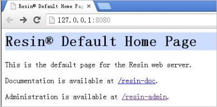

# 在Resin服务器上安装SSL证书<a name="ZH-CN_TOPIC_0000001216304857"></a>

本章节介绍如何将下载的证书安装到Resin服务器上。安装好证书后，您的Web服务器将能支持SSL通信，从而保证您Web服务器的通信安全。

> **说明：** 
>如果证书安装过程中遇到问题，请在证书下载页面右方的“一对一咨询“中，单击“立即咨询“，联系工程师进行处理。
>您还可以直接单击[HTTPS服务配置全站加密SSL优化检测](https://market.huaweicloud.com/product/00301-120142-0--0)进行购买，购买服务后，联系工程师进行处理。

## 前提条件<a name="zh-cn_topic_0000001170378830_zh-cn_topic_0000001119293962_zh-cn_topic_0171809250_section487617561143"></a>

-   “证书状态“为“已签发“。

-   已下载SSL证书，具体操作请参见[下载证书](下载SSL证书.md#ZH-CN_TOPIC_0000001215904793)。

## 约束条件<a name="zh-cn_topic_0000001170378830_zh-cn_topic_0000001124217601_zh-cn_topic_0171809251_section13500821131513"></a>

-   证书安装前，务必在安装SSL证书的服务器上开启“443“端口，同时在安全组增加“443“端口，避免安装后仍然无法启用HTTPS。
-   如果一个域名有多个服务器，则每一个服务器上都要部署。
-   待安装证书的服务器上需要运行的域名，必须与证书的域名一一对应，即购买的是哪个域名的证书，则用于哪个域名。否则安装部署后，浏览器将提示不安全。

## 操作步骤<a name="zh-cn_topic_0000001170378830_zh-cn_topic_0000001119293962_zh-cn_topic_0171809250_section6411655151013"></a>

在Resin服务器上安装SSL证书的流程如下所示：

[①获取文件](#zh-cn_topic_0000001170378830_zh-cn_topic_0000001119293962_zh-cn_topic_0184554056_section97292033920)  →  [②配置Resin](#zh-cn_topic_0000001170378830_zh-cn_topic_0000001119293962_section1676152762620)  →  [③效果验证](#zh-cn_topic_0000001170378830_zh-cn_topic_0000001124217601_zh-cn_topic_0171809251_section17691911165112)

## 步骤一：获取文件<a name="zh-cn_topic_0000001170378830_zh-cn_topic_0000001119293962_zh-cn_topic_0184554056_section97292033920"></a>

安装证书前，需要获取证书文件和密码文件，请根据申请证书时选择的“证书请求文件“生成方式来选择操作步骤：

-   如果申请证书时，“证书请求文件“选择“系统生成CSR“，具体操作请参见：[系统生成CSR](#zh-cn_topic_0000001170378830_zh-cn_topic_0000001119293962_zh-cn_topic_0184554056_li16102103493417)。
-   如果申请证书时，“证书请求文件“选择“自己生成CSR“，具体操作请参见：[自己生成CSR](#zh-cn_topic_0000001170378830_zh-cn_topic_0000001119293962_zh-cn_topic_0184554056_li81041349344)。

具体操作如下：

-   <a name="zh-cn_topic_0000001170378830_zh-cn_topic_0000001119293962_zh-cn_topic_0184554056_li16102103493417"></a>系统生成CSR
    1.  在本地解压已下载的证书文件。

        下载的文件包含了“Apache“、“IIS“、“Nginx“、“Tomcat“4个文件夹和1个“domain.csr“文件，如[图1](#zh-cn_topic_0000001170378830_zh-cn_topic_0000001170697336_zh-cn_topic_0000001124519755_zh-cn_topic_0171809250_zh-cn_topic_0110866190_fdd76c20249e24d95b7a52872f72f84fd)所示。

        **图 1**  本地解压SSL证书<a name="zh-cn_topic_0000001170378830_zh-cn_topic_0000001170697336_zh-cn_topic_0000001124519755_zh-cn_topic_0171809250_zh-cn_topic_0110866190_fdd76c20249e24d95b7a52872f72f84fd"></a>  
        

    2.  从“_证书ID_\__证书绑定的域名_\_Tomcat“文件夹内获得证书文件“_证书ID_\__证书绑定的域名_\_server.jks“和密码文件“_证书ID_\__证书绑定的域名_\_keystorePass.txt“。

        > **须知：** 
        >密码文件“keystorePass.txt“中的密码为服务默认生成的初始随机密码，为了保证您的系统安全，建议您及时修改该密码。转换证书格式时可修改密码，详细操作请参见[主流数字证书都有哪些格式？](https://support.huaweicloud.com/ccm_faq/ccm_01_0054.html)。


-   <a name="zh-cn_topic_0000001170378830_zh-cn_topic_0000001119293962_zh-cn_topic_0184554056_li81041349344"></a>申请证书时，如果“证书请求文件“选择“自己生成CSR“，请参考以下步骤进行配置。
    1.  解压已下载的证书压缩包，获得“_证书ID_\__证书绑定的域名_\_server.pem“文件。

        “_证书ID_\__证书绑定的域名_\_server.pem“文件包括两段证书代码“-----BEGIN CERTIFICATE-----“和“-----END CERTIFICATE-----“，分别为服务器证书和中级CA证书。

    2.  <a name="zh-cn_topic_0000001170378830_zh-cn_topic_0000001119293962_zh-cn_topic_0184554056_zh-cn_topic_0110866190_zh-cn_topic_0168518253_li5678941865"></a>使用OpenSSL工具，将pem格式证书转换为PFX格式证书，得到“server.pfx“文件。
        1.  “pem“文件和生成CSR时的私钥“server.key“放在OpenSSL工具安装目录的bin目录下。
        2.  在OpenSSL工具安装目录的bin目录下，执行以下命令将pem格式证书转换为PFX格式证书，按“Enter”。

            **openssl pkcs12 -export -out server.pfx -inkey server.key -in** _证书ID_\__证书绑定的域名_\_**server.pem**

            回显信息如下：

            ```
            Enter Export Password:
            ```

        3.  <a name="zh-cn_topic_0000001170378830_zh-cn_topic_0000001119293962_li579473023318"></a>输入PFX证书密码，按“Enter”。

            此处输入的密码为用户自定义密码，请根据自己的需求进行设置并输入密码。

            回显信息如下：

            ```
            Verifying - Enter Export Password:
            ```

            > **说明：** 
            >请牢记此处输入的PFX证书密码。后续设置JKS密码需要与此处设置的PFX密码保持一致，否则可能会导致Resin启动失败。
            >为提高用户密码安全性，建议按以下复杂度要求设置密码：
            >-   密码长度为8～32个字符。
            >-   至少需要包含大写字母、小写字母、数字、空格、特殊字符\~\`!@\#$%^&\*\(\)\_+|\{\}:"<\>?-=\\\[\];',./中的3种类型字符。

        4.  再次输入PFX证书密码，按“Enter”。

            当系统没有回显任何错误信息，表示已在OpenSSL工具安装目录下成功生成“server.pfx“文件。

    3.  使用Keytool工具，将PFX格式证书文件转换成JKS格式，得到“server.jks“文件。
        1.  将[2](#zh-cn_topic_0000001170378830_zh-cn_topic_0000001119293962_zh-cn_topic_0184554056_zh-cn_topic_0110866190_zh-cn_topic_0168518253_li5678941865)中生成的“server.pfx“文件拷贝到“%JAVA\_HOME%/jdk/bin“目录下。
        2.  在“%JAVA\_HOME%/jdk/bin“目录下，执行以下命令，按“Enter”。

            **keytool -importkeystore -srckeystore server.pfx -destkeystore server.jks -srcstoretype PKCS12 -deststoretype JKS**

            回显信息如下：

            ```
            输入目标密钥库口令：
            ```

        3.  输入JKS证书密码，按“Enter”。

            > **须知：** 
            >请将JKS密码设置为与PFX证书密码相同的密码，否则可能会导致Resin启动失败。

            回显信息如下：

            ```
            再次输入新口令：
            ```

        4.  再次输入JKS证书密码，按“Enter”。

            回显信息如下：

            ```
            输入源密钥库口令：
            ```

        5.  输入[2.c](#zh-cn_topic_0000001170378830_zh-cn_topic_0000001119293962_li579473023318)中设置PFX证书密码，按“Enter”。

            回显类似如下信息时，则表示转换成功，已在OpenSSL工具安装目录下成功生成“server.jks“文件。

            ```
            已成功导入别名1的条目。
            已完成导入命令：1个条目成功导入，0个条目失败或取消
            ```

        6.  在“%JAVA\_HOME%/jdk/bin“目录下新建一个“keystorePass.txt“文件，将JKS的密码保存在该文件中。

    4.  将转换后的证书文件“server.jks“和新建的密码文件“keystorePass.txt“放在同一目录下。


## 步骤二：配置Resin<a name="zh-cn_topic_0000001170378830_zh-cn_topic_0000001119293962_section1676152762620"></a>

1.  （可选）安装Resin。

    如果已安装，则请跳过该步骤。

    1.  登录[Resin官网](https://caucho.com/)并根据您的系统下载不同的应用程序包。

        本步骤以下载**Windows**版本的**Resin-4.0.38**版本为例进行说明。

    2.  解压下载的Resin包。
    3.  进入Resin-4.0.38根目录并找到resin.exe文件。
    4.  运行resin.exe文件，运行期间将出现如[图2](#zh-cn_topic_0000001170378830_zh-cn_topic_0000001119293962_fig77491348103816)所示的命令提示符窗口。

        **图 2**  提示窗口<a name="zh-cn_topic_0000001170378830_zh-cn_topic_0000001119293962_fig77491348103816"></a>  
        

    5.  运行完成后，启动浏览器，在Web地址栏中输入Resin默认地址“http://127.0.0.1:8080“，并按“Enter“。

        当界面显示如[图3](#zh-cn_topic_0000001170378830_zh-cn_topic_0000001119293962_fig192720218391)所示时，则表示安装成功。

        **图 3**  登录Resin<a name="zh-cn_topic_0000001170378830_zh-cn_topic_0000001119293962_fig192720218391"></a>  
        

2.  修改配置文件。
    1.  在Resin安装目录下的“Resin.properties“配置文件（由于Resin版本的不同，配置文件也可能为“resin.xml“文件）中，找到如下参数：

        ```
        # specifies the --server in the config file
        # home_server : app-0
        
        # Set HTTP and HTTPS bind address
        # http_address : *
        
        # Set HTTP and HTTPS ports.
        # Use overrides for individual server control, for example: app-0.http : 8081
        app.http          : 8080
        # app.https          : 8443
        
        web.http          : 8080
        # web.https          : 8443
        ```

    2.  将“app.https“和“web.https“前的注释符“\#“去掉，并将“8443端“口修改为“443“。修改后，如下所示：

        “app.https“、“web.https“：指定服务器要使用的端口号，建议配置为“443“。

        ```
        # specifies the --server in the config file
        # home_server : app-0
        
        # Set HTTP and HTTPS bind address
        # http_address : *
        
        # Set HTTP and HTTPS ports.
        # Use overrides for individual server control, for example: app-0.http : 8081
        app.http          : 8080
        app.https          : 443
        
        web.http          : 8080
        web.https          : 443
        ```

    3.  找到如下参数，并将“jsse\_keystore\_tye“、“jsse\_keystore\_file“和“jsse\_keystore\_password“三行前的注释符“\#“去掉。

        ```
        # JSSE certificate configuration
        # Keys are typically stored in the resin configuration directory.
        jsse_keystore_tye : jks
        jsse_keystore_file : cert/server.jks
        jsse_keystore_password : 证书密码
        ```

    4.  修改证书相关配置参数，具体配置请参见[表1](#zh-cn_topic_0000001170378830_zh-cn_topic_0000001119293962_zh-cn_topic_0171809250_zh-cn_topic_0110866190_ta67047d5985940a4a548c68bd7f1960b)。

        ```
        # JSSE certificate configuration
        # Keys are typically stored in the resin configuration directory.
        jsse_keystore_tye : jks
        jsse_keystore_file : cert/server.jks
        jsse_keystore_password : 证书密码
        ```

        **表 1**  参数说明

        <a name="zh-cn_topic_0000001170378830_zh-cn_topic_0000001119293962_zh-cn_topic_0171809250_zh-cn_topic_0110866190_ta67047d5985940a4a548c68bd7f1960b"></a>
        <table><thead align="left"><tr id="zh-cn_topic_0000001170378830_zh-cn_topic_0000001119293962_zh-cn_topic_0171809250_zh-cn_topic_0110866190_r67df352686cc4a658647fdc78b35bfae"><th class="cellrowborder" valign="top" width="32.29%" id="mcps1.2.3.1.1"><p id="zh-cn_topic_0000001170378830_zh-cn_topic_0000001119293962_zh-cn_topic_0171809250_zh-cn_topic_0110866190_zh-cn_topic_0168518253_p316602111915"><a name="zh-cn_topic_0000001170378830_zh-cn_topic_0000001119293962_zh-cn_topic_0171809250_zh-cn_topic_0110866190_zh-cn_topic_0168518253_p316602111915"></a><a name="zh-cn_topic_0000001170378830_zh-cn_topic_0000001119293962_zh-cn_topic_0171809250_zh-cn_topic_0110866190_zh-cn_topic_0168518253_p316602111915"></a>参数</p>
        </th>
        <th class="cellrowborder" valign="top" width="67.71000000000001%" id="mcps1.2.3.1.2"><p id="zh-cn_topic_0000001170378830_zh-cn_topic_0000001119293962_zh-cn_topic_0171809250_zh-cn_topic_0110866190_zh-cn_topic_0168518253_p81664211094"><a name="zh-cn_topic_0000001170378830_zh-cn_topic_0000001119293962_zh-cn_topic_0171809250_zh-cn_topic_0110866190_zh-cn_topic_0168518253_p81664211094"></a><a name="zh-cn_topic_0000001170378830_zh-cn_topic_0000001119293962_zh-cn_topic_0171809250_zh-cn_topic_0110866190_zh-cn_topic_0168518253_p81664211094"></a>参数说明</p>
        </th>
        </tr>
        </thead>
        <tbody><tr id="zh-cn_topic_0000001170378830_zh-cn_topic_0000001119293962_zh-cn_topic_0171809250_zh-cn_topic_0110866190_rab9d7c63741a4796b648cec33c2eeab1"><td class="cellrowborder" valign="top" width="32.29%" headers="mcps1.2.3.1.1 "><p id="zh-cn_topic_0000001170378830_zh-cn_topic_0000001119293962_zh-cn_topic_0171809250_zh-cn_topic_0110866190_zh-cn_topic_0168518253_p15166121394"><a name="zh-cn_topic_0000001170378830_zh-cn_topic_0000001119293962_zh-cn_topic_0171809250_zh-cn_topic_0110866190_zh-cn_topic_0168518253_p15166121394"></a><a name="zh-cn_topic_0000001170378830_zh-cn_topic_0000001119293962_zh-cn_topic_0171809250_zh-cn_topic_0110866190_zh-cn_topic_0168518253_p15166121394"></a>jsse_keystore_tye</p>
        </td>
        <td class="cellrowborder" valign="top" width="67.71000000000001%" headers="mcps1.2.3.1.2 "><p id="zh-cn_topic_0000001170378830_zh-cn_topic_0000001119293962_zh-cn_topic_0171809250_zh-cn_topic_0110866190_a81ea998f5a744d12a537d36a88e1f3ce"><a name="zh-cn_topic_0000001170378830_zh-cn_topic_0000001119293962_zh-cn_topic_0171809250_zh-cn_topic_0110866190_a81ea998f5a744d12a537d36a88e1f3ce"></a><a name="zh-cn_topic_0000001170378830_zh-cn_topic_0000001119293962_zh-cn_topic_0171809250_zh-cn_topic_0110866190_a81ea998f5a744d12a537d36a88e1f3ce"></a>设定Keystore文件的类型，一般都设为<strong id="zh-cn_topic_0000001170378830_zh-cn_topic_0000001119293962_b1714653010306"><a name="zh-cn_topic_0000001170378830_zh-cn_topic_0000001119293962_b1714653010306"></a><a name="zh-cn_topic_0000001170378830_zh-cn_topic_0000001119293962_b1714653010306"></a>jks</strong></p>
        </td>
        </tr>
        <tr id="zh-cn_topic_0000001170378830_zh-cn_topic_0000001119293962_zh-cn_topic_0171809250_zh-cn_topic_0110866190_r4aaa7681ab9b4130b1319274970dd370"><td class="cellrowborder" valign="top" width="32.29%" headers="mcps1.2.3.1.1 "><p id="zh-cn_topic_0000001170378830_zh-cn_topic_0000001119293962_zh-cn_topic_0171809250_zh-cn_topic_0110866190_zh-cn_topic_0168518253_p216632116913"><a name="zh-cn_topic_0000001170378830_zh-cn_topic_0000001119293962_zh-cn_topic_0171809250_zh-cn_topic_0110866190_zh-cn_topic_0168518253_p216632116913"></a><a name="zh-cn_topic_0000001170378830_zh-cn_topic_0000001119293962_zh-cn_topic_0171809250_zh-cn_topic_0110866190_zh-cn_topic_0168518253_p216632116913"></a>jsse_keystore_file</p>
        </td>
        <td class="cellrowborder" valign="top" width="67.71000000000001%" headers="mcps1.2.3.1.2 "><p id="zh-cn_topic_0000001170378830_zh-cn_topic_0000001119293962_zh-cn_topic_0171809250_zh-cn_topic_0110866190_zh-cn_topic_0168518253_p11664219915"><a name="zh-cn_topic_0000001170378830_zh-cn_topic_0000001119293962_zh-cn_topic_0171809250_zh-cn_topic_0110866190_zh-cn_topic_0168518253_p11664219915"></a><a name="zh-cn_topic_0000001170378830_zh-cn_topic_0000001119293962_zh-cn_topic_0171809250_zh-cn_topic_0110866190_zh-cn_topic_0168518253_p11664219915"></a><span class="filepath" id="zh-cn_topic_0000001170378830_zh-cn_topic_0000001124519755_zh-cn_topic_0171809250_zh-cn_topic_0110866190_f9864cb7c252549188889dbc21fd1a82e"><a name="zh-cn_topic_0000001170378830_zh-cn_topic_0000001124519755_zh-cn_topic_0171809250_zh-cn_topic_0110866190_f9864cb7c252549188889dbc21fd1a82e"></a><a name="zh-cn_topic_0000001170378830_zh-cn_topic_0000001124519755_zh-cn_topic_0171809250_zh-cn_topic_0110866190_f9864cb7c252549188889dbc21fd1a82e"></a>“server.jks”</span>文件存放路径，绝对路径和相对路径均可。示例：cert/server.jks</p>
        </td>
        </tr>
        <tr id="zh-cn_topic_0000001170378830_zh-cn_topic_0000001119293962_zh-cn_topic_0171809250_zh-cn_topic_0110866190_rd2fe9775052c490b9b1627f41bbc3b2b"><td class="cellrowborder" valign="top" width="32.29%" headers="mcps1.2.3.1.1 "><p id="zh-cn_topic_0000001170378830_zh-cn_topic_0000001119293962_zh-cn_topic_0171809250_zh-cn_topic_0110866190_a454be4a55757417db796a449645b2848"><a name="zh-cn_topic_0000001170378830_zh-cn_topic_0000001119293962_zh-cn_topic_0171809250_zh-cn_topic_0110866190_a454be4a55757417db796a449645b2848"></a><a name="zh-cn_topic_0000001170378830_zh-cn_topic_0000001119293962_zh-cn_topic_0171809250_zh-cn_topic_0110866190_a454be4a55757417db796a449645b2848"></a>jsse_keystore_password</p>
        </td>
        <td class="cellrowborder" valign="top" width="67.71000000000001%" headers="mcps1.2.3.1.2 "><p id="zh-cn_topic_0000001170378830_zh-cn_topic_0000001119293962_zh-cn_topic_0171809250_zh-cn_topic_0110866190_zh-cn_topic_0168518253_p21676213911"><a name="zh-cn_topic_0000001170378830_zh-cn_topic_0000001119293962_zh-cn_topic_0171809250_zh-cn_topic_0110866190_zh-cn_topic_0168518253_p21676213911"></a><a name="zh-cn_topic_0000001170378830_zh-cn_topic_0000001119293962_zh-cn_topic_0171809250_zh-cn_topic_0110866190_zh-cn_topic_0168518253_p21676213911"></a><span class="filepath" id="zh-cn_topic_0000001170378830_zh-cn_topic_0000001124519755_zh-cn_topic_0171809250_zh-cn_topic_0110866190_f44280eacea774b499e3df9674cfbe726"><a name="zh-cn_topic_0000001170378830_zh-cn_topic_0000001124519755_zh-cn_topic_0171809250_zh-cn_topic_0110866190_f44280eacea774b499e3df9674cfbe726"></a><a name="zh-cn_topic_0000001170378830_zh-cn_topic_0000001124519755_zh-cn_topic_0171809250_zh-cn_topic_0110866190_f44280eacea774b499e3df9674cfbe726"></a>“server.jks”</span>的密码。填写<span class="filepath" id="zh-cn_topic_0000001170378830_zh-cn_topic_0000001124519755_zh-cn_topic_0171809250_zh-cn_topic_0110866190_f7cf5e65a199d44009552416579cd69bd"><a name="zh-cn_topic_0000001170378830_zh-cn_topic_0000001124519755_zh-cn_topic_0171809250_zh-cn_topic_0110866190_f7cf5e65a199d44009552416579cd69bd"></a><a name="zh-cn_topic_0000001170378830_zh-cn_topic_0000001124519755_zh-cn_topic_0171809250_zh-cn_topic_0110866190_f7cf5e65a199d44009552416579cd69bd"></a>“keystorePass.txt”</span>文件内的密码。</p>
        <div class="notice" id="zh-cn_topic_0000001170378830_zh-cn_topic_0000001119293962_zh-cn_topic_0171809250_zh-cn_topic_0110866190_note118771122133116"><a name="zh-cn_topic_0000001170378830_zh-cn_topic_0000001119293962_zh-cn_topic_0171809250_zh-cn_topic_0110866190_note118771122133116"></a><a name="zh-cn_topic_0000001170378830_zh-cn_topic_0000001119293962_zh-cn_topic_0171809250_zh-cn_topic_0110866190_note118771122133116"></a><span class="noticetitle"> 须知： </span><div class="noticebody"><p id="zh-cn_topic_0000001170378830_zh-cn_topic_0000001124519755_zh-cn_topic_0171809250_zh-cn_topic_0110866190_p1687872218315"><a name="zh-cn_topic_0000001170378830_zh-cn_topic_0000001124519755_zh-cn_topic_0171809250_zh-cn_topic_0110866190_p1687872218315"></a><a name="zh-cn_topic_0000001170378830_zh-cn_topic_0000001124519755_zh-cn_topic_0171809250_zh-cn_topic_0110866190_p1687872218315"></a>如果密码中包含<strong id="zh-cn_topic_0000001170378830_zh-cn_topic_0000001124519755_zh-cn_topic_0171809250_zh-cn_topic_0110866190_b1075825220319"><a name="zh-cn_topic_0000001170378830_zh-cn_topic_0000001124519755_zh-cn_topic_0171809250_zh-cn_topic_0110866190_b1075825220319"></a><a name="zh-cn_topic_0000001170378830_zh-cn_topic_0000001124519755_zh-cn_topic_0171809250_zh-cn_topic_0110866190_b1075825220319"></a><span class="parmname" id="zh-cn_topic_0000001170378830_zh-cn_topic_0000001124519755_zh-cn_topic_0171809250_zh-cn_topic_0110866190_parmname66211956173220"><a name="zh-cn_topic_0000001170378830_zh-cn_topic_0000001124519755_zh-cn_topic_0171809250_zh-cn_topic_0110866190_parmname66211956173220"></a><a name="zh-cn_topic_0000001170378830_zh-cn_topic_0000001124519755_zh-cn_topic_0171809250_zh-cn_topic_0110866190_parmname66211956173220"></a>“&amp;”</span></strong>，请将其替换成<strong id="zh-cn_topic_0000001170378830_zh-cn_topic_0000001124519755_zh-cn_topic_0171809250_zh-cn_topic_0110866190_b17963939183212"><a name="zh-cn_topic_0000001170378830_zh-cn_topic_0000001124519755_zh-cn_topic_0171809250_zh-cn_topic_0110866190_b17963939183212"></a><a name="zh-cn_topic_0000001170378830_zh-cn_topic_0000001124519755_zh-cn_topic_0171809250_zh-cn_topic_0110866190_b17963939183212"></a><span class="parmname" id="zh-cn_topic_0000001170378830_zh-cn_topic_0000001124519755_zh-cn_topic_0171809250_zh-cn_topic_0110866190_parmname75291505335"><a name="zh-cn_topic_0000001170378830_zh-cn_topic_0000001124519755_zh-cn_topic_0171809250_zh-cn_topic_0110866190_parmname75291505335"></a><a name="zh-cn_topic_0000001170378830_zh-cn_topic_0000001124519755_zh-cn_topic_0171809250_zh-cn_topic_0110866190_parmname75291505335"></a>“&amp;amp;”</span></strong>，以免配置不成功。</p>
        <p id="zh-cn_topic_0000001170378830_zh-cn_topic_0000001124519755_zh-cn_topic_0171809250_zh-cn_topic_0110866190_p8608124915338"><a name="zh-cn_topic_0000001170378830_zh-cn_topic_0000001124519755_zh-cn_topic_0171809250_zh-cn_topic_0110866190_p8608124915338"></a><a name="zh-cn_topic_0000001170378830_zh-cn_topic_0000001124519755_zh-cn_topic_0171809250_zh-cn_topic_0110866190_p8608124915338"></a>示例：</p>
        <p id="zh-cn_topic_0000001170378830_zh-cn_topic_0000001124519755_zh-cn_topic_0171809250_zh-cn_topic_0110866190_p13926175414333"><a name="zh-cn_topic_0000001170378830_zh-cn_topic_0000001124519755_zh-cn_topic_0171809250_zh-cn_topic_0110866190_p13926175414333"></a><a name="zh-cn_topic_0000001170378830_zh-cn_topic_0000001124519755_zh-cn_topic_0171809250_zh-cn_topic_0110866190_p13926175414333"></a>如果keystorePass="Ix6<strong id="zh-cn_topic_0000001170378830_zh-cn_topic_0000001124519755_zh-cn_topic_0171809250_zh-cn_topic_0110866190_b127665710356"><a name="zh-cn_topic_0000001170378830_zh-cn_topic_0000001124519755_zh-cn_topic_0171809250_zh-cn_topic_0110866190_b127665710356"></a><a name="zh-cn_topic_0000001170378830_zh-cn_topic_0000001124519755_zh-cn_topic_0171809250_zh-cn_topic_0110866190_b127665710356"></a>&amp;</strong>APWgcHf72DMu"，则修改为keystorePass="Ix6<strong id="zh-cn_topic_0000001170378830_zh-cn_topic_0000001124519755_zh-cn_topic_0171809250_zh-cn_topic_0110866190_b85241119359"><a name="zh-cn_topic_0000001170378830_zh-cn_topic_0000001124519755_zh-cn_topic_0171809250_zh-cn_topic_0110866190_b85241119359"></a><a name="zh-cn_topic_0000001170378830_zh-cn_topic_0000001124519755_zh-cn_topic_0171809250_zh-cn_topic_0110866190_b85241119359"></a>&amp;amp;</strong>APWgcHf72DMu"。</p>
        </div></div>
        </td>
        </tr>
        </tbody>
        </table>

    5.  修改完成后保存配置文件。

3.  重启Resin。

## 效果验证<a name="zh-cn_topic_0000001170378830_zh-cn_topic_0000001124217601_zh-cn_topic_0171809251_section17691911165112"></a>

部署成功后，可在浏览器的地址栏中输入“https://域名“，按“Enter“。

如果浏览器地址栏显示安全锁标识，则说明证书安装成功。

-   如果网站仍然出现不安全提示，请参见[为什么部署了SSL证书后，网站仍然出现不安全提示？](https://support.huaweicloud.com/ccm_faq/ccm_01_0098.html)进行处理。
-   如果通过域名访问网站时，无法打开网站，请参见[为什么部署了SSL证书后，通过域名访问网站时，无法打开网站？](https://support.huaweicloud.com/ccm_faq/ccm_01_0099.html)进行处理。

