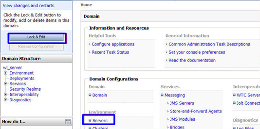
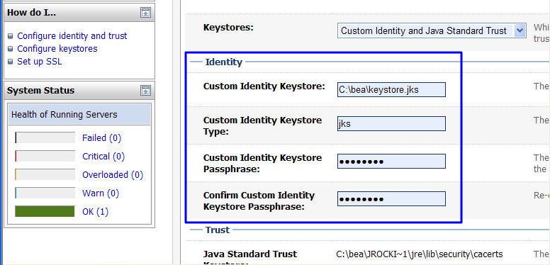
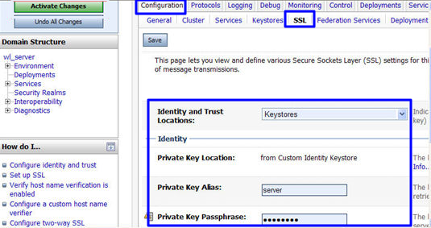
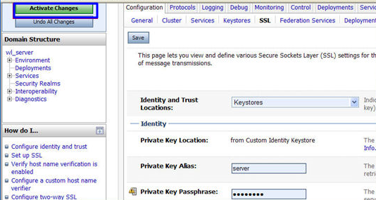

# 在Weblogic服务器上安装SSL证书<a name="ZH-CN_TOPIC_0184554056"></a>

Weblogic基于JAVAEE架构的中间件，Weblogic是用于开发、集成、部署和管理大型分布式Web应用、网络应用和数据库应用的Java应用服务器。将Java的动态功能和Java Enterprise标准的安全性引入大型网络应用的开发、集成、部署和管理之中。

目前Weblogic 10.3.1及其以上的版本支持所有主流品牌的SSL证书，10.3.1之前的版本不支持各品牌SSL证书。

本章节介绍如何将下载的证书安装到Weblogic服务器上。安装好证书后，您的Web服务器将能支持SSL通信，从而保证您Web服务器的通信安全。

## 前提条件<a name="zh-cn_topic_0000001124217543_zh-cn_topic_0184554056_section62921748113314"></a>

-   “证书状态“为“已签发“。
-   已下载SSL证书，具体操作请参见[下载证书](下载证书.md#ZH-CN_TOPIC_0110866214)。

-   已安装JDK。

    Weblogic安装后自带JDK安装。如果未安装，则请安装[Java SE Development Kit \(JDK\)](https://www.oracle.com/technetwork/java/javase/downloads/index.html)。


## 约束条件<a name="zh-cn_topic_0000001124217543_zh-cn_topic_0184554056_section13500821131513"></a>

-   证书安装前，务必在安装SSL证书的服务器上开启“443“端口，同时在安全组增加“443“端口，避免安装后仍然无法启用HTTPS。
-   如果一个域名有多个服务器，则每一个服务器上都要部署。
-   待安装证书的服务器上需要运行的域名，必须与证书的域名一一对应，即购买的是哪个域名的证书，则用于哪个域名。否则安装部署后，浏览器将提示不安全。

## 操作步骤<a name="zh-cn_topic_0000001124217543_zh-cn_topic_0184554056_section6604155243312"></a>

在Weblogic服务器上安装SSL证书的流程如下所示：

[①获取文件](#zh-cn_topic_0000001124217543_zh-cn_topic_0184554056_section97292033920)  →  [②配置Weblogic](#zh-cn_topic_0000001124217543_zh-cn_topic_0184554056_section0621183144418)  →  [③效果验证](#zh-cn_topic_0000001124217543_zh-cn_topic_0184554056_section10711447172315)

## 步骤一：获取文件<a name="zh-cn_topic_0000001124217543_zh-cn_topic_0184554056_section97292033920"></a>

安装证书前，需要获取证书文件和密码文件，请根据申请证书时选择的“证书请求文件“生成方式来选择操作步骤：

-   如果申请证书时，“证书请求文件“选择“系统生成CSR“，具体操作请参见：[系统生成CSR](#zh-cn_topic_0000001124217543_zh-cn_topic_0184554056_li16102103493417)。
-   如果申请证书时，“证书请求文件“选择“自己生成CSR“，具体操作请参见：[自己生成CSR](#zh-cn_topic_0000001124217543_zh-cn_topic_0184554056_li81041349344)。

具体操作如下：

-   <a name="zh-cn_topic_0000001124217543_zh-cn_topic_0184554056_li16102103493417"></a>系统生成CSR
    1.  在本地解压已下载的证书文件。

        下载的文件包含了“Apache“、“IIS“、“Nginx“、“Tomcat“4个文件夹和1个“domain.csr“文件，如[图1](#zh-cn_topic_0000001124217543_zh-cn_topic_0000001124519755_zh-cn_topic_0171809250_zh-cn_topic_0110866190_fdd76c20249e24d95b7a52872f72f84fd)所示。

        **图 1**  本地解压SSL证书<a name="zh-cn_topic_0000001124217543_zh-cn_topic_0000001124519755_zh-cn_topic_0171809250_zh-cn_topic_0110866190_fdd76c20249e24d95b7a52872f72f84fd"></a>  
        

    2.  从“Tomcat“文件夹内获得证书文件“server.jks“和密码文件“keystorePass.txt“。

        > **须知：** 
        >密码文件“keystorePass.txt“中的密码为服务默认生成的初始随机密码，为了保证您的系统安全，建议您及时修改该密码。转换证书格式时可修改密码，详细操作请参见[主流数字证书都有哪些格式？](https://support.huaweicloud.com/ccm_faq/ccm_01_0054.html)。


-   <a name="zh-cn_topic_0000001124217543_zh-cn_topic_0184554056_li81041349344"></a>申请证书时，如果“证书请求文件“选择“自己生成CSR“，请参考以下步骤进行配置。
    1.  解压已下载的证书压缩包，获得“server.pem“文件。

        “server.pem“文件包括两段证书代码“-----BEGIN CERTIFICATE-----“和“-----END CERTIFICATE-----“，分别为服务器证书和中级CA证书。

    2.  <a name="zh-cn_topic_0000001124217543_zh-cn_topic_0184554056_zh-cn_topic_0110866190_zh-cn_topic_0168518253_li5678941865"></a>使用OpenSSL工具，将pem格式证书转换为PFX格式证书，得到“server.pfx“文件。
        1.  “pem“文件和生成CSR时的私钥“server.key“放在OpenSSL工具安装目录的bin目录下。
        2.  在OpenSSL工具安装目录的bin目录下，执行以下命令将pem格式证书转换为PFX格式证书，按“Enter”。

            **openssl pkcs12 -export -out server.pfx -inkey server.key -in server.pem**

            回显信息如下：

            ```
            Enter Export Password:
            ```

        3.  <a name="zh-cn_topic_0000001124217543_zh-cn_topic_0171809250_zh-cn_topic_0110866190_zh-cn_topic_0168518253_li76851541564"></a>输入PFX证书密码，按“Enter”。

            此处输入的密码为用户自定义密码，请根据自己的需求进行设置并输入密码。

            回显信息如下：

            ```
            Verifying - Enter Export Password:
            ```

            > **说明：** 
            >请牢记此处输入的PFX证书密码。后续设置JKS密码需要与此处设置的PFX密码保持一致，否则可能会导致Weblogic启动失败。
            >为提高用户密码安全性，建议按以下复杂度要求设置密码：
            >-   密码长度为8～32个字符。
            >-   至少需要包含大写字母、小写字母、数字、空格、特殊字符\~\`!@\#$%^&\*\(\)\_+|\{\}:"<\>?-=\\\[\];',./中的3种类型字符。

        4.  再次输入PFX证书密码，按“Enter”。

            当系统没有回显任何错误信息，表示已在OpenSSL工具安装目录下成功生成“server.pfx“文件。


    3.  使用Keytool工具，将PFX格式证书文件转换成JKS格式，得到“server.jks“文件。
        1.  将[2](#zh-cn_topic_0000001124217543_zh-cn_topic_0184554056_zh-cn_topic_0110866190_zh-cn_topic_0168518253_li5678941865)中生成的“server.pfx“文件拷贝到“%JAVA\_HOME%/jdk/bin“目录下。
        2.  在“%JAVA\_HOME%/jdk/bin“目录下，执行以下命令，按“Enter”。

            **keytool -importkeystore -srckeystore server.pfx -destkeystore server.jks -srcstoretype PKCS12 -deststoretype JKS**

            回显信息如下：

            ```
            输入目标密钥库口令：
            ```

        3.  输入JKS证书密码，按“Enter”。

            > **须知：** 
            >请将JKS密码设置为与PFX证书密码相同的密码，否则可能会导致Weblogic启动失败。

            回显信息如下：

            ```
            再次输入新口令：
            ```

        4.  再次输入JKS证书密码，按“Enter”。

            回显信息如下：

            ```
            输入源密钥库口令：
            ```

        5.  输入[2.c](#zh-cn_topic_0000001124217543_zh-cn_topic_0171809250_zh-cn_topic_0110866190_zh-cn_topic_0168518253_li76851541564)中设置PFX证书密码，按“Enter”。

            回显类似如下信息时，则表示转换成功，已在OpenSSL工具安装目录下成功生成“server.jks“文件。

            ```
            已成功导入别名1的条目。
            已完成导入命令：1个条目成功导入，0个条目失败或取消
            ```

        6.  在“%JAVA\_HOME%/jdk/bin“目录下新建一个“keystorePass.txt“文件，将JKS的密码保存在该文件中。

    4.  将转换后的证书文件“server.jks“和新建的密码文件“keystorePass.txt“放在同一目录下。


## 步骤二：配置Weblogic<a name="zh-cn_topic_0000001124217543_zh-cn_topic_0184554056_section0621183144418"></a>

1.  登录Weblogic服务器管理控制台。
2.  单击页面左上方“Lock & Edit“，解锁配置。
3.  在“Domain Configurations“中，单击“Servers“。

    **图 2**  服务器<a name="zh-cn_topic_0000001124217543_zh-cn_topic_0184554056_fig879735113488"></a>  
    

4.  在服务器列表中，选择您需要配置服务器证书的Server，进入服务器的设置页面。

    **图 3**  目标服务器<a name="zh-cn_topic_0000001124217543_zh-cn_topic_0184554056_fig1754104620491"></a>  
    

5.  修改HTTPS端口。

    在服务器的配置页面，选择“General“页签，配置是否启用HTTP和HTTPS，以及访问端口号。

    请勾选“Listen SSL Port Enabled“，并修改端口号为“443“。

    **图 4**  端口<a name="zh-cn_topic_0000001124217543_zh-cn_topic_0184554056_fig16458357145714"></a>  
    

6.  配置认证方式和密钥。
    1.  在服务器的配置页面，选择“Keystores“页签，配置认证方式。

        **图 5**  认证方式<a name="zh-cn_topic_0000001124217543_zh-cn_topic_0184554056_fig12273281606"></a>  
        

        -   服务器身份认证请选择“Custom identity and Java Standard Trust“。
        -   双向认证请选择“Custom Identity and Custom Trust“。

    2.  在“Identity“区域中，配置密钥。

        配置密钥库文件server.jks所保存的服务器上的路径，并填写密钥库文件密码。

        **图 6**  密钥<a name="zh-cn_topic_0000001124217543_zh-cn_topic_0184554056_fig8433775524"></a>  
        

        -   **Custom Identity Keystore**：请填写jks文件保存路径。示例：C:\\bea\\server.jks
        -   **Custom Identity Keystore Type**：文件格式请填写“jks“。
        -   **Custom Identity Keystore Passphrase**：请填在证书密码，即“keystorePass.txt“中的密码。
        -   **Confirm Custom Identity Keystore Passphrase**：请再次填写证书密码。

    3.  在单向认证中，需要配置JRE默认信任库文件cacerts。

        Cacerts默认密码为changeit。

        **图 7**  信任库文件<a name="zh-cn_topic_0000001124217543_zh-cn_topic_0184554056_fig129941296171"></a>  
        

        -   **Java Standard Trust Keystore Passphrase**：输入默认密码changeit。
        -   **Confirm Java Standard Trust Keystore Passphrase**：再次输入默认密码。


7.  配置服务器证书私钥别名。

    在服务器的配置页面，选择“SSL“页签，配置以下参数：

    **图 8**  私钥<a name="zh-cn_topic_0000001124217543_zh-cn_topic_0184554056_fig93121941132219"></a>  
    

    -   **Identity and Trust Locations**：请选择为“Keystores“。
    -   **Private KeyAlias**：配置私钥库中的私钥别名信息。私钥别名可以使用**keystool -list**命令查看。
    -   **Private Key Passphrase**：输入私钥保护密码。通常私钥保护密码和keystore文件保护密码相同。
    -   **Confirm** **Private** **Key** **Passphrase**：再次输入私钥保护密码。

8.  设置完成后，单击“Active Changes“，保存所有修改。

    **图 9**  保存配置<a name="zh-cn_topic_0000001124217543_zh-cn_topic_0184554056_fig11766113665315"></a>  
    

9.  （可选）如果系统提示需要重启Weblogic，则需要重启后才能使配置生效。如[图10](#zh-cn_topic_0000001124217543_zh-cn_topic_0184554056_fig68541521201719)所示，则无需重启。

    **图 10**  提示信息<a name="zh-cn_topic_0000001124217543_zh-cn_topic_0184554056_fig68541521201719"></a>  
    


## 效果验证<a name="zh-cn_topic_0184554056_section10711447172315"></a>

部署成功后，可在浏览器的地址栏中输入“https://域名“，按“Enter“。

如果浏览器地址栏显示安全锁标识，则说明证书安装成功。

-   如果网站仍然出现不安全提示，请参见[为什么部署了SSL证书后，网站仍然出现不安全提示？](https://support.huaweicloud.com/ccm_faq/ccm_01_0098.html)进行处理。
-   如果通过域名访问网站时，无法打开网站，请参见[为什么部署了SSL证书后，通过域名访问网站时，无法打开网站？](https://support.huaweicloud.com/ccm_faq/ccm_01_0099.html)进行处理。

