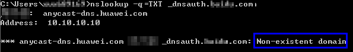

# 手动DNS验证结果排查

手动DNS验证操作完成后，如果您使用的是Windows操作系统，可通过以下方式进行排查：

## 操作步骤

1.  在Windows系统中，单击“开始“，输入“cmd“，进入命令提示符对话框。
2.  在cmd中输入以下命令，查看DNS验证配置是否已经生效。

    **nslookup -q=TXT** _xxx_

    _xxx_代表域名服务商返回的“主机记录“值。

    -   如果界面回显的记录值（text的值）与域名服务商返回的“记录值“一致，如[图1](#zh-cn_topic_0000001171009914_zh-cn_topic_0000001215578709_zh-cn_topic_0000001169740848_fig1141255248)所示，说明域名授权验证配置已经生效。

        **图 1**  域名授权验证配置生效  
        

    -   如果界面回显信息不存在TXT记录，显示为“Non-existent domain“，说明域名授权验证配置未生效。

        **图 2**  域名授权验证配置未生效  
        

3.  如果DNS验证配置未生效，请根据以下可能原因进行排除修改，直至验证生效。

    **表 1**  排查处理

    
    <table><thead align="left"><tr id="zh-cn_topic_0000001171009914_zh-cn_topic_0000001215578709_zh-cn_topic_0000001169740848_row1828919251041"><th class="cellrowborder" valign="top" width="28.939999999999998%" id="mcps1.2.3.1.1">
可能原因

    </th>
    <th class="cellrowborder" valign="top" width="71.06%" id="mcps1.2.3.1.2">
处理方法

    </th>
    </tr>
    </thead>
    <tbody><tr id="zh-cn_topic_0000001171009914_zh-cn_topic_0000001215578709_zh-cn_topic_0000001169740848_row62896252047"><td class="cellrowborder" valign="top" width="28.939999999999998%" headers="mcps1.2.3.1.1 ">
记录配置出错

    </td>
    <td class="cellrowborder" valign="top" width="71.06%" headers="mcps1.2.3.1.2 ">
请您检查“主机记录”或“类型”是否填写正确。

    
如下以华为云的云解析服务中的配置为例进行说明：

    

    </td>
    </tr>
    <tr id="zh-cn_topic_0000001171009914_zh-cn_topic_0000001215578709_zh-cn_topic_0000001169740848_row1428962511415"><td class="cellrowborder" valign="top" width="28.939999999999998%" headers="mcps1.2.3.1.1 ">
配置的生效时间过长，生效时间还未到，因此无法查询到数据。

    </td>
    <td class="cellrowborder" valign="top" width="71.06%" headers="mcps1.2.3.1.2 ">
请您检查生效时间（TTL）是否设置过长，建议将生效时间修改为5分钟。不同的域名提供商的DNS配置不一样，如华为云的DNS（云解析服务）默认是5分钟后生效，如下图所示。

    
若配置的生效时间未到，请等时间到了后再进行验证。

    

    </td>
    </tr>
    </tbody>
    </table>

