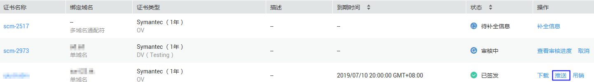
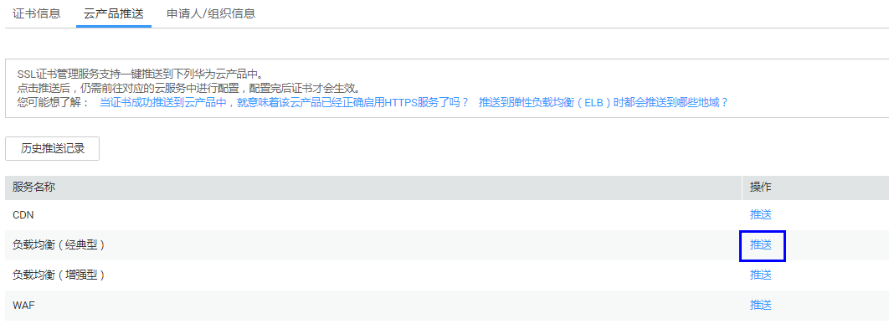

# 推送证书

## 操作场景

该任务指导用户将SSL证书一键推送到弹性负载均衡（Elastic Load Balance，简称ELB）、Web应用防火墙（Web Application Firewall，WAF）、CDN（Content Delivery Network，内容分发网络）等其它华为云产品中。

## 前提条件

-   已获取管理控制台的登录账号与密码。
-   证书的状态为“已签发“、“已到期“或者“托管中“。

## 操作步骤

1.  登录管理控制台。
2.  选择“安全  \>  SSL证书管理“，进入SSL证书列表界面。
3.  在需要推送的证书所在行的“操作“列中，单击“推送“，如[图1](#fig107181543153314)所示。

    **图 1**  推送证书  
    

4.  在“云产品推送“页面，需要推送的目标服务所在行的“操作“列中，单击“推送“，如[图2](#fig1492310253216)所示。

    **图 2**  云产品推送  
    

5.  请根据目标服务执行以下操作。
    -   推送到CDN

        在弹出的对话框中，单击“确定“，在页面右上角弹出推送证书成功提示，表示SSL证书推送给CDN成功。

        您可在证书详情界面，“云产品推送“页签中，单击“历史推送记录“，查看最近10条推送记录。

    -   推送到ELB、WAF
        1.  在弹出的对话框中，单击目标项目右侧的，选择推送的区域。

            **图 3**  目标项目  
            

        2.  单击“确定“，系统弹出提示框。

            在页面右上角弹出推送证书成功提示，表示SSL证书推送给目标服务成功。

            此时，您还需要在目标服务中进行证书配置操作才能在目标服务中正确启用HTTPS服务。具体操作请参见目标服务操作指导。

        3.  在弹出提示框中，确认是否需要立即前往目标服务进行证书配置操作。

            -   是，单击“确定“。系统将进入目标服务管理页面。请进行证书配置操作，具体操作请参见目标服务操作指导。
            -   否，单击“取消“。系统将继续停留在证书详情页面。您可以后续自行前往目标服务器页面进行证书管理配置操作。

            您可在证书详情界面，“云产品推送“页签中，单击“历史推送记录“，查看最近10条推送记录。

