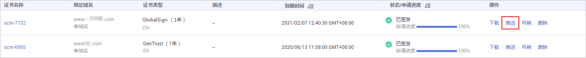
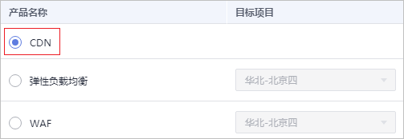
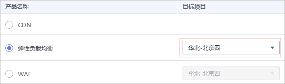

# 推送证书到云产品

## 操作场景

该任务指导用户将SSL证书一键推送到弹性负载均衡（Elastic Load Balance，简称ELB）、Web应用防火墙（Web Application Firewall，WAF）、CDN（Content Delivery Network，内容分发网络）等其它华为云产品中。推送后，可以帮助您提升云产品访问数据的安全性。

> **说明：**   
>-   申请证书时，如果“证书请求文件“选择的是“自己生成CSR“，那么签发的证书不支持推送到云产品。  
>-   如果没有购买对应的云产品，或数字证书所绑定的域名没有在对应的云产品中开通服务，请不要将数字证书推送到对应的云产品中，若推送将可能导致推送失败。  

## 前提条件

-   已获取管理控制台的登录账号与密码。
-   证书的状态为“已签发“或者“托管中“。

## 操作步骤

1.  登录[管理控制台](https://console.huaweicloud.com/)。
2.  在左侧导航树中，单击，选择“安全  \>  SSL证书管理“，进入SSL证书管理界面。
3.  在需要推送的证书所在行的“操作“列，单击“推送“，系统从右面弹出证书推送详细页面，如[图1](#fig4429445388)所示。

    **图 1**  推送证书  
    

4.  选中需要推送的云产品。

    **图 2**  选择云产品  
    

5.  （可选）当推送到ELB、WAF时，需要执行该步骤。

    单击目标项目右侧的，选择推送的区域。

    **图 3**  选择推送区域  
    

6.  在页面右下角单击“推送“。

    页面出现推送证书成功提示，表示SSL证书推送给目标服务成功。

    此时，您还需要在目标服务中进行证书配置操作才能在目标服务中正确启用HTTPS服务。

7.  确认是否需要立即前往目标服务进行证书配置操作。

    -   是，单击“立即前往配置“。系统将进入目标服务管理页面。请进行证书配置操作：

        -   ELB：如果需要支持HTTPS数据传输加密认证，在创建HTTPS协议监听的时候需绑定证书。此时，如果选择一键推送证书到ELB，则可以在ELB中选择已推送的证书。否则，需要手动上传证书。具体操作请参见[ELB证书管理](https://support.huaweicloud.com/usermanual-elb/zh_cn_elb_03_0005.html)文档。

            另外，一般的HTTPS业务场景只对服务器做认证，因此只需要配置服务器的证书即可，某些关键业务（如银行支付），需要对通信双方的身份都要做认证，即双向认证，以确保业务的安全性。双向认证具体操作请参见[HTTPS双向认证](https://support.huaweicloud.com/usermanual-elb/zh_cn_elb_03_0006.html)。

        -   CDN：如果需要实现HTTPS安全加速，则需要通过配置加速域名的HTTPS证书，并将其部署在全网CDN节点。此时，如果选择一键推送证书到CDN，则可以在CDN中选择已推送的证书。否则，需要手动上传证书。具体操作请参见[CDN证书配置](https://support.huaweicloud.com/usermanual-cdn/cdn_01_0086.html)文档。
        -   WAF：当接入防护域名至WAF时，若客户端与WAF之间的通信采用HTTPS协议，则需要配置证书。此时，如果选择一键推送证书到WAF，则可以在WAF中选择已推送的证书。否则，需要手动上传证书。具体操作请参见[WAF证书配置](https://support.huaweicloud.com/usermanual-waf/waf_01_0002.html)文档。

            如果已配置证书到WAF中，仅需要更新证书，具体操作请参见[更新证书](https://support.huaweicloud.com/usermanual-waf/waf_01_0078.html)。

        配置过程中如有问题，请参考相应服务文档进行处理或咨询对应服务。

    -   否，单击“继续推送“或单击页面右上角的。系统将回到证书推送页面或SSL证书管理界面。

        您可以后续自行前往目标服务器页面进行证书管理配置操作。

    您可在证书推送界面，查看最近10条推送记录。

