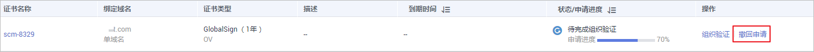

# 撤回证书申请

该任务指导用户撤回申请。

当用户已提交审核，域名注册平台DNS或者用户信息正在审核中，此时用户可以撤回申请。

撤回后，CA将终止审核，请谨慎操作。需要注意，由于处理流程的原因，可能您选择撤回时CA已经审核通过，那么您的撤回申请将会失败。因此，是否撤回成功以华为云SCM证书列表呈现最终状态为准。

## 前提条件

证书状态为“待完成域名验证“、“待完成组织验证“或“CA审核中（追加域名）“。

## 约束条件

-   证书未签发前，可通过撤回证书申请，修改域名或相关信息；证书签发后，如果需要更改绑定的域名，只能在规定的时间内重新签发证书，详细操作请参见[重新签发](重新签发.md#ZH-CN_TOPIC_0300304827)。
-   删除和吊销证书的申请提交后，无法撤回。
-   撤回证书成功后，证书状态处于“待申请“，您需要重新完成“申请证书  \>  域名验证  \>  组织验证“，才可以签发证书。

## 操作步骤

1.  登录[管理控制台](https://console.huaweicloud.com/)。
2.  在左侧导航树中，单击，选择“安全  \>  云证书管理“，进入云证书管理界面。
3.  在左侧导航树中选择“证书管理  \>  SSL证书“，进入“SSL证书管理“界面。
4.  在目标证书所在行的“操作“列，单击“撤回申请“，如[图1](#zh-cn_topic_0000001124217629_zh-cn_topic_0110866197_fig9203145514618)所示。

    **图 1**  撤回申请  
    

5.  在弹出的“取消申请流程“对话框中，单击“确定“，页面右上角弹出“取消申请流程成功“，则说明取消证书的申请流程提交成功。

    此时，证书的状态为“CA审核中（撤回申请）“，待服务审核撤销证书申请流程通过后，撤销成功，证书的状态切换为“待申请“。

    > **须知：** 
    >撤回后，CA将终止审核，请谨慎操作。需要注意，由于处理流程的原因，可能您选择撤回时CA已经审核通过，那么您的撤回申请将会失败。因此，是否撤回成功以华为云SCM证书列表呈现最终状态为准。

## 相关操作

证书申请撤回成功后，证书的状态切换为“待申请“，可再次申请证书，具体操作请参见[申请证书](https://support.huaweicloud.com/qs-ccm/ccm_07_0009.html)。

