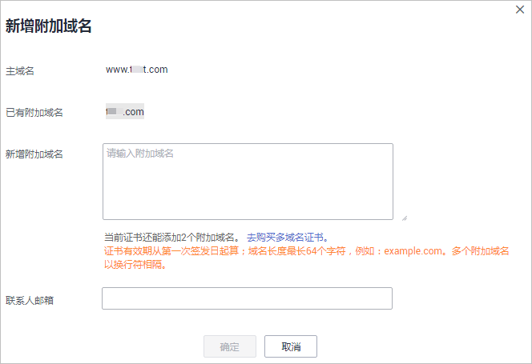

# 新增附加域名

如果您购买的是多域名类型的SSL证书，且该证书有可追加附加域名的额度，您可以在证书签发后，增加附加域名。

本章节介绍如何新增附加域名。

## 前提条件

-   证书状态为“已签发“。
-   待新增附加域名的证书有可追加附加域名的额度。

## 约束条件

-   证书有效期以第一次签发日开始计算。
-   新增附加域名提交审核后，当前证书仍然可以下载（下载的证书不适用于审核中的附加域名）。
-   待新增的附加域名审核完成，证书签发后，即可下载新的证书。原有证书将不再提供下载，用户需自行保存原有证书。

## 操作步骤

1.  登录[管理控制台](https://console.huaweicloud.com/)。
2.  在左侧导航树中，单击，选择“安全与合规  \>  云证书管理“，进入云证书管理界面。
3.  在左侧导航树中选择“证书管理  \>  SSL证书“，进入“SSL证书管理“界面。
4.  在目标证书所在行的“操作“列，单击“更多 \> 新增附加域名“，弹出“新增附加域名“对话框。
5.  在对话框中，补全新增附加域名的信息，如[图1](#zh-cn_topic_0000001124519763_zh-cn_topic_0168543992_fig1964114481101)所示，参数说明如[表1](#zh-cn_topic_0000001124519763_zh-cn_topic_0168543992_table4528632171819)所示。

    **图 1**  新增附加域名  
    

    **表 1**  参数说明

    
    <table><thead align="left"><tr id="zh-cn_topic_0000001124519763_zh-cn_topic_0168543992_row75291532171811"><th class="cellrowborder" valign="top" width="26.1%" id="mcps1.2.4.1.1">
参数名称

    </th>
    <th class="cellrowborder" valign="top" width="47.21%" id="mcps1.2.4.1.2">
参数说明

    </th>
    <th class="cellrowborder" valign="top" width="26.69%" id="mcps1.2.4.1.3">
取值样例

    </th>
    </tr>
    </thead>
    <tbody><tr id="zh-cn_topic_0000001124519763_zh-cn_topic_0168543992_row55291432141818"><td class="cellrowborder" valign="top" width="26.1%" headers="mcps1.2.4.1.1 ">
新增附加域名

    </td>
    <td class="cellrowborder" valign="top" width="47.21%" headers="mcps1.2.4.1.2 ">
输入此次需要添加的附加域名。

    </td>
    <td class="cellrowborder" valign="top" width="26.69%" headers="mcps1.2.4.1.3 ">
domain03.com

    
domain04.com

    </td>
    </tr>
    <tr id="zh-cn_topic_0000001124519763_zh-cn_topic_0168543992_row8529103213181"><td class="cellrowborder" valign="top" width="26.1%" headers="mcps1.2.4.1.1 ">
联系人邮箱

    </td>
    <td class="cellrowborder" valign="top" width="47.21%" headers="mcps1.2.4.1.2 ">
请填写正确的邮箱地址。证书提交审核后华为云将会向您的邮箱发送通知邮件（证书签发通知），请注意及时查收。

    
 须知： 

CA中心发来的认证邮件将发送到域名管理员的邮箱，请您提交审核后务必第一时间登录域名管理员的邮箱进行查收和认证。

    

    </td>
    <td class="cellrowborder" valign="top" width="26.69%" headers="mcps1.2.4.1.3 ">
-

    </td>
    </tr>
    </tbody>
    </table>

6.  单击“确定“。

    新增附加域名完成，页面进入到SSL证书管理界面，状态更新为“CA审核中（追加域名）“。

## 后续处理

提交审核后，证书颁发机构将向您填写的邮箱发送一封域名验证邮件，您需要按照需求进行域名验证。如果您不进行域名验证，您的证书将一直处于“CA审核中（追加域名）“状态，且您的证书将无法通过审核。验证时间根据不同CA中心的要求而不同，请您关注您的邮箱和电话，及时回馈能有效缩短您的数字证书的验证时间。

新增附加域名仅需进行域名验证，待域名验证完成，CA系统中心审核通过后，即可签发证书。

域名验证详细操作请参见[域名验证](https://support.huaweicloud.com/qs-ccm/ccm_07_0010.html)。

## 相关操作

新增域名审核提交后，如需更改新增加的域名或修改联系人邮箱，则可以撤回申请。操作步骤如下：

1.  登录[管理控制台](https://console.huaweicloud.com/)。
2.  在左侧导航树中，单击，选择“安全与合规  \>  云证书管理“，进入云证书管理界面。
3.  在左侧导航树中选择“证书管理  \>  SSL证书“，进入“SSL证书管理“界面。
4.  在目标证书所在行的“操作“列，单击“撤回申请“，弹出“取消申请流程“提示框。
5.  在弹出的“取消申请流程“提示框中，单击“确定“。

    页面右上角弹出“取消申请流程成功“，则说明取消申请流程提交成功。

    此时，证书的状态仍然为“CA审核中（追加域名）“，待服务审核取消申请流程通过后，取消申请成功，证书的状态切换为“已签发“。

