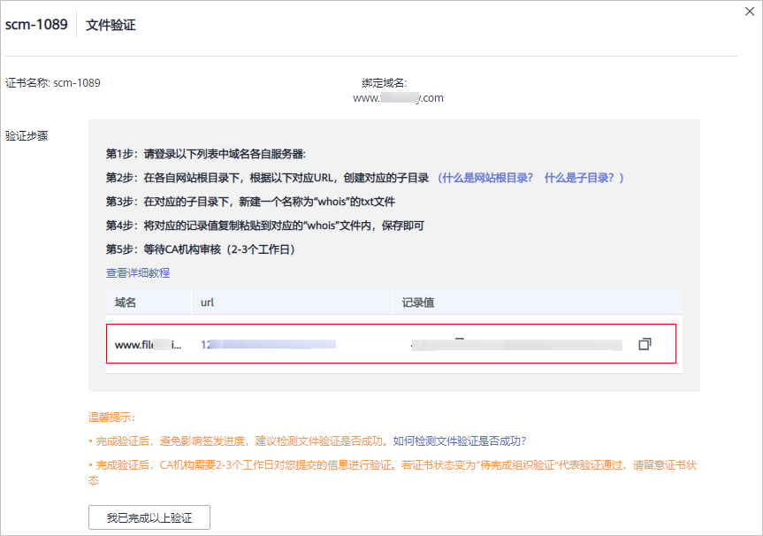

# 方式三：文件验证

按照CA中心的规范，如果您申请了SSL证书，则必须完成域名验证（又称验证域名所有权）来证明待申请证书要绑定的域名属于您。

文件验证，是指您手动从SCM控制台获取证书验证文件，然后在服务器的网站根目录下创建指定文件。CA机构验证文件路径可以被访问，则表示验证通过。

如果您在申请证书时域名验证方式选择了文件验证，请参照本章节进行处理。

## 约束与限制

-   如果绑定的域名带www，则需要验证带www和不带www的两个域名。例如，www.example.com，则需要验证example.com和www.example.com。
-   如果绑定的域名为泛域名，则只需要验证不带\*的域名。例如，\*.example.com，则只需要验证example.com。

## 步骤一：获取验证信息

1.  登录[管理控制台](https://console.huaweicloud.com/)。
2.  单击页面左上方的，选择“安全与合规  \>  云证书管理服务“，进入云证书管理界面。
3.  在左侧导航栏选择“SSL证书管理“，并SSL证书页面中待域名验证的证书所在行的“操作“列，单击“域名验证“，系统从右面弹出域名验证详细页面。
4.  在域名验证页面中，查看此处的“记录值“。

    如果界面未显示，则请按照页面中的提示，登录邮箱（申请证书时填写的邮箱）查看“记录值“。

    **图 1**  文件验证  
    

## 步骤二：创建指定文件

1.  登录您的服务器，并且确保域名已指向该服务器并且对应的网站已正常启用。
2.  在网站根目录下，创建指定的文件。该文件包括文件目录、文件名、文件内容。

    > **说明：** 
    >网站根目录是指您在服务器上存放网站程序的文件夹，大致有这几种表示名称：wwwroot、htdocs、public\_html、webroot等。请您根据实际情况进行操作。

    如下以网站根目录为“/www/htdocs“为例进行说明：

    1.  在网站根目录下，创建“.well-known/pki-validation“子目录。

        此处则在“/www/htdocs“目录下进行创建，请您根据实际情况进行操作。

    2.  在“.well-known/pki-validation“子目录下，创建一个名称为“whois.txt“的文件。
    3.  将[4](#zh-cn_topic_0000001215857175_zh-cn_topic_0000001169580876_li72365415328)中的记录值放在“whois.txt“文件内。

## 步骤三：查看验证配置是否生效

1.  打开浏览器，访问URL地址“https://yourdomain/.well-known/pki-validation/whois.txt“或“http://yourdomain/.well-known/pki-validation/whois.txt“。

    请将URL地址中的yourdomain替换成您申请证书时绑定的域名。

    -   如果您的域名是普通域名，则请参照以下方法进行操作：

        例如，如果您的域名为example.com，则访问的URL地址为：https://example.com/.well-known/pki-validation/whois.txt或http://example.com/.well-known/pki-validation/whois.txt

    -   如果您的域名为泛域名，则请参照以下方法进行操作：

        例如，如果您的域名为\*.domain.com，则访问的URL地址为：https://domain.com/.well-known/pki-validation/whois.txt或http://domain.com/.well-known/pki-validation/whois.txt

2.  确认验证URL地址在浏览器中是否可正常访问，且页面中显示的内容和订单进度页面中的记录值是否内容一致。
    -   如果界面回显的记录值与SSL证书管理控制台的域名验证页面中显示记录值中显示的记录值一致，则说明域名授权验证已生效。
    -   如果界面回显信息不一致，则说明域名授权验证未生效。

3.  如果配置未生效，请从以下几方面进行排查和处理：
    -   检查该验证URL地址是否在HTTPS可访问的地址中存在。如果存在，请在浏览器中使用HTTPS重新访问，如果浏览器提示“证书不可信”或者显示的内容不正确，请您暂时关闭该域名的HTTPS服务。
    -   确保该验证URL地址在任何一个地方都能正确访问。由于有些品牌的检测服务器均在国外，请确认您的站点是否有国外镜像，或者是否使用了智能DNS服务。
    -   检查该验证URL地址是否存在301或302跳转。如存在此类重定向跳转，请取消相关设置关闭跳转。

        您可使用**wget -S** _URL地址_命令检测该验证URL地址是否存在跳转。

