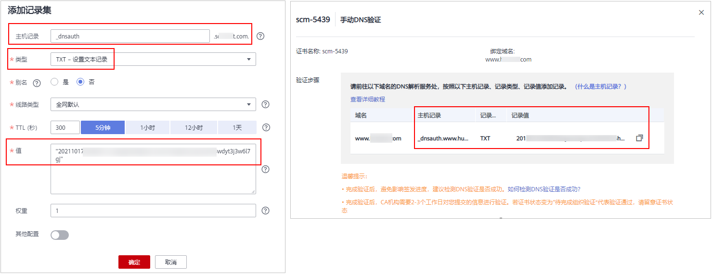

# 方式二：手动DNS验证

按照CA中心的规范，如果您申请了SSL证书，则必须完成域名验证（又称验证域名所有权）来证明待申请证书要绑定的域名属于您。

手动DNS验证，是指您需要在域名的DNS解析服务商手动修改域名的DNS解析记录，在解析记录中添加一条用于验证的TXT类型记录。CA机构验证TXT记录能被解析，则表示验证通过。

如果您在申请证书时域名验证方式选择了手动DNS验证，请参照本章节进行处理。

## 约束与限制

手动DNS验证的域名解析只能在您的域名管理平台上进行操作，具体的解析方法以域名服务商提供的解析方法为准。

## 前提条件

绑定的域名须做实名认证，如果未做实名认证，请前往您的域名服务商处完成域名实名认证。

## （可选）步骤一：域名托管至华为云云解析服务

**DNS验证只能在域名管理平台（即您的域名托管平台）上进行解析**。因此，如果您的域名不在华为云平台中管理，在进行DNS验证时，请确认是否愿意把域名从其他服务商迁移到华为云DNS？

-   是：请执行以下操作步骤：
    1.  请参见[怎样把域名从其他服务商迁移到华为云DNS？](https://support.huaweicloud.com/dns_faq/dns_faq_001.html)，把域名从其他服务商迁移到华为云DNS。
    2.  继续执行[步骤二：获取验证信息](#zh-cn_topic_0000001215578709_zh-cn_topic_0000001169740848_section7859163414285)。

-   否：请在相应的平台上进行DNS验证。例如，域名托管在阿里云，则需要到阿里云的云解析DNS控制台进行相关配置。

> **说明：** 
>如果已在华为云平台中管理您的域名，即证书绑定的域名已使用华为云云解析服务，则请跳过该步骤。

## 步骤二：获取验证信息

1.  登录[管理控制台](https://console.huaweicloud.com/)。
2.  单击页面左上方的，选择“安全与合规  \>  云证书管理服务“，进入云证书管理界面。
3.  在左侧导航栏选择“SSL证书管理“，并SSL证书页面中待域名验证的证书所在行的“操作“列，单击“域名验证“，系统从右面弹出域名验证详细页面。
4.  在证书的域名验证页面，查看并记录“主机记录“、“记录类型“和“记录值“，如[图1](#zh-cn_topic_0000001215578709_zh-cn_topic_0000001169740848_fig1272351623219)所示。

    如果界面未显示，则请登录邮箱（申请证书时填写的邮箱）进行查看。

    **图 1**  查看主机记录  
    

## 步骤三：在华为云云解析服务上进行DNS验证

1.  登录[管理控制台](https://console.huaweicloud.com/)。
2.  选择“网络  \>  云解析服务“，并在云解析页面左侧导航栏，选择“域名解析  \>  公网解析“，进入“公网域名“页面。
3.  在“公网域名“页面的域名列表中，单击需要解析的域名，并在解析记录页面右上角单击“添加记录集“，进入“添加记录集“页面。

    > **说明：** 
    >如果在“解析记录“的域名列表中，已存在带解析域名的TXT记录值，直接在目标域名的“操作“列，单击“修改“，进入“修改记录集“页面。

    **图 2**  域名解析  
    

    **表 1**  域名解析参数说明

    
    <table><thead align="left"><tr id="zh-cn_topic_0000001215578709_zh-cn_topic_0000001169740848_row18461150152415"><th class="cellrowborder" valign="top" width="19.57%" id="mcps1.2.3.1.1">
参数名称

    </th>
    <th class="cellrowborder" valign="top" width="80.43%" id="mcps1.2.3.1.2">
参数说明

    </th>
    </tr>
    </thead>
    <tbody><tr id="zh-cn_topic_0000001215578709_zh-cn_topic_0000001169740848_row14461140172417"><td class="cellrowborder" valign="top" width="19.57%" headers="mcps1.2.3.1.1 ">
<strong id="zh-cn_topic_0000001215578709_zh-cn_topic_0000001169740848_b48623202716">主机记录</strong>

    </td>
    <td class="cellrowborder" valign="top" width="80.43%" headers="mcps1.2.3.1.2 ">
证书的“域名验证”页面，域名服务商返回的“主机记录”。

    
不同的域名服务商返回的主机记录不同，请保持填写记录一致。

    
<strong id="zh-cn_topic_0000001215578709_zh-cn_topic_0000001169740848_b20506945112712">示例：</strong><ul id="zh-cn_topic_0000001215578709_zh-cn_topic_0000001169740848_ul0506204518276"><li>如果域名服务商返回的主机记录为“_dnsauth.example.com”，则主机记录填写“_dnsauth”。</li><li>如果域名服务商返回的主机记录为“example.com”，则主机记录为空，<strong id="zh-cn_topic_0000001215578709_zh-cn_topic_0000001169740848_b43452040195420">不需要填写</strong>。</li></ul>
    

    </td>
    </tr>
    <tr id="zh-cn_topic_0000001215578709_zh-cn_topic_0000001169740848_row346119011242"><td class="cellrowborder" valign="top" width="19.57%" headers="mcps1.2.3.1.1 ">
<strong id="zh-cn_topic_0000001215578709_zh-cn_topic_0000001169740848_b934916613275">类型</strong>

    </td>
    <td class="cellrowborder" valign="top" width="80.43%" headers="mcps1.2.3.1.2 ">
选择“TXT – 设置文本记录”。

    </td>
    </tr>
    <tr id="zh-cn_topic_0000001215578709_zh-cn_topic_0000001169740848_row2814104310328"><td class="cellrowborder" valign="top" width="19.57%" headers="mcps1.2.3.1.1 ">
别名

    </td>
    <td class="cellrowborder" valign="top" width="80.43%" headers="mcps1.2.3.1.2 ">
选择“否”。

    </td>
    </tr>
    <tr id="zh-cn_topic_0000001215578709_zh-cn_topic_0000001169740848_row19461905246"><td class="cellrowborder" valign="top" width="19.57%" headers="mcps1.2.3.1.1 ">
线路类型

    </td>
    <td class="cellrowborder" valign="top" width="80.43%" headers="mcps1.2.3.1.2 ">
选择“全网默认”。

    </td>
    </tr>
    <tr id="zh-cn_topic_0000001215578709_zh-cn_topic_0000001169740848_row134611801240"><td class="cellrowborder" valign="top" width="19.57%" headers="mcps1.2.3.1.1 ">
TTL (秒)

    </td>
    <td class="cellrowborder" valign="top" width="80.43%" headers="mcps1.2.3.1.2 ">
一般建议设置为5分钟。TTL值越大，则DNS记录的同步和更新越慢。

    </td>
    </tr>
    <tr id="zh-cn_topic_0000001215578709_zh-cn_topic_0000001169740848_row5360938132418"><td class="cellrowborder" valign="top" width="19.57%" headers="mcps1.2.3.1.1 ">
<strong id="zh-cn_topic_0000001215578709_zh-cn_topic_0000001169740848_b131981198274">值</strong>

    </td>
    <td class="cellrowborder" valign="top" width="80.43%" headers="mcps1.2.3.1.2 ">
证书的“域名验证”页面，域名服务商返回的“记录值”。

    
 说明： 

记录值必须用英文引号引用后粘贴在文本框中。

    

    </td>
    </tr>
    <tr id="zh-cn_topic_0000001215578709_zh-cn_topic_0000001169740848_row10837134414246"><td class="cellrowborder" colspan="2" valign="top" headers="mcps1.2.3.1.1 mcps1.2.3.1.2 ">
其他的设置保持不变。

    </td>
    </tr>
    </tbody>
    </table>

4.  单击“确定“，记录集添加成功。

    当记录集的状态显示为“正常“时，表示记录集添加成功。

    > **说明：** 
    >该TXT记录在证书签发后才可以删除。

## 步骤四：查看域名验证是否生效

1.  在Windows系统中，单击“开始“，输入“cmd“，进入命令提示符对话框。
2.  在cmd中输入以下命令，查看DNS验证配置是否已经生效。

    **nslookup -q=TXT** _xxx_

    _xxx_代表域名服务商返回的“主机记录“值。

    -   如果界面回显的记录值（text的值）与域名服务商返回的“记录值“一致，如[图3](#zh-cn_topic_0000001215578709_zh-cn_topic_0000001169740848_fig1141255248)所示，说明域名授权验证配置已经生效。

        **图 3**  域名授权验证配置生效  
        

    -   如果界面回显信息不存在TXT记录，显示为“Non-existent domain“，说明域名授权验证配置未生效。

        **图 4**  域名授权验证配置未生效  
        

3.  如果DNS验证配置未生效，请根据以下可能原因进行排除修改，直至验证生效。

    **表 2**  排查处理

    
    <table><thead align="left"><tr id="zh-cn_topic_0000001215578709_zh-cn_topic_0000001169740848_row1828919251041"><th class="cellrowborder" valign="top" width="28.939999999999998%" id="mcps1.2.3.1.1">
可能原因

    </th>
    <th class="cellrowborder" valign="top" width="71.06%" id="mcps1.2.3.1.2">
处理方法

    </th>
    </tr>
    </thead>
    <tbody><tr id="zh-cn_topic_0000001215578709_zh-cn_topic_0000001169740848_row62896252047"><td class="cellrowborder" valign="top" width="28.939999999999998%" headers="mcps1.2.3.1.1 ">
记录配置出错

    </td>
    <td class="cellrowborder" valign="top" width="71.06%" headers="mcps1.2.3.1.2 ">
请您检查“主机记录”或“类型”是否填写正确。

    
如下以华为云的云解析服务中的配置为例进行说明：

    
<b>图1 </b>配置记录 

    
根据域名服务商不同，返回的“主机记录”不同，以下仅为两个样例。

    
<strong id="zh-cn_topic_0000001215578709_zh-cn_topic_0000001124315609_b1264150113617">举例：</strong><ul id="zh-cn_topic_0000001215578709_zh-cn_topic_0000001124315609_ul0264750183615"><li>如果域名服务商返回的“主机记录”为“_dnsauth.www.huawei.com”，则主机记录填写“_dnsauth”。</li><li>如果域名服务商返回的“主机记录”为“www.huawei.com”，则“主机记录”为<strong id="zh-cn_topic_0000001215578709_zh-cn_topic_0000001124315609_b145182208374">空</strong>，<strong id="zh-cn_topic_0000001215578709_zh-cn_topic_0000001124315609_b1584515994219">不需要填写</strong>。</li></ul>
    
 须知： 

请您确认您的域名管理平台提供的主机记录是否支持全域名，如果您的域名管理系统不支持全域名的主机记录，请去掉根域名的后缀部分。

    

    

    </td>
    </tr>
    <tr id="zh-cn_topic_0000001215578709_zh-cn_topic_0000001169740848_row1428962511415"><td class="cellrowborder" valign="top" width="28.939999999999998%" headers="mcps1.2.3.1.1 ">
配置的生效时间过长，生效时间还未到，因此无法查询到数据。

    </td>
    <td class="cellrowborder" valign="top" width="71.06%" headers="mcps1.2.3.1.2 ">
请您检查生效时间（TTL）是否设置过长，建议将生效时间修改为5分钟。不同的域名提供商的DNS配置不一样，如华为云的DNS（云解析服务）默认是5分钟后生效，如下图所示。

    
若配置的生效时间未到，请等时间到了后再进行验证。

    
<b>图2 </b>生效时间 

    </td>
    </tr>
    </tbody>
    </table>

