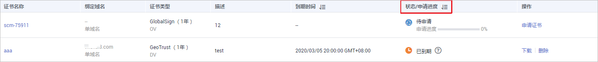

# 查看申请进度

该任务指导用户查看已提交申请的证书的审核进度。

用户可根据申请进度中的提示执行对应操作，以便尽快获取证书。

## 前提条件

-   已获取管理控制台的登录账号与密码。
-   已购买证书。
-   已完成申请证书的操作。

## 操作步骤

1.  登录[管理控制台](https://console.huaweicloud.com/)。
2.  在左侧导航树中，单击，选择“安全  \>  SSL证书管理“，进入SSL证书管理界面。
3.  在待查看审核进度的证书所在行的“状态/申请进度“列，查看证书的申请进度，如[图1](#fig1612862619396)所示。

    **图 1**  查看申请进度  
    

    查看后，请根据证书状态进行对应操作。以下为几个重要操作的示例：

    -   待申请：购买的证书需要提交域名和用户信息，具体操作请参见[申请证书](https://support.huaweicloud.com/qs-scm/scm_07_0003.html)。此时，证书申请进度为0%。
    -   待完成域名验证：已提交申请证书的请求，需要按照CA机构的要求完成域名授权验证，具体操作请参见[域名验证](https://support.huaweicloud.com/qs-scm/scm_07_0004.html)。此时，证书申请进度为40%。
    -   待完成组织验证：如果您申请的是OV或EV类型的证书，域名验证完成后，CA机构将还会确认组织是否发起了此次的证书订单申请。具体操作请参见[组织验证](https://support.huaweicloud.com/qs-scm/scm_07_0005.html)。此时，证书申请进度为70%。
    -   即将签发：已完成域名验证、组织验证等操作，等待CA机构审核中，请您耐心等待。此时，证书申请进度为90%。

    待所有信息验证通过后，证书“状态“更新为“已签发“。

