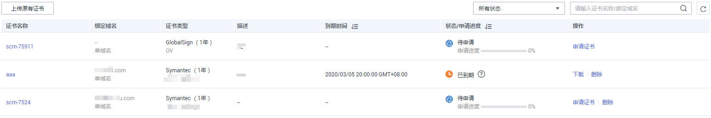
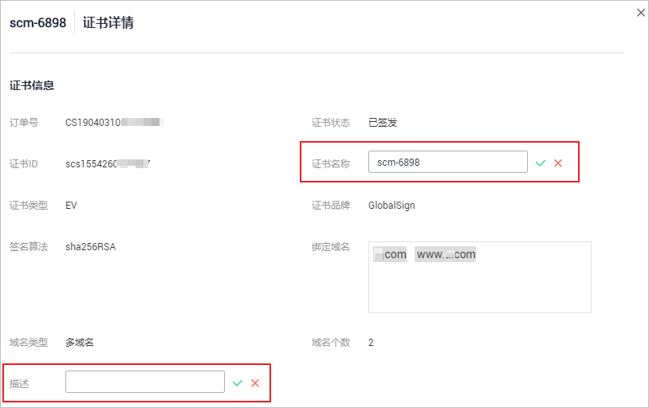

# 查看证书详情

该任务指导用户查看已购买证书的详细信息，包括已购买和上传的证书。

您还可以参考本章节进行查看证书审核进度、修改证书名称和描述的操作，以及证书是否即将到期的提醒。托管中和已签发的证书到期前30天，云证书管理控制台在SSL证书列表的“状态/申请进度“栏会提示您有即将到期的证书。

## 前提条件

已购买证书或者已上传原有证书。

## 操作步骤

1.  登录[管理控制台](https://console.huaweicloud.com/)。
2.  单击页面左上方的，选择“安全与合规  \>  云证书管理“，进入云证书管理界面。
3.  在左侧导航树中选择“证书管理  \>  SSL证书“，进入“SSL证书管理“界面。
4.  查看证书信息，如[图1](#zh-cn_topic_0000001124519785_zh-cn_topic_0110866182_fig1864632765513)所示，证书参数说明如[表1](#zh-cn_topic_0000001124519785_zh-cn_topic_0110866182_table1731752125212)所示。

    **图 1**  证书列表  
    

    > **说明：** 
    >-   在“所有状态“搜索栏选择证书状态，证书列表界面将只显示对应状态的证书。
    >-   输入证书名称或绑定域名的关键字，单击或按“Enter“，可以搜索指定的证书。
    >-   单击证书名称，可以查看证书的详细信息。
    >-   托管中和已签发的证书到期前30天，云证书管理控制台在SSL证书列表的“状态/申请进度“栏会提示您有即将到期的证书。

    **表 1**  证书参数说明

    
    <table><thead align="left"><tr id="zh-cn_topic_0000001124519785_zh-cn_topic_0110866182_row17485275216"><th class="cellrowborder" valign="top" width="20%" id="mcps1.2.3.1.1">
参数名称

    </th>
    <th class="cellrowborder" valign="top" width="80%" id="mcps1.2.3.1.2">
说明

    </th>
    </tr>
    </thead>
    <tbody><tr id="zh-cn_topic_0000001124519785_zh-cn_topic_0110866182_row641052195214"><td class="cellrowborder" valign="top" width="20%" headers="mcps1.2.3.1.1 ">
证书名称

    </td>
    <td class="cellrowborder" valign="top" width="80%" headers="mcps1.2.3.1.2 ">
成功购买证书后，证书名称由系统自动生成，用户可以修改证书名称。具体操作请参见<a href="#zh-cn_topic_0000001124519785_zh-cn_topic_0110866182_section7550844182213">修改证书名称和描述</a>。

    </td>
    </tr>
    <tr id="zh-cn_topic_0000001124519785_zh-cn_topic_0110866182_row1445217527"><td class="cellrowborder" valign="top" width="20%" headers="mcps1.2.3.1.1 ">
绑定域名

    </td>
    <td class="cellrowborder" valign="top" width="80%" headers="mcps1.2.3.1.2 ">
证书绑定的域名信息。

    </td>
    </tr>
    <tr id="zh-cn_topic_0000001124519785_zh-cn_topic_0110866182_row141252195216"><td class="cellrowborder" valign="top" width="20%" headers="mcps1.2.3.1.1 ">
证书类型

    </td>
    <td class="cellrowborder" valign="top" width="80%" headers="mcps1.2.3.1.2 ">
购买证书时选择的证书类型。

    </td>
    </tr>
    <tr id="zh-cn_topic_0000001124519785_zh-cn_topic_0110866182_row14417521521"><td class="cellrowborder" valign="top" width="20%" headers="mcps1.2.3.1.1 ">
描述

    </td>
    <td class="cellrowborder" valign="top" width="80%" headers="mcps1.2.3.1.2 ">
证书的补充信息，用户可以修改描述内容。具体操作请参见<a href="#zh-cn_topic_0000001124519785_zh-cn_topic_0110866182_section7550844182213">修改证书名称和描述</a>。

    </td>
    </tr>
    <tr id="zh-cn_topic_0000001124519785_zh-cn_topic_0110866182_row18681853135313"><td class="cellrowborder" valign="top" width="20%" headers="mcps1.2.3.1.1 ">
到期时间

    </td>
    <td class="cellrowborder" valign="top" width="80%" headers="mcps1.2.3.1.2 ">
证书到期的日期。

    
 说明： 

已签发的证书，系统会在证书到期前两个月、一个月、一周和到期时，发送邮件和短信提醒用户。

    

    </td>
    </tr>
    <tr id="zh-cn_topic_0000001124519785_zh-cn_topic_0110866182_row034581514542"><td class="cellrowborder" valign="top" width="20%" headers="mcps1.2.3.1.1 ">
状态/申请进度

    </td>
    <td class="cellrowborder" valign="top" width="80%" headers="mcps1.2.3.1.2 ">
证书状态/申请进度说明如下：

    <ul id="zh-cn_topic_0000001124519785_zh-cn_topic_0110866182_ul39355114576"><li>待申请
购买的证书需要提交域名和用户信息。具体操作请参见<a href="https://support.huaweicloud.com/qs-ccm/ccm_07_0009.html" target="_blank" rel="noopener noreferrer">申请证书</a>。

    
申请进度为0%。

    </li><li>待完成域名验证
已提交申请证书的请求，需要按照CA机构的要求完成域名授权验证。具体操作请参见<a href="https://support.huaweicloud.com/qs-ccm/ccm_07_0010.html" target="_blank" rel="noopener noreferrer">域名验证</a>。

    
申请进度为40%。

    </li><li>待完成组织验证
如果您申请的是OV或EV类型的证书，域名验证完成后，CA机构将还会确认组织是否发起了此次的证书订单申请。具体操作请参见<a href="https://support.huaweicloud.com/qs-ccm/ccm_07_0011.html" target="_blank" rel="noopener noreferrer">组织验证</a>。

    
申请进度为70%。

    </li><li>即将签发
购买的证书已完成申请证书、域名验证和组织验证，正在等待CA机构签发证书。

    
申请进度为90%。

    </li><li>已签发
域名验证、组织验证成功以及用户信息验证通过。

    
申请进度为100%。

    </li><li>审核失败
用户信息验证失败。

    </li><li>CA审核中（重签）
已签发的证书执行了重新签发操作，正在等待CA机构审核。具体操作请参见<a href="重新签发.md#ZH-CN_TOPIC_0300304827">重新签发</a>。

    </li><li>CA审核中（追加域名）
多域名证书已提交追加域名的申请，CA机构正在对新增的附加域名进行审核。具体操作请参见<a href="新增附加域名.md#ZH-CN_TOPIC_0168543992">新增附加域名</a>。

    </li><li>CA审核中（撤回申请）
购买的证书已提交撤回申请，正在等待CA机构审核。具体操作请参见<a href="撤回证书申请.md#ZH-CN_TOPIC_0110866197">撤回证书申请</a>。

    </li><li>CA审核中（吊销）
购买的证书已提交吊销申请，正在等待CA机构审核。

    </li><li>已吊销
证书已吊销。

    </li><li>托管中
上传的证书的状态为托管中。

    </li><li>已到期
证书已到期。证书到期后无法续费，只能重新购买并申请新证书。

    </li></ul>
    </td>
    </tr>
    <tr id="zh-cn_topic_0000001124519785_zh-cn_topic_0110866182_row1450415155182"><td class="cellrowborder" valign="top" width="20%" headers="mcps1.2.3.1.1 ">
操作

    </td>
    <td class="cellrowborder" valign="top" width="80%" headers="mcps1.2.3.1.2 ">
用户可以在操作栏中，执行申请证书、域名验证、组织验证、撤销申请等操作。

    </td>
    </tr>
    </tbody>
    </table>

## 修改证书名称和描述

1.  登录[管理控制台](https://console.huaweicloud.com/)。
2.  单击页面左上方的，选择“安全与合规  \>  云证书管理“，进入云证书管理界面。
3.  在左侧导航树中选择“证书管理  \>  SSL证书“，进入“SSL证书管理“界面。

1.  单击需要修改的证书名称，系统从右面弹出证书的详情页面。
2.  修改证书名称和描述。

    单击“证书名称“（或“描述“）栏后的展开编辑框，在编辑框中输入证书名称（或描述信息）后，单击保存修改的信息，页面右上角弹出“修改成功“，则说明修改证书名称（或描述信息）成功，如[图2](#zh-cn_topic_0000001124519785_zh-cn_topic_0110866182_fig989510710273)所示。

    **图 2**  修改证书名称和描述  
    

