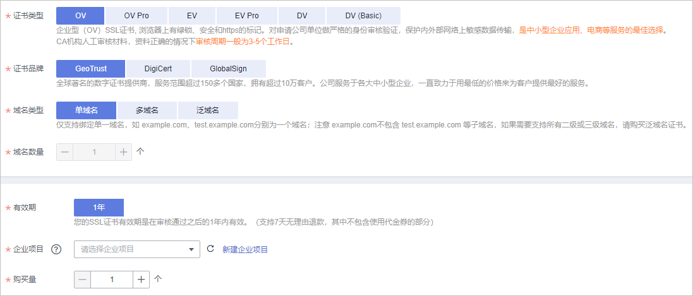

# 步骤一：购买SSL证书

该任务指导用户如何购买SSL证书，包括选择证书的类型、品牌、购买量等。

## 前提条件

购买证书的帐号拥有“SCM Administrator“、“BSS Administrator“和“DNS Administrator“权限。

## 约束条件

-   暂不支持在控制台购买**CFCA国密证书**。如果需要，请通过**工单**进行申请。
-   特殊企业不支持申请OV、EV类型的证书。例如：军队、政府的一些特殊机构、国家保密单位等。

    原因：全国组织机构统一社会信用代码公示查询平台无法在查询到特殊企业的相关信息，因而无法完成组织身份验证，所以特殊企业无法使用OV、EV类型的SSL证书。

## 操作步骤

1.  登录[管理控制台](https://console.huaweicloud.com/)。
2.  单击页面左上方的，选择“安全与合规  \>  云证书管理服务“，进入云证书管理界面。
3.  在左侧导航栏选择“SSL证书管理“，并在SSL证书在界面右上角，单击“购买证书“，进入购买证书页面。
4.  在购买证书页面，选择“证书类型“、“证书品牌“、“域名类型“、“域名数量“、“有效期“，如[图1](#zh-cn_topic_0000001215817231_zh-cn_topic_0000001124518721_zh-cn_topic_0196219184_zh-cn_topic_0195832373_zh-cn_topic_0110865441_febde28a9608b455bacf6a953e615237e)所示。

    **图 1**  服务选型  
    

    1.  选择“证书类型“：

        提供的证书类型以及区别如[表1](#zh-cn_topic_0000001215817231_zh-cn_topic_0000001124518721_table12702927165919)所示，请根据您的需要进行选择。

        **表 1**  证书类型

        
        <table><thead align="left"><tr id="zh-cn_topic_0000001215817231_zh-cn_topic_0000001124518721_row12703182725914"><th class="cellrowborder" valign="top" width="20%" id="mcps1.2.5.1.1">
证书类型

        </th>
        <th class="cellrowborder" valign="top" width="30%" id="mcps1.2.5.1.2">
典型应用场景

        </th>
        <th class="cellrowborder" valign="top" width="30%" id="mcps1.2.5.1.3">
认证强度

        </th>
        <th class="cellrowborder" valign="top" width="20%" id="mcps1.2.5.1.4">
审核周期

        </th>
        </tr>
        </thead>
        <tbody><tr id="zh-cn_topic_0000001215817231_zh-cn_topic_0000001124518721_row1670332718592"><td class="cellrowborder" valign="top" width="20%" headers="mcps1.2.5.1.1 ">
EV、EV Pro

        </td>
        <td class="cellrowborder" valign="top" width="30%" headers="mcps1.2.5.1.2 ">
适用于大型政企/电商/教育/金融/银行/医疗等行业的平台网站、APP应用、小程序等

        </td>
        <td class="cellrowborder" valign="top" width="30%" headers="mcps1.2.5.1.3 ">
严格验证组织及企业真实性和域名所有权

        </td>
        <td class="cellrowborder" valign="top" width="20%" headers="mcps1.2.5.1.4 ">
7～10个<strong id="zh-cn_topic_0000001215817231_zh-cn_topic_0000001124518721_b1659115281006">工作日</strong>

        </td>
        </tr>
        <tr id="zh-cn_topic_0000001215817231_zh-cn_topic_0000001124518721_row1370342795916"><td class="cellrowborder" valign="top" width="20%" headers="mcps1.2.5.1.1 ">
OV、OV Pro

        </td>
        <td class="cellrowborder" valign="top" width="30%" headers="mcps1.2.5.1.2 ">
适用于中小企业的网站、APP应用、小程序等

        </td>
        <td class="cellrowborder" valign="top" width="30%" headers="mcps1.2.5.1.3 ">
验证组织及企业真实性和域名所有权

        </td>
        <td class="cellrowborder" valign="top" width="20%" headers="mcps1.2.5.1.4 ">
3～5个<strong id="zh-cn_topic_0000001215817231_zh-cn_topic_0000001124518721_b1198083118018">工作日</strong>

        </td>
        </tr>
        <tr id="zh-cn_topic_0000001215817231_zh-cn_topic_0000001124518721_row7703427125917"><td class="cellrowborder" valign="top" width="20%" headers="mcps1.2.5.1.1 ">
DV、DV（Basic）

        </td>
        <td class="cellrowborder" valign="top" width="30%" headers="mcps1.2.5.1.2 ">
适用于个人网站、企业测试

        </td>
        <td class="cellrowborder" valign="top" width="30%" headers="mcps1.2.5.1.3 ">
简易验证域名所有权

        </td>
        <td class="cellrowborder" valign="top" width="20%" headers="mcps1.2.5.1.4 ">
数小时内快速颁发

        </td>
        </tr>
        <tr id="zh-cn_topic_0000001215817231_zh-cn_topic_0000001124518721_row1881813479815"><td class="cellrowborder" colspan="4" valign="top" headers="mcps1.2.5.1.1 mcps1.2.5.1.2 mcps1.2.5.1.3 mcps1.2.5.1.4 ">
更多关于证书类型的区别，请参见<a href="https://support.huaweicloud.com/productdesc-ccm/ccm_01_0219.html" target="_blank" rel="noopener noreferrer">各证书之间的区别</a>。

        </td>
        </tr>
        </tbody>
        </table>

    2.  选择“证书品牌“：

        当前支持的品牌包括“GeoTrust“、“DigiCert“、“GlobalSign“。关于证书类型的区别，请参见[各证书之间的区别](https://support.huaweicloud.com/productdesc-ccm/ccm_01_0219.html)。

    3.  选择“域名类型“：

        域名的类型，支持“单域名“、“多域名“和“泛域名“。具体参数说明如[表2](#zh-cn_topic_0000001215817231_zh-cn_topic_0000001124518721_zh-cn_topic_0196219184_zh-cn_topic_0195832373_zh-cn_topic_0110865441_table29981458163911)所示。

        **表 2**  域名类型

        
        <table><thead align="left"><tr id="zh-cn_topic_0000001215817231_zh-cn_topic_0000001124518721_zh-cn_topic_0196219184_zh-cn_topic_0195832373_zh-cn_topic_0110865441_row15999258123913"><th class="cellrowborder" valign="top" width="23.46%" id="mcps1.2.3.1.1">
参数名称

        </th>
        <th class="cellrowborder" valign="top" width="76.53999999999999%" id="mcps1.2.3.1.2">
参数说明

        </th>
        </tr>
        </thead>
        <tbody><tr id="zh-cn_topic_0000001215817231_zh-cn_topic_0000001124518721_zh-cn_topic_0196219184_zh-cn_topic_0195832373_zh-cn_topic_0110865441_row299965823914"><td class="cellrowborder" valign="top" width="23.46%" headers="mcps1.2.3.1.1 ">
单域名

        </td>
        <td class="cellrowborder" valign="top" width="76.53999999999999%" headers="mcps1.2.3.1.2 ">
即单个SSL证书只支持绑定1个单域名。例如，example.com

        </td>
        </tr>
        <tr id="zh-cn_topic_0000001215817231_zh-cn_topic_0000001124518721_zh-cn_topic_0196219184_zh-cn_topic_0195832373_zh-cn_topic_0110865441_row149998582391"><td class="cellrowborder" valign="top" width="23.46%" headers="mcps1.2.3.1.1 ">
多域名

        </td>
        <td class="cellrowborder" valign="top" width="76.53999999999999%" headers="mcps1.2.3.1.2 ">
即单个SSL证书可以同时绑定多个域名。

        
最多可以支持100个域名。

        </td>
        </tr>
        <tr id="zh-cn_topic_0000001215817231_zh-cn_topic_0000001124518721_zh-cn_topic_0196219184_zh-cn_topic_0195832373_zh-cn_topic_0110865441_row899945813915"><td class="cellrowborder" valign="top" width="23.46%" headers="mcps1.2.3.1.1 ">
泛域名

        </td>
        <td class="cellrowborder" valign="top" width="76.53999999999999%" headers="mcps1.2.3.1.2 ">
即单个SSL证书支持绑定一个且只有一个泛域名。*.*.example.com多个通配符的泛域名不支持。

        
泛域名只允许添加一个通配符域名，例如*.example.com（包含a.example.com、b.example.com、......，但是不包含a.a.example.com）。

        </td>
        </tr>
        <tr id="zh-cn_topic_0000001215817231_zh-cn_topic_0000001124518721_zh-cn_topic_0196219184_zh-cn_topic_0195832373_zh-cn_topic_0110865441_row993151974114"><td class="cellrowborder" colspan="2" valign="top" headers="mcps1.2.3.1.1 mcps1.2.3.1.2 ">
更多关于如何选择域名类型，详情请参见<a href="https://support.huaweicloud.com/ccm_faq/ccm_01_0271.html#section2" target="_blank" rel="noopener noreferrer">如何选择域名类型？</a>

        </td>
        </tr>
        </tbody>
        </table>

    4.  设置“域名数量“：
        -   “域名类型“选择“单域名“和“泛域名“时，域名数量限制为1个。
        -   “域名类型“选择“多域名“时，域名数量范围为“2\~100“。域名数量须满足以下条件：

            -   **主域名**数量固定为1个
            -   **附加单域名**数量≥1个（当证书类型为OV、OV Pro时，**附加单域名**数量+**附加泛域名**数量≥1）

            **图 2**  域名类型  
            

    5.  选择“有效期“：默认为1年。

        证书有效期从证书最终签发的时间开始计算，到期后，需要重新购买并完成证书申请流程。

    6.  设置“购买量“：设置购买的证书个数。

5.  确认参数配置无误后，在页面右下角，单击“立即购买“。

    如果您对价格有疑问，可以单击页面左下角的“了解计费详情“，了解产品价格。

6.  确认订单无误后，阅读并勾选“我已阅读并同意《SSL证书管理（SCM）免责声明》“，单击“去支付“。
7.  在购买页面，请选择付款方式进行付款。

    成功付款后，在SSL证书管理界面，可以查看证书列表中购买的证书。

## 后续处理

成功购买SSL证书后，请参考[申请证书](步骤二-申请SSL证书.md#ZH-CN_TOPIC_0000001216146273)为证书绑定域名，并填写证书申请人的详细信息。

