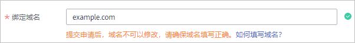
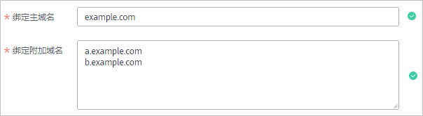
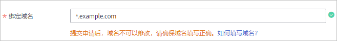
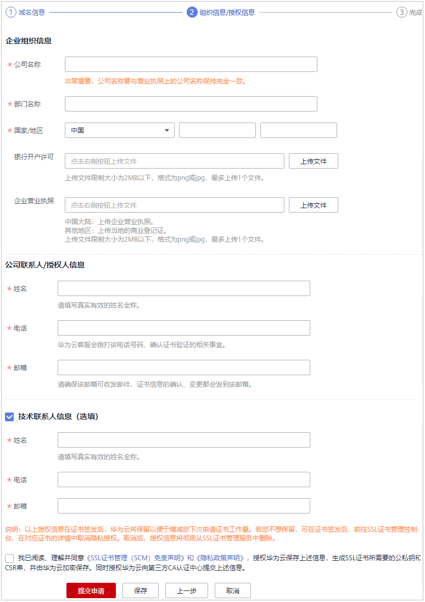

# 步骤二：申请SSL证书

成功购买证书后，您需要申请证书，即为证书绑定域名、填写证书申请人的详细信息并提交审核。所有信息通过审核后，证书颁发机构才签发证书。

本章节将介绍申请证书的详细操作。

## 前提条件

证书的状态为“待申请“。

## 约束限制

-   绑定域名时，如果需要绑定中文域名，请先使用**Punycode编码**工具将中文域名编码，再使用编码后信息来申请证书。
-   由于各个证书品牌针对www型域名有不同的惠赠活动，具体的详见[证书品牌](https://support.huaweicloud.com/productdesc-ccm/ccm_01_0219.html#section0)。

## 操作步骤

1.  登录[管理控制台](https://console.huaweicloud.com/)。
2.  单击页面左上方的，选择“安全与合规  \>  云证书管理服务“，进入云证书管理界面。
3.  在左侧导航栏选择“SSL证书管理“，并SSL证书页面中待申请证书所在行的“操作“列，单击“申请证书“，系统从右面弹出申请证书详细页面。
4.  在弹出申请证书详细页面中，填写域名信息。
    1.  **证书请求文件**

        证书请求文件（Certificate Signing Request，CSR）即证书签名申请，包含了您的服务器信息和公司信息。申请证书时需要将您证书的CSR文件提交给CA认证中心审核。

        选择证书请求文件生成方式：

        -   系统生成CSR（**推荐**）：系统将自动帮您生成证书私钥，并且您可以在证书申请成功后直接在证书管理页面下载您的证书和私钥。
        -   自己生成CSR：手动生成CSR文件并将文件内容复制到CSR文件内容对话框中。详细操作请参见[如何制作CSR文件？](https://support.huaweicloud.com/ccm_faq/ccm_01_0059.html)。

        两种证书请求文件的区别请参见[系统生成的CSR和自己生成CSR的区别？](https://support.huaweicloud.com/ccm_faq/ccm_01_0234.html)。

    2.  **绑定域名**
        -   当“证书请求文件“选择“自己生成CSR“时，域名将根据CSR文件自动解析出来，不需要手动输入域名。
        -   当“证书请求文件“选择“系统生成CSR“时，需要手动输入证书需要绑定的域名。

            **表 1**  绑定域名

            
            <table><thead align="left"><tr id="zh-cn_topic_0000001170378824_zh-cn_topic_0000001124518813_row13150528114214"><th class="cellrowborder" valign="top" width="24.7%" id="mcps1.2.3.1.1">
域名类型

            </th>
            <th class="cellrowborder" valign="top" width="75.3%" id="mcps1.2.3.1.2">
填写说明

            </th>
            </tr>
            </thead>
            <tbody><tr id="zh-cn_topic_0000001170378824_zh-cn_topic_0000001124518813_row015062819424"><td class="cellrowborder" valign="top" width="24.7%" headers="mcps1.2.3.1.1 ">
<strong id="zh-cn_topic_0000001170378824_zh-cn_topic_0000001124518813_b41271042165217">单域名</strong>

            </td>
            <td class="cellrowborder" valign="top" width="75.3%" headers="mcps1.2.3.1.2 ">
填写需要绑定的1个域名。

            
例如，需要绑定域名为example.com，则填写如下图所示：

            

            </td>
            </tr>
            <tr id="zh-cn_topic_0000001170378824_zh-cn_topic_0000001124518813_row121501528164216"><td class="cellrowborder" valign="top" width="24.7%" headers="mcps1.2.3.1.1 ">
<strong id="zh-cn_topic_0000001170378824_zh-cn_topic_0000001124518813_b6509844115220">多域名</strong>

            </td>
            <td class="cellrowborder" valign="top" width="75.3%" headers="mcps1.2.3.1.2 ">
需要绑定<strong id="zh-cn_topic_0000001170378824_zh-cn_topic_0000001124518813_b16017568561">主域名</strong>和<strong id="zh-cn_topic_0000001170378824_zh-cn_topic_0000001124518813_b7018563569">附加域名</strong>。

            
例如，需要绑定域名为example.com、a.example.com和b.example.com，则填写如下图所示：

            

            
 说明： 
<ul id="zh-cn_topic_0000001170378824_zh-cn_topic_0000001124518813_ul1059585516571"><li>附加域名须<strong id="zh-cn_topic_0000001170378824_zh-cn_topic_0000001124518813_b1183511422010">大于等于1个</strong>。附加域名可分批次进行录入，具体操作请参见<a href="https://support.huaweicloud.com/usermanual-ccm/ccm_01_0069.html" target="_blank" rel="noopener noreferrer">新增附加域名</a>。</li><li>多个附加域名请换行输入。</li><li>如果购买的是组合证书（单域名+泛域名），<strong id="zh-cn_topic_0000001170378824_zh-cn_topic_0000001124518813_b185091722502">主域名仅支持绑定单域名</strong>。</li><li>主域名和附加域名的关系（主从关系）对添加的域名没有影响。</li></ul>
            

            

            </td>
            </tr>
            <tr id="zh-cn_topic_0000001170378824_zh-cn_topic_0000001124518813_row715018285427"><td class="cellrowborder" valign="top" width="24.7%" headers="mcps1.2.3.1.1 ">
<strong id="zh-cn_topic_0000001170378824_zh-cn_topic_0000001124518813_b699524615525">泛域名</strong>

            </td>
            <td class="cellrowborder" valign="top" width="75.3%" headers="mcps1.2.3.1.2 ">
填写需要绑定的1个泛域名。

            
例如，需要绑定域名为*.example.com，则填写如下图所示：

            

            </td>
            </tr>
            <tr id="zh-cn_topic_0000001170378824_zh-cn_topic_0000001124518813_row261554719433"><td class="cellrowborder" colspan="2" valign="top" headers="mcps1.2.3.1.1 mcps1.2.3.1.2 ">
如果需要绑定中文域名，请先使用<strong id="zh-cn_topic_0000001170378824_zh-cn_topic_0000001124518813_b2073215374414">Punycode编码</strong>工具将中文域名编码，再填写编码后信息。

            
示例：<strong id="zh-cn_topic_0000001170378824_zh-cn_topic_0000001124518813_b1499785814310">华为云.com</strong> Punycode 编码后：<strong id="zh-cn_topic_0000001170378824_zh-cn_topic_0000001124518813_b699745834313">xn--siq1ht8k.com</strong>，则在“绑定域名”中填写xn--siq1ht8k.com

            </td>
            </tr>
            </tbody>
            </table>

    3.  **域名验证方式**

        按照CA中心的规范，如果您申请了数字证书，您必须配合完成域名授权验证来证明您对所申请绑定的域名的所有权。当您按照要求正确配置域名验证信息，待域名授权验证完成，CA系统中心审核通过后，证书审核才可以进入下一个状态。

        > **说明：** 
        >DV型SSL证书默认通过“DNS验证“方式进行验证，无需进行配置。

        **表 2**  域名验证方式

        
        <table><thead align="left"><tr id="zh-cn_topic_0000001170378824_zh-cn_topic_0000001124518813_row9939757547"><th class="cellrowborder" valign="top" width="25%" id="mcps1.2.4.1.1">
验证方式

        </th>
        <th class="cellrowborder" valign="top" width="37%" id="mcps1.2.4.1.2">
说明

        </th>
        <th class="cellrowborder" valign="top" width="38%" id="mcps1.2.4.1.3">
使用条件及限制

        </th>
        </tr>
        </thead>
        <tbody><tr id="zh-cn_topic_0000001170378824_zh-cn_topic_0000001124518813_row169390555413"><td class="cellrowborder" valign="top" width="25%" headers="mcps1.2.4.1.1 ">
DNS验证（<strong id="zh-cn_topic_0000001170378824_zh-cn_topic_0000001124518813_b16965165545813">自动DNS验证</strong>）

        </td>
        <td class="cellrowborder" valign="top" width="37%" headers="mcps1.2.4.1.2 ">
指您授权SCM服务修改域名的DNS解析记录，自动在解析记录中添加一条用于验证的TXT类型记录，无需您手动修改域名解析记录。

        </td>
        <td class="cellrowborder" valign="top" width="38%" headers="mcps1.2.4.1.3 "><ul id="zh-cn_topic_0000001170378824_zh-cn_topic_0000001124518813_ul7268959101413"><li>购买的是<strong id="zh-cn_topic_0000001170378824_zh-cn_topic_0000001124518813_b425141410243">单域名</strong>类型的证书</li><li>待绑定的域名是在<strong id="zh-cn_topic_0000001170378824_zh-cn_topic_0000001124518813_b1322872082413">华为云</strong>上申请的，且已使用<strong id="zh-cn_topic_0000001170378824_zh-cn_topic_0000001124518813_b82314258241">云解析服务</strong>（Domain Name Service）</li></ul>
        </td>
        </tr>
        <tr id="zh-cn_topic_0000001170378824_zh-cn_topic_0000001124518813_row99394512541"><td class="cellrowborder" valign="top" width="25%" headers="mcps1.2.4.1.1 ">
DNS验证（<strong id="zh-cn_topic_0000001170378824_zh-cn_topic_0000001124518813_b528495835810">手动DNS验证</strong>）

        </td>
        <td class="cellrowborder" valign="top" width="37%" headers="mcps1.2.4.1.2 ">
指您需要在域名的DNS解析服务商手动修改域名的DNS解析记录，在解析记录中添加一条用于验证的TXT类型记录。

        </td>
        <td class="cellrowborder" valign="top" width="38%" headers="mcps1.2.4.1.3 ">
您有权限修改域名的DNS解析设置（即拥有域名管理权限）。

        </td>
        </tr>
        <tr id="zh-cn_topic_0000001170378824_zh-cn_topic_0000001124518813_row593916555411"><td class="cellrowborder" valign="top" width="25%" headers="mcps1.2.4.1.1 ">
<strong id="zh-cn_topic_0000001170378824_zh-cn_topic_0000001124518813_b14175356619">文件验证</strong>

        </td>
        <td class="cellrowborder" valign="top" width="37%" headers="mcps1.2.4.1.2 ">
指由您手动从SCM控制台获取证书验证文件，然后在服务器的网站根目录下创建指定文件。

        </td>
        <td class="cellrowborder" valign="top" width="38%" headers="mcps1.2.4.1.3 "><ul id="zh-cn_topic_0000001170378824_zh-cn_topic_0000001124518813_ul12566182618419"><li>您有权限向网站所在服务器的根目录写入内容（即拥有服务器管理权限）。</li><li>服务器开放了80、443端口，支持监听HTTP、HTTPS访问。
 注意： 

目前CA机构仅支持向80、443端口发起认证请求。如果您的服务器未开放80、443端口，则请勿使用文件验证方式。

        

        </li></ul>
        </td>
        </tr>
        <tr id="zh-cn_topic_0000001170378824_zh-cn_topic_0000001124518813_row39401459548"><td class="cellrowborder" valign="top" width="25%" headers="mcps1.2.4.1.1 ">
<strong id="zh-cn_topic_0000001170378824_zh-cn_topic_0000001124518813_b132628387619">邮箱验证</strong>

        </td>
        <td class="cellrowborder" valign="top" width="37%" headers="mcps1.2.4.1.2 ">
即您登录域名管理员邮箱，接收域名确认邮件并回复CA机构发送的域名确认邮件。

        </td>
        <td class="cellrowborder" valign="top" width="38%" headers="mcps1.2.4.1.3 ">
您有权限登录域名管理员邮箱（即拥有域名管理权限）。

        </td>
        </tr>
        </tbody>
        </table>

5.  单击“下一步“，进入“组织信息/授权信息“页面，并在页面中填写相关信息。

    **图 1**  授权信息  
    

    1.  （可选）OV、EV类型的证书需要填写企业组织信息，请根据界面提示进行填写。

        > **说明：** 
        >-   公司名称请填写营业执照注册公司的全称。
        >-   **银行开户许可**和**企业营业执照**是**可选**项。
        >    -   如需上传企业营业执照，**中国大陆**请上传企业营业执照，**其他地区**请上传当地的商业登记证。
        >    -   上传的文件大小限制为2MB以下，格式须为png或jpg，且仅支持上传一个文件。
        >    -   不上传会延长证书的签发周期，具体延长时间取决于CA机构验证时间。为了避免延长证书的签发周期，建议您上传文件。

    2.  填写公司联系人/授权人信息。

        > **说明：** 
        >-   请确保此处填写的联系人电话和邮箱填写准确，CA机构人员会在审核过程中通过邮箱和电话联系您。
        >-   系统会在证书到期前两个月、一个月、一周和到期时，向此处填写的公司联系人/授权人的邮箱和电话分别发送邮件和短信提醒。
        >-   公司联系人/授权人信息，涉及用户个人信息的内容，证书签发后**不会**包含在证书中。

6.  确认填写的信息无误后，阅读《SSL证书管理（SCM）免责声明》、《隐私政策声明》和信息授权声明，并勾选声明内容前面的框。
7.  单击“提交申请“。

    系统将把您的申请提交到CA认证机构，请您**保持电话畅通**，并**及时查阅**邮箱中来自CA认证机构的电子**邮件**。

## 后续处理

-   提交审核后，CA颁发机构将在2-3个工作日内对您提交的申请进行处理并给您填写的邮箱发送一封验证邮件。

    您需要按照要求进行域名验证。具体操作请参见[域名验证](步骤三-域名验证.md#ZH-CN_TOPIC_0000001215904789)。

-   如果已提交了证书申请，发现信息填写错误，可撤销申请，并重新申请证书，撤回申请具体操作请参见[撤回证书申请](https://support.huaweicloud.com/usermanual-ccm/ccm_01_0051.html)。

