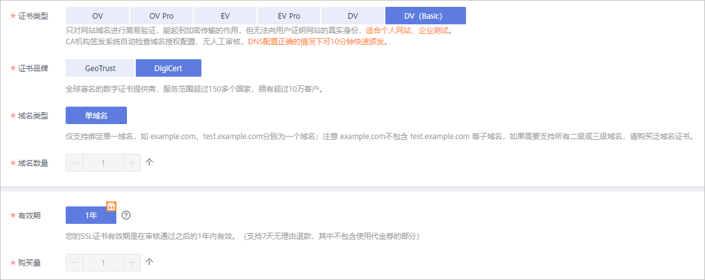
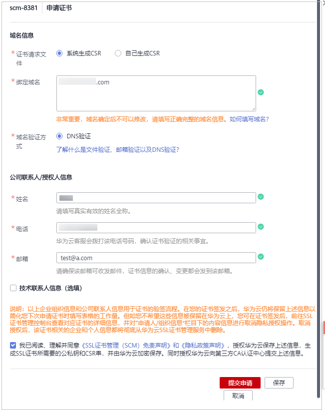

# 申请免费证书

## 操作场景

华为云SSL证书管理服务中，DigiCert品牌提供有证书类型为DV（Basic）、域名类型为单域名、有效期1年的免费证书。

## 约束与限制

-   免费的SSL证书一个账号最多可以申请20张。同时，为了减少证书资源的浪费，SCM只支持单次申请一张免费证书。
-   一张DigiCert品牌的DV（Basic）类型的SSL证书仅支持绑定一个单域名。
-   免费证书不支持保护IP和泛域名（通配符域名）。
-   免费证书的信任等级和安全性都较低，所以建议只用于测试。
-   由于DigiCert品牌的DV（Basic）免费证书是无偿提供给个人用户用于测试或个人业务，因此不支持任何免费的人工技术支持或安装指导。如果您需要华为云专业的工程师为您提供SSL证书支撑服务，您可以进入[云市场](https://market.huaweicloud.com/product/00301-120142-0--0)购买HTTPS服务配置全站加密SSL优化检测服务。

## 步骤一：购买证书

> **说明：** 
>请确认购买证书的账号拥有“SCM Administrator”和“BSS Administrator”权限。

1.  登录[管理控制台](https://console.huaweicloud.com/)。
2.  在左侧导航树中，单击，选择“安全  \>  SSL证书管理“，进入SSL证书管理界面。
3.  在界面右上角，单击“购买证书“，进入购买证书页面。
4.  在购买证书页面，配置购买参数。

    -   “证书类型“：选择“DV（Basic）“。
    -   “证书品牌“：选择“DigiCert“。
    -   “证书类型“和“证书品牌“选择后，“域名类型“、“域名数量“、“有效期“、“购买量“将自动生成，无需配置。

    **图 1**  免费证书配置信息  
    

5.  确认参数配置无误后，在页面右下角，单击“立即购买“。
6.  确认订单无误后，阅读并勾选“我已阅读并同意《SSL证书管理（SCM）免责声明》“，单击“去支付“。
7.  在购买页面，请选择付款方式进行付款。

    成功付款后，在SSL证书管理界面，可以查看证书列表中购买的证书。

## 步骤二：申请证书

成功购买证书后，您需要为证书绑定域名、填写证书申请人的详细信息并提交审核。

1.  登录[管理控制台](https://console.huaweicloud.com/)。
2.  在左侧导航树中，单击，选择“安全  \>  SSL证书管理“，进入SSL证书管理界面。
3.  在证书列表中已购的免费证书所在行的“操作“列，单击“申请证书“。
4.  在“申请证书“页面，参考表[表1](#table1783613118304)配置相关参数，如[图2](#fig39971182810)所示。

    **图 2**  免费证书申请证面  
    

    **表 1**  参数说明

    
    <table><thead align="left"><tr id="row583741116303"><th class="cellrowborder" valign="top" width="22.03220322032203%" id="mcps1.2.4.1.1">
参数名称

    </th>
    <th class="cellrowborder" valign="top" width="55.00550055005501%" id="mcps1.2.4.1.2">
参数说明

    </th>
    <th class="cellrowborder" valign="top" width="22.96229622962296%" id="mcps1.2.4.1.3">
取值样例

    </th>
    </tr>
    </thead>
    <tbody><tr id="row108371711203019"><td class="cellrowborder" valign="top" width="22.03220322032203%" headers="mcps1.2.4.1.1 ">
证书请求文件

    </td>
    <td class="cellrowborder" valign="top" width="55.00550055005501%" headers="mcps1.2.4.1.2 ">
证书请求文件（Certificate Signing Request，CSR）即证书签名申请，获取SSL证书，需要先生成CSR文件并提交给CA中心。CSR包含了公钥和标识名称（Distinguished Name），通常从Web服务器生成CSR，同时创建加解密的公钥私钥对。

    
选择证书请求文件生成方式：<ul id="zh-cn_topic_0196219185_zh-cn_topic_0195832400_ul172523619546"><li>系统生成CSR：系统将自动帮您生成证书私钥，并且您可以在证书申请成功后直接在证书管理页面下载您的证书和私钥。</li><li>自己生成CSR：手动生成CSR文件并将文件内容复制到CSR文件内容对话框中。详细操作请参见<a href="https://support.huaweicloud.com/scm_faq/scm_01_0059.html" target="_blank" rel="noopener noreferrer">如何制作CSR文件？</a>。
 说明： 
<ul id="zh-cn_topic_0196219185_zh-cn_topic_0195832400_ul1225218613544"><li>建议选择“系统生成CSR”，避免出现内容不正确而导致的审核失败。</li><li>“自己生成CSR”的证书不支持一键部署到云产品。</li><li>手动生成CSR文件的同时会生成私钥文件，请务必妥善保管和备份您的私钥文件。私钥和数字证书一一对应，一旦丢失了私钥，您的数字证书也将不可使用。华为云不负责保管您的私钥，如果您的私钥丢失，您需要重新购买并替换您的数字证书。</li><li>证书服务系统对CSR文件的密钥长度有严格要求，密钥长度必须是2,048位，密钥类型必须为RSA。</li><li>选择“系统生成CSR”，在数字证书颁发后还可以支持不同格式的证书下载。</li></ul>
    

    </li></ul>
    

    </td>
    <td class="cellrowborder" valign="top" width="22.96229622962296%" headers="mcps1.2.4.1.3 ">
系统生成CSR

    </td>
    </tr>
    <tr id="row18378119305"><td class="cellrowborder" valign="top" width="22.03220322032203%" headers="mcps1.2.4.1.1 ">
绑定域名

    </td>
    <td class="cellrowborder" valign="top" width="55.00550055005501%" headers="mcps1.2.4.1.2 ">
输入证书需要绑定的单域名。

    
填写示例：您的域名为www.domain.com，则在“绑定域名”中填写www.domain.com

    </td>
    <td class="cellrowborder" valign="top" width="22.96229622962296%" headers="mcps1.2.4.1.3 ">
www.domain.com

    </td>
    </tr>
    <tr id="row68371011193016"><td class="cellrowborder" valign="top" width="22.03220322032203%" headers="mcps1.2.4.1.1 ">
域名验证方式

    </td>
    <td class="cellrowborder" valign="top" width="55.00550055005501%" headers="mcps1.2.4.1.2 ">
DNS验证。DigCert品牌，DV（Basic）类型的免费证书只支持DNS的验证方式。

    </td>
    <td class="cellrowborder" valign="top" width="22.96229622962296%" headers="mcps1.2.4.1.3 ">
DNS验证

    </td>
    </tr>
    <tr id="row1183721183010"><td class="cellrowborder" valign="top" width="22.03220322032203%" headers="mcps1.2.4.1.1 ">
公司联系人/授权人信息

    </td>
    <td class="cellrowborder" valign="top" width="55.00550055005501%" headers="mcps1.2.4.1.2 ">
仅需要填写联系人的姓名、电话、邮箱。

    
为了使证书能够快速的签发，此处填写的电话、邮箱必须真实有效。

    </td>
    <td class="cellrowborder" valign="top" width="22.96229622962296%" headers="mcps1.2.4.1.3 ">
--

    </td>
    </tr>
    <tr id="row17837111115301"><td class="cellrowborder" valign="top" width="22.03220322032203%" headers="mcps1.2.4.1.1 ">
技术联系人信息（选填）

    </td>
    <td class="cellrowborder" valign="top" width="55.00550055005501%" headers="mcps1.2.4.1.2 ">
可选项。可以不填。

    </td>
    <td class="cellrowborder" valign="top" width="22.96229622962296%" headers="mcps1.2.4.1.3 ">
--

    </td>
    </tr>
    </tbody>
    </table>

5.  确认填写的信息无误后，阅读《SSL证书管理（SCM）免责声明》、《隐私政策声明》和信息授权声明，并勾选声明内容前面的框。

    当证书不在审核中，可取消隐私信息授权。取消隐私信息授权后，华为云将不再保存并删除您的相关信息（包括联系人姓名、电话、邮箱、企业信息）。具体操作请参见[取消隐私信息授权](https://support.huaweicloud.com/usermanual-scm/scm_01_0066.html)。

6.  单击“提交申请“。

    证书填写信息完成，页面返回到证书列表，状态更新为“待完成域名验证“。

    系统将把您的申请提交到CA认证机构，请您保持电话畅通，并及时查阅邮箱中来自CA认证机构的电子邮件。

    > **说明：** 
    >-   单击“保存“，系统将自动保存填写的信息。
    >-   由于服务处理需求，CA机构将在2-3个工作日内对您提交的申请进行处理并给您发送域名验证邮件。在此期间，请您耐心等待。

## 步骤三：DNS验证

DNS验证，是指在域名管理平台通过解析指定的DNS记录，验证域名所有权。即您需要到该域名的管理平台中为该域名添加一条TXT类型的DNS记录。例如：如果您购买的是A公司的域名，您需要到A公司的域名管理平台添加DNS记录文件。有关DNS验证方式详细操作请参见[域名DNS的TXT解析](https://support.huaweicloud.com/bestpractice-scm/scm_06_0007.html)。

> **说明：** 
>在您成功申请证书后，需要按照证书列表页面的提示完成域名授权验证配置，否则证书将一直处于“待完成域名验证“状态，且您的证书将无法通过审核。

## 步骤四：签发证书

DNS验证通过之后，CA机构将还需要一段时间进行处理，请您耐心等待。CA机构审核通过后，将会签发证书。

证书签发后便立即生效，即可推送证书到华为云其他云产品或下载证书并部署到服务器上进行使用。

> **说明：** 
>CA机构针对已提交申请的证书的审核检测频率为：
>-   提交申请后0-1h：15分钟轮询一次，如果配置没有问题，一般情况，10-20分钟签发证书。
>-   提交申请后1-4h：30分钟轮询一次。
>-   提交申请后4h-24h：1小时轮询一次。
>-   提交申请后1-7天：4小时轮询一次
>-   提交申请后7天以上认定为订单超时，自动取消。此时，请参照[为什么“证书状态”长时间停留在审核中？](https://support.huaweicloud.com/scm_faq/scm_01_0088.html)排查并解决问题。

