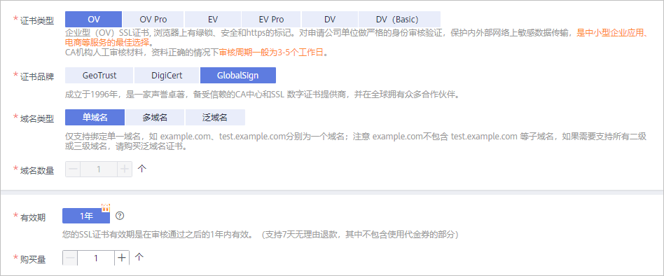

# 申请纯IP证书

## 操作场景

SSL证书管理服务中提供纯IP证书，即绑定IP地址的证书。如果您需要纯IP证书，且IP地址是公网IP地址，则可在华为云SSL证书管理服务中申请纯IP证书。

华为云SSL证书管理服务中，GlobalSign品牌（OV类型）提供纯IP证书，目前仅支持申请绑定1个IP的证书。

本章节将介绍如何申请纯IP证书。

## 约束与限制

-   一张GlobalSign品牌（OV类型）的单域名证书仅支持绑定1个IP。
-   IP必须为公网IP。
-   域名验证仅支持文件验证的方式。

## 前提条件

已获取管理控制台的登录账号与密码。

## 步骤一：购买证书

纯IP证书仅可购买**GlobalSign品牌**、**OV类型**的**单域名**证书。其他品牌或类型的证书暂不支持。

> **说明：** 
>-   请确认购买证书的账号拥有“SCM Administrator“和“BSS Administrator“权限。
>-   “证书类型“须选择“OV“，“证书品牌“须选择“GlobalSign“、“域名类型“须选择“单域名“。

1.  登录[管理控制台](https://console.huaweicloud.com/)。
2.  在左侧导航树中，单击，选择“安全  \>  SSL证书管理“，进入SSL证书管理界面。
3.  在界面右上角，单击“购买证书“，进入购买证书页面。
4.  在购买证书页面，配置购买参数。

    -   “证书类型“：选择“OV“。
    -   “证书品牌“：选择“GlobalSign“。
    -   “域名类型“：选择“单域名“。
    -   “购买量“：根据实际需求进行选择。
    -   “域名数量“、“有效期“将自动生成，无需配置。

    **图 1**  纯IP证书配置信息  
    

5.  确认参数配置无误后，在页面右下角，单击“立即购买“。
6.  确认订单无误后，阅读并勾选“我已阅读并同意《SSL证书管理（SCM）免责声明》“，单击“去支付“。
7.  在购买页面，请选择付款方式进行付款。

    成功付款后，在SSL证书管理界面，可以查看证书列表中购买的证书。

## 步骤二：申请证书

成功购买证书后，您需要为证书绑定域名、填写证书申请人的详细信息并提交审核。

申请证书的详细操作请参见[申请证书](https://support.huaweicloud.com/qs-scm/scm_07_0003.html)。

> **须知：** 
>“域名信息“中，“绑定域名“填写需要绑定的公网IP；“域名验证方式“仅可选择“文件验证“。

## 步骤三：文件验证

文件验证指通过在服务器上创建指定文件的方式来验证域名所有权。文件验证方式一般需要由您的服务器管理人员进行操作，详细操作请参见[文件验证](https://support.huaweicloud.com/qs-scm/scm_07_0004.html#section2)。

> **说明：** 
>在您成功申请证书后，需要按照订单进度提示完成域名授权验证配置，否则证书将一直处于“待完成域名验证“状态，且您的证书将无法通过审核。

## 步骤四：组织验证

文件验证完成后，CA机构将向您填写的邮箱发送一封组织验证邮件。CA机构将根据您选择的验证方式与企业/组织进行联系，确认企业/组织是否发起了此次的证书订单申请。

详细操作请参见[组织验证](https://support.huaweicloud.com/qs-scm/scm_07_0005.html)。

## 步骤五：签发证书

组织验证完成后，CA机构将还需要一段时间进行处理，请您耐心等待。CA机构审核通过后，将会签发证书。

证书签发后便立即生效，即可推送证书到华为云其他云产品或下载证书并部署到服务器上进行使用。

> **说明：** 
>CA机构针对已提交申请的证书的审核检测频率为：
>-   提交申请后0-1h：15分钟轮询一次，如果配置没有问题，一般情况，10-20分钟签发证书。
>-   提交申请后1-4h：30分钟轮询一次。
>-   提交申请后4h-24h：1小时轮询一次。
>-   提交申请后1-7天：4小时轮询一次
>-   提交申请后7天以上认定为订单超时，自动取消。此时，请参照[为什么“证书状态”长时间停留在审核中？](https://support.huaweicloud.com/scm_faq/scm_01_0088.html)排查并解决问题。

