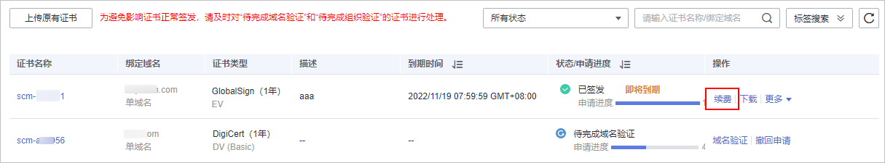
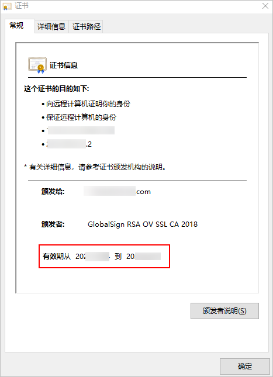

# 续费证书

CA机构签发的SSL证书默认有效期为1年，您需要在证书到期前进行续费，以便延长证书的有效期。

本章节介绍如何续费SSL证书。

## 约束与限制

-   **上传的证书**、**免费证书**暂不支持续费。
-   仅支持对在华为云SSL证书管理中购买的，已签发且即将到期的付费SSL证书进行续费。
-   续费操作入口仅在SSL证书到期前30个自然日内开放，其余时间不支持操作。
-   SSL证书续费操作相当于在控制台重新购买一张与原证书规格（即证书品牌、证书类型、域名类型、域名数量、主域名）**完全相同**的证书。

    如果续费的证书与原证书的规格（即证书品牌、证书类型、域名类型、域名数量、主域名）不完全相同，则只能重新申请一张新的证书。

-   续费证书有效期说明：
    -   续费签发的新证书的到期时间，除正常续费时长外，原证书未用完的时间会自动补齐到新证书里面，额外赠送时长最多为30天。

        例如，您已签发的1年有效期证书将于2022年11月30日过期，如果您在2022年11月25日完成续费购买和签发，则续费签发证书的有效期将在2023年11月25日的基础上再加上5天，即2023年11月30日。

    -   如果通过续费购买入口购买的证书与原证书规格（即证书品牌、证书类型、域名类型、域名数量、主域名）不完全相同，则新签发证书的有效期为一年（可能与原证书过期前未使用的有效期存在重合），无法自动补齐原证书剩余的有效期。
    -   如果您没有通过续费购买入口购买证书，而是通过购买页面购买了一张新证书，则新签发证书的有效期为1年（可能与原证书过期前未使用的有效期存在重合），无法自动补齐原证书剩余的有效期。

## 前提条件

付费证书处于即将到期状态。

## 操作步骤

1.  登录[管理控制台](https://console.huaweicloud.com/)。
2.  单击页面左上方的，选择“安全与合规  \>  云证书管理服务“，进入云证书管理界面。
3.  在左侧导航栏选择“SSL证书管理“，进入SSL证书管理页面。
4.  在需要续费的证书所在行的“操作“列中，单击“续费“，如[图1](#zh-cn_topic_0000001179606478_zh-cn_topic_0000001208469923_fig7698132011319)所示。

    **图 1**  续费  
    

5.  在续费证书页面确认待续费证书信息，确认信息无误后，在页面右下角，单击“立即购买“。

    如果您对价格有疑问，可以单击页面左下角的“了解计费详情“，了解产品价格。

6.  确认订单无误后，阅读并勾选“我已阅读并同意《SSL证书管理（SCM）免责声明》“，单击“去支付“。
7.  在购买页面，请选择付款方式进行付款。

    成功付款后，在SSL证书管理界面，可以查看证书列表中购买的证书。

8.  提交证书申请。

    详细操作请参见[申请SSL证书](步骤二-申请SSL证书.md#ZH-CN_TOPIC_0000001216146273)。

9.  域名验证，详细操作请参见[域名验证](概览.md#ZH-CN_TOPIC_0000001220077019)。
10. （OV、EV型）组织验证。

    详细操作请参见[组织验证](步骤四-（OV-EV）组织验证.md#ZH-CN_TOPIC_0000001170266468)。

11. 签发证书。

    以上操作完成后，请您耐心等待，CA机构将还需要一段时间进行处理。CA机构审核通过后，将会签发证书。

12. 将已签发的续费证书安装到您的Web服务器，替换即将过期的旧证书。

    如果您没有在Web服务器中安装续费证书，则在旧证书过期后，您的服务器将无法正常使用HTTPS服务。

    安装证书详细操作请参见[安装SSL证书](下载与安装SSL证书.md#ZH-CN_TOPIC_0000001216146275)。

## 查看续费证书是否已更新

续费证书安装到Web服务器后，可通过浏览器查看证书是否已更新。

1.  通过Web浏览器访问您的网站。
2.  单击浏览器地址栏的，查看证书的有效期是否已更新。

    如果证书有效期已显示为新证书的有效期，表示您的续费证书已完成更新。

    **图 2**  有效期  
    

