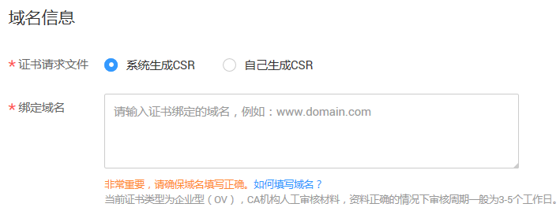
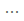
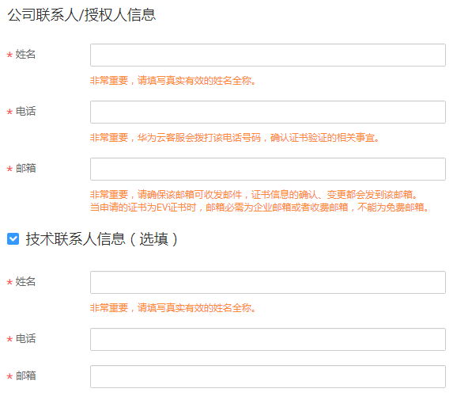
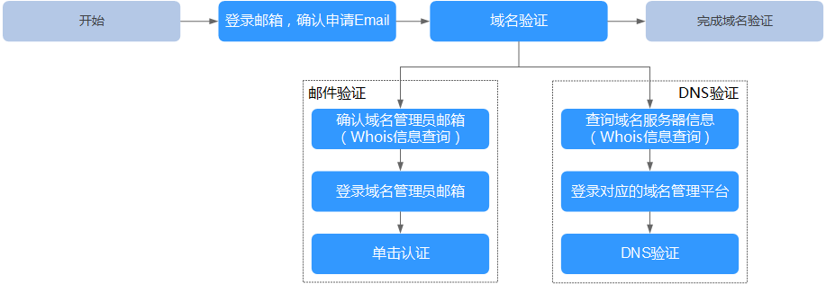

# 补全信息

## 操作场景

免费申请或成功购买证书后，您需要为证书绑定域名、填写证书申请人的详细信息并提交审核。所有信息通过审核后，证书颁发机构才签发证书。

本章节将介绍补全信息的详细操作。

## 前提条件

-   已获取管理控制台的登录账号与密码。
-   证书的状态为“待补全信息“。

## 操作步骤

1.  登录管理控制台。
2.  单击页面上方的“服务列表“，选择“安全  \>  SSL证书管理“，进入SSL证书管理界面。
3.  在待补全信息的证书所在行的“操作“列，单击“补全信息“，进入补全信息详细页面。请填写您的详细信息。

    您需要补全“域名信息“、“企业组织信息“（仅企业或组织单位需要补充该信息）和“联系方式“。

    1.  补全域名信息，如[图1](#fig20542619194213)所示。参数说明如[表1](#table42541262541)所示。

        **图 1**  域名信息  
        

        **表 1**  域名信息参数说明

        
        <table><thead align="left"><tr id="row325166195413"><th class="cellrowborder" valign="top" width="21.02%" id="mcps1.2.4.1.1">
参数名称

        </th>
        <th class="cellrowborder" valign="top" width="56.8%" id="mcps1.2.4.1.2">
参数说明

        </th>
        <th class="cellrowborder" valign="top" width="22.18%" id="mcps1.2.4.1.3">
取值样例

        </th>
        </tr>
        </thead>
        <tbody><tr id="row525386105419"><td class="cellrowborder" valign="top" width="21.02%" headers="mcps1.2.4.1.1 ">
证书请求文件

        </td>
        <td class="cellrowborder" valign="top" width="56.8%" headers="mcps1.2.4.1.2 ">
证书请求文件（Certificate Signing Request，CSR）即证书签名申请，获取SSL证书，需要先生成CSR文件并提交给CA中心。CSR包含了公钥和标识名称（Distinguished Name），通常从Web服务器生成CSR，同时创建加解密的公钥私钥对。

        
选择证书请求文件生成方式：

        <ul id="ul172523619546"><li>系统生成CSR：系统将自动帮您生成证书私钥，并且您可以在证书申请成功后直接在证书管理页面下载您的证书和私钥。</li><li>自己生成CSR：手动生成CSR文件并将文件内容复制到CSR文件内容对话框中。详细操作请参见<a href="https://support.huaweicloud.com/scm_faq/scm_01_0059.html" target="_blank" rel="noopener noreferrer">如何制作CSR文件？</a>。
 说明： 
<ul id="ul1225218613544"><li>建议选择“系统生成CSR”，避免出现内容不正确而导致的审核失败。</li><li>“自己生成CSR”的证书不支持一键部署到云产品。</li><li>手动生成CSR文件的同时会生成私钥文件，请务必妥善保管和备份您的私钥文件。私钥和数字证书一一对应，一旦丢失了私钥您的数字证书也将不可使用。华为云不负责保管您的私钥，如果您的私钥丢失，您需要重新购买并替换您的数字证书。</li><li>证书服务系统对CSR文件的密钥长度有严格要求，密钥长度必须是2,048位，密钥类型必须为RSA。</li></ul>
        

        </li></ul>
        </td>
        <td class="cellrowborder" valign="top" width="22.18%" headers="mcps1.2.4.1.3 ">
系统生成CSR

        </td>
        </tr>
        <tr id="row15253968549"><td class="cellrowborder" valign="top" width="21.02%" headers="mcps1.2.4.1.1 ">
绑定域名

        </td>
        <td class="cellrowborder" valign="top" width="56.8%" headers="mcps1.2.4.1.2 ">
当购买的是“单域名”、“泛域名”类型的SSL证书时，显示该参数。

        
输入证书需要绑定的域名或泛域名。

        </td>
        <td class="cellrowborder" valign="top" width="22.18%" headers="mcps1.2.4.1.3 ">
www.domain.com

        </td>
        </tr>
        <tr id="row92539613546"><td class="cellrowborder" valign="top" width="21.02%" headers="mcps1.2.4.1.1 ">
绑定主域名

        </td>
        <td class="cellrowborder" valign="top" width="56.8%" headers="mcps1.2.4.1.2 ">
当购买的是“多域名”类型的SSL证书时，显示该参数。

        
输入证书绑定的主域名。

        </td>
        <td class="cellrowborder" valign="top" width="22.18%" headers="mcps1.2.4.1.3 ">
www.domain01.com

        </td>
        </tr>
        <tr id="row32541068547"><td class="cellrowborder" valign="top" width="21.02%" headers="mcps1.2.4.1.1 ">
绑定附加域名

        </td>
        <td class="cellrowborder" valign="top" width="56.8%" headers="mcps1.2.4.1.2 ">
当购买的是“多域名”类型的SSL证书时，显示该参数。

        
输入证书绑定的附加域名。

        
 说明： 
<ul id="ul3219104012147"><li>多个附加域名请换行输入。</li><li>附加域名可分批次进行录入，具体操作请参见<a href="新增附加域名.md">新增附加域名</a>。</li></ul>
        

        </td>
        <td class="cellrowborder" valign="top" width="22.18%" headers="mcps1.2.4.1.3 ">
www.domain02.com

        
www.domain03.com

        </td>
        </tr>
        </tbody>
        </table>

    1.  补全企业组织信息，如[图2](#fig201001056182414)所示。参数说明如[表2](#table111651218171312)所示。

        > **说明：**   
        >仅企业、组织单位需要补充该信息。  

        **图 2**  企业组织信息  
        

        **表 2**  企业组织信息参数说明

        
        <table><thead align="left"><tr id="row716412187132"><th class="cellrowborder" valign="top" width="22.93%" id="mcps1.2.3.1.1">
参数名称

        </th>
        <th class="cellrowborder" valign="top" width="77.07000000000001%" id="mcps1.2.3.1.2">
参数说明

        </th>
        </tr>
        </thead>
        <tbody><tr id="row1516481821314"><td class="cellrowborder" valign="top" width="22.93%" headers="mcps1.2.3.1.1 ">
公司名称

        </td>
        <td class="cellrowborder" valign="top" width="77.07000000000001%" headers="mcps1.2.3.1.2 ">
营业执照注册公司的全称。

        </td>
        </tr>
        <tr id="row5165618111311"><td class="cellrowborder" valign="top" width="22.93%" headers="mcps1.2.3.1.1 ">
部门名称

        </td>
        <td class="cellrowborder" valign="top" width="77.07000000000001%" headers="mcps1.2.3.1.2 ">
用户所在的部门名称。

        </td>
        </tr>
        <tr id="row515762411560"><td class="cellrowborder" valign="top" width="22.93%" headers="mcps1.2.3.1.1 ">
国家/地区

        </td>
        <td class="cellrowborder" valign="top" width="77.07000000000001%" headers="mcps1.2.3.1.2 ">
公司所在的国家或地区。

        </td>
        </tr>
        <tr id="row14165151831311"><td class="cellrowborder" valign="top" width="22.93%" headers="mcps1.2.3.1.1 ">
银行开户许可

        </td>
        <td class="cellrowborder" valign="top" width="77.07000000000001%" headers="mcps1.2.3.1.2 ">
（可选）单击，上传银行开户许可证电子件。

        </td>
        </tr>
        <tr id="row14165191811137"><td class="cellrowborder" valign="top" width="22.93%" headers="mcps1.2.3.1.1 ">
企业营业执照

        </td>
        <td class="cellrowborder" valign="top" width="77.07000000000001%" headers="mcps1.2.3.1.2 ">
（可选）单击，上传企业营业执照电子件。

        </td>
        </tr>
        </tbody>
        </table>

    2.  补全联系方式，如[图3](#fig157381745152313)所示。参数说明如[表3](#table325713615413)所示。

        **图 3**  补全联系方式  
        

        **表 3**  联系方式参数说明

        
        <table><thead align="left"><tr id="row1725666155420"><th class="cellrowborder" valign="top" width="23.45%" id="mcps1.2.3.1.1">
参数名称

        </th>
        <th class="cellrowborder" valign="top" width="76.55%" id="mcps1.2.3.1.2">
参数说明

        </th>
        </tr>
        </thead>
        <tbody><tr id="row10256186185411"><td class="cellrowborder" valign="top" width="23.45%" headers="mcps1.2.3.1.1 ">
姓名

        </td>
        <td class="cellrowborder" valign="top" width="76.55%" headers="mcps1.2.3.1.2 ">
请输入您的姓名。

        </td>
        </tr>
        <tr id="row82565635413"><td class="cellrowborder" valign="top" width="23.45%" headers="mcps1.2.3.1.1 ">
电话

        </td>
        <td class="cellrowborder" valign="top" width="76.55%" headers="mcps1.2.3.1.2 ">
请填写正确，签证中心人员会拨打该电话号码确认证书认证相关的信息。

        </td>
        </tr>
        <tr id="row1825715605412"><td class="cellrowborder" valign="top" width="23.45%" headers="mcps1.2.3.1.1 ">
邮箱

        </td>
        <td class="cellrowborder" valign="top" width="76.55%" headers="mcps1.2.3.1.2 ">
请输入可以正常收到邮件的邮箱地址。

        
 注意： 

该邮箱会收到华为云发送的通知邮件（证书签发通知），CA中心发来的认证邮件将发送到域名管理员的邮箱，请您提交审核后务必第一时间登录域名管理员的邮箱进行查收和认证。

        

        </td>
        </tr>
        </tbody>
        </table>

        > **说明：**   
        >-   系统会在证书到期前两个月、一个月、一周和到期时，向此处填写的公司联系人/授权人的邮箱和电话分别发送邮件和短信提醒。  
        >-   如果您需要技术联系人信息，请勾选“技术联系人信息（选填）“。勾选后，即可填写技术联系人信息。  

4.  确认填写的信息无误后，阅读《SSL证书管理（SCM）免责声明》、《隐私政策声明》和信息授权声明，并勾选声明内容前面的框。
5.  单击“确定“。

    证书补全信息完成，页面返回到证书列表，状态更新为“审核中“。

    系统将把您的申请提交到CA认证机构，请您保持电话畅通，并及时查阅邮箱中来自CA认证机构的电子邮件。

    > **说明：**   
    >-   单击“保存“，系统将自动保存填写的信息。  
    >-   根据用户填写的信息，SCM自动生成证书请求文件。  

## 后续处理

提交审核后，证书颁发机构将向您填写的邮箱发送一封验证邮件。您需要按照以下流程进行域名验证（免费测试证书和DV型证书仅支持DNS验证）。如果不进行域名验证，您的证书将一直处于“审核中“状态，且您的证书将无法通过审核。验证时间根据不同CA中心的要求而不同，请您关注您的邮箱和电话，及时回馈能有效缩短您的数字证书的验证时间。

**图 4**  处理流程  

