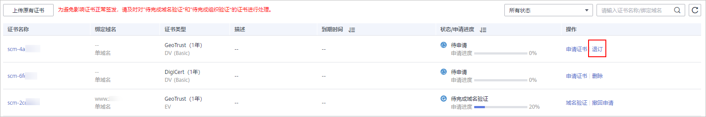

# 退订证书

如果您通过华为云SSL证书控制台购买了SSL证书，SCM支持7天无理由退款。

本章节介绍符合退订的条件以及如何退订SSL证书。

## 约束与限制

-   满足以下条件（必须全部满足）的SSL证书订单，可申请退订：
    -   您通过华为云SSL证书控制台购买了SSL证书。
    -   距离SSL证书订单下单时间（完成支付的时间）不超过7个自然日，即距离SSL证书订单完成支付时间顺延不超过7\*24小时。

        例如，12月1日12:00完成SSL证书订单支付，则在12月8日11:59前可以退订，12月8日11:59后将不支持退订。

        > **注意：** 
        >购买7天后不支持退款。

    -   已购买的SSL证书符合以下情况之一：
        -   未提交证书申请，证书状态为“待申请“。
        -   提交过证书申请，证书未签发，且已取消申请，证书状态为“待申请“。
        -   提交过证书申请，证书已签发，且在下单后7个自然日内完成了证书吊销流程（不仅是提交了吊销申请，须完成吊销流程），证书状态为“已吊销“。

-   全额退款将退还您在购买SSL证书时所支付的费用。如果购买证书时，使用了代金券，则将退还已使用的代金券。

## 操作步骤

1.  登录[管理控制台](https://console.huaweicloud.com/)。
2.  单击页面左上方的，选择“安全与合规  \>  云证书管理服务“，进入云证书管理界面。
3.  在左侧导航栏选择“SSL证书管理“，进入SSL证书管理页面。
4.  在需要退订的证书所在行的“操作“列中，单击“退订“，如[图1](#zh-cn_topic_0000001170697340_zh-cn_topic_0000001208469923_fig7698132011319)所示。

    **图 1**  退订  
    

5.  在“退订信息确认“页面确认待退订证书信息，确认信息无误后，勾选退订提示信息。
6.  在页面右下角，单击“退订“。

    > **须知：** 
    >-   退订后，证书将被删除且无法恢复，请谨慎操作。
    >-   退订提交后，系统将对您提交的退订进行审核。审核通过后，证书才不会显示在控制台证书列表中。在此期间，请勿对SSL证书做任何操作，避免审核失败。

    在页面的右上角弹出“证书退订成功“，表示证书退订成功，已支付的费用将按照原支付路径退还给您。

    退订成功后，可在“费用中心 \> 订单管理 \> 我的订单“中查看已退订的证书订单。

