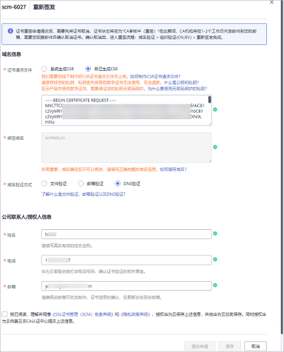

# 重新签发

如果您的证书在已签发后，需要重新绑定域名，可参考本章节重新签发证书。

## 前提条件

证书状态为“已签发“。

## 约束条件

证书签发后，各证书品牌针对证书重新签发的时间有以下限制：

-   GlobalSign品牌：5天。
-   DigiCert品牌和GeoTrust品牌：25天。

在规定时间内，证书可重新签发的次数不限，超过各证书品牌的规定的时间，将不能执行重新签发的操作。

## 操作步骤

1.  登录[管理控制台](https://console.huaweicloud.com/)。
2.  在左侧导航树中，单击，选择“安全  \>  SSL证书管理“，进入SSL证书管理界面。
3.  在目标域名所在行的“操作“列，单击“更多  \>  重新签发“，进入“重新签发“页面，如[图1](#fig1716314922213)所示。

    如果您需要重新绑定域名，可参照[表1](#table4169849162210)进行操作，同时您也可以修改公司联系人/授权人信息。

    **图 1**  重新签发  
    

    **表 1**  域名信息参数说明

    
    <table><thead align="left"><tr id="zh-cn_topic_0196219185_row17157151717326"><th class="cellrowborder" valign="top" width="20%" id="mcps1.2.4.1.1">
参数名称

    </th>
    <th class="cellrowborder" valign="top" width="60%" id="mcps1.2.4.1.2">
参数说明

    </th>
    <th class="cellrowborder" valign="top" width="20%" id="mcps1.2.4.1.3">
取值样例

    </th>
    </tr>
    </thead>
    <tbody><tr id="zh-cn_topic_0196219185_row717631710329"><td class="cellrowborder" valign="top" width="20%" headers="mcps1.2.4.1.1 ">
证书请求文件

    </td>
    <td class="cellrowborder" valign="top" width="60%" headers="mcps1.2.4.1.2 ">
证书请求文件（Certificate Signing Request，CSR）即证书签名申请，获取SSL证书，需要先生成CSR文件并提交给CA中心。CSR包含了公钥和标识名称（Distinguished Name），通常从Web服务器生成CSR，同时创建加解密的公钥私钥对。

    
选择证书请求文件生成方式：<ul id="zh-cn_topic_0196219185_ul3176917113211"><li>系统生成CSR：系统将自动帮您生成证书私钥，并且您可以在证书申请成功后直接在证书管理页面下载您的证书和私钥。</li><li>自己生成CSR：手动生成CSR文件并将文件内容复制到CSR文件内容对话框中。详细操作请参见<a href="https://support.huaweicloud.com/scm_faq/scm_01_0059.html" target="_blank" rel="noopener noreferrer">如何制作CSR文件？</a>。</li></ul>
    

    
建议您选择“系统生成CSR”，避免出现内容不正确而导致的审核失败。两种证书请求文件的区别请参见<a href="https://support.huaweicloud.com/scm_faq/scm_01_0234.html" target="_blank" rel="noopener noreferrer">系统生成的CSR和自己生成CSR的区别？</a>。

    </td>
    <td class="cellrowborder" valign="top" width="20%" headers="mcps1.2.4.1.3 ">
系统生成CSR

    </td>
    </tr>
    <tr id="zh-cn_topic_0196219185_row19177151711323"><td class="cellrowborder" valign="top" width="20%" headers="mcps1.2.4.1.1 ">
绑定域名

    </td>
    <td class="cellrowborder" valign="top" width="60%" headers="mcps1.2.4.1.2 ">
当购买的是“单域名”、“泛域名”类型的SSL证书时，显示该参数。

    <ul id="zh-cn_topic_0196219185_ul992512731410"><li>当“证书请求文件”选择“自己生成CSR”时，域名将根据CSR文件自动解析出来，不需要手动输入域名。</li><li>当“证书请求文件”选择“系统生成CSR”时，需要手动输入证书需要绑定的域名或泛域名。
“单域名”填写示例：您的域名为www.domain.com，则在“绑定域名”中填写www.domain.com

    
“泛域名”填写示例：您的域名为test.huaweicloud.com、yun.huaweicloud.com、example.huaweicloud.com、good.huaweicloud.com等，均在同一个级别，则在“绑定域名”中填写*.huaweicloud.com

    </li></ul>
    </td>
    <td class="cellrowborder" valign="top" width="20%" headers="mcps1.2.4.1.3 ">
www.domain.com

    </td>
    </tr>
    <tr id="zh-cn_topic_0196219185_row10178101714327"><td class="cellrowborder" valign="top" width="20%" headers="mcps1.2.4.1.1 ">
绑定主域名

    </td>
    <td class="cellrowborder" valign="top" width="60%" headers="mcps1.2.4.1.2 ">
当购买的是“多域名”类型的SSL证书时，显示该参数。

    <ul id="zh-cn_topic_0196219185_ul15118122115151"><li>当“证书请求文件”选择“自己生成CSR”时，主域名将根据CSR文件自动解析出来，不需要手动输入域名。</li><li>当“证书请求文件”选择“系统生成CSR”时，手动输入证书绑定的主域名。需要将其中一个域名设置为主域名，其他域名则设置为附加域名。</li></ul>
    
 须知： 

主域名和附加域名的关系（主从关系）对添加的域名没有影响。

    

    
示例：如果购买的域名数量为3，且您的域名为www.domain01.com、www.domain02.com和www.domain03.com，需要选择一个域名作为主域名，此处示例选择www.domain01.com，则在“绑定主域名”中填写www.domain01.com

    </td>
    <td class="cellrowborder" valign="top" width="20%" headers="mcps1.2.4.1.3 ">
www.domain01.com

    </td>
    </tr>
    <tr id="zh-cn_topic_0196219185_row1818091753216"><td class="cellrowborder" valign="top" width="20%" headers="mcps1.2.4.1.1 ">
绑定附加域名

    </td>
    <td class="cellrowborder" valign="top" width="60%" headers="mcps1.2.4.1.2 ">
当购买的是“多域名”类型的SSL证书时，显示该参数。

    
输入证书绑定的附加域名。

    
 说明： 
<ul id="zh-cn_topic_0196219185_ul417910175329"><li>多个附加域名请换行输入。</li><li>附加域名可分批次进行录入，具体操作请参见<a href="https://support.huaweicloud.com/usermanual-scm/scm_01_0069.html" target="_blank" rel="noopener noreferrer">新增附加域名</a>。</li></ul>
    

    
示例：如果购买的域名数量为3，且您的域名为www.domain01.com、www.domain02.com和www.domain03.com，主域名已绑定www.domain01.com，则“绑定附加域名”填写www.domain02.com和www.domain03.com

    </td>
    <td class="cellrowborder" valign="top" width="20%" headers="mcps1.2.4.1.3 ">
www.domain02.com

    
www.domain03.com

    </td>
    </tr>
    <tr id="zh-cn_topic_0196219185_row3189181718325"><td class="cellrowborder" valign="top" width="20%" headers="mcps1.2.4.1.1 ">
域名验证方式

    </td>
    <td class="cellrowborder" valign="top" width="60%" headers="mcps1.2.4.1.2 ">
按照CA中心的规范，如果您申请了数字证书，您必须配合完成域名授权验证来证明您对所申请绑定的域名的所有权。当您按照要求正确配置域名验证信息，待域名授权验证完成，CA系统中心审核通过后，证书审核才可以进入下一个状态。

    
选择域名验证方式：

    <ul id="zh-cn_topic_0196219185_ul171881317133214"><li>文件验证：指通过在服务器上创建指定文件的方式来验证域名所有权。
纯IP（公网IP）的证书仅支持通过“文件验证”方式进行验证。

    </li><li>邮箱验证：指登录域名管理员邮箱，接收域名确认邮件并根据提示进行操作来验证域名所有权。</li><li>DNS验证：指在域名管理平台通过解析指定的DNS记录，验证域名所有权。
DV域名型和DV基础版证书（GeoTrust入门级SSL证书和DigiCert免费SSL证书）仅支持通过“DNS验证”方式进行验证。

    </li></ul>
    </td>
    <td class="cellrowborder" valign="top" width="20%" headers="mcps1.2.4.1.3 ">
DNS验证

    </td>
    </tr>
    </tbody>
    </table>

4.  确认填写的信息无误后，阅读《SSL证书管理（SCM）免责声明》、《隐私政策声明》和信息授权声明，并勾选声明内容前面的框。

    当证书不在审核中，可取消隐私信息授权。取消隐私信息授权后，华为云将不再保存并删除您的相关信息（包括联系人姓名、电话、邮箱、企业信息）。具体操作请参见[取消隐私信息授权](https://support.huaweicloud.com/usermanual-scm/scm_01_0066.html)。

5.  单击“提交申请“。

    1.  证书重签申请提交后，证书状态将变为“CA审核中（重签）“。
    2.  CA机构将在1-2个工作日内通过您预留的邮箱向您发送确认取消已签发证书的邮件，确认取消并邮件回复后，CA机构会将已签发证书取消，该证书将进入重签流程。

        如果您修改了域名或者公司联系人/授权人信息，原证书取消后，证书状态为“待完成域名验证“，您需要完成[域名验证](https://support.huaweicloud.com/qs-scm/scm_07_0004.html)和[组织验证](https://support.huaweicloud.com/qs-scm/scm_07_0005.html)\(OV、OV Pro、EV和EV Pro类型证书\) ，才可以重新签发新的证书。

    > **说明：** 
    >单击“保存“，系统将自动保存填写的信息。

